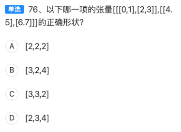

【题目记录】  
单选 76：以下哪一项是张量 `[[[0,1],[2,3]],[[4,5],[6,7]]]` 的正确形状？  
A. [2,2,2] B. [3,2,4] C. [3,3,2] D. [2,3,4]

---

### 一、分步解析
1. **识别维度（Rank）**  
   张量由外到内嵌套了 3 层中括号，因此是 **3 维张量（Rank=3）**。

2. **逐层数元素个数**  
   - 第 1 维：最外层有 2 个元素（`[ [0,1],[2,3] ]` 和 `[ [4,5],[6,7] ]`）→ `dim0=2`  
   - 第 2 维：每个元素内部又有 2 个子元素（如 `[0,1]` 和 `[2,3]`）→ `dim1=2`  
   - 第 3 维：最内层每个子元素有 2 个标量（如 `0,1`）→ `dim2=2`  

3. **形状表达式**  
   形状按 `[dim0, dim1, dim2]` 书写，即 `[2,2,2]`。

---

### 二、选项对比表（记忆用）

| 选项 | 形状    | 是否符合 | 错误原因/记忆点                               |
| ---- | ------- | -------- | --------------------------------------------- |
| A    | [2,2,2] | ✅ 正确   | 与逐层计数完全一致                            |
| B    | [3,2,4] | ❌ 错误   | 维度值全错，尤其最内层只有 2 个标量而非 4     |
| C    | [3,3,2] | ❌ 错误   | 前两个维度应为 2，写成 3 是常见“多数一层”陷阱 |
| D    | [2,3,4] | ❌ 错误   | 第 2、3 维写反且数值错误（3 和 4 无依据）     |

---

### 三、考点扩展（HCIA-AI 重点）
| 考点      | 速记口诀                         | 易错点                                                       |
| --------- | -------------------------------- | ------------------------------------------------------------ |
| 张量形状  | “从外到内数括号，每层元素记下来” | 把最外层括号当成第 0 维（不是 1 开始）                       |
| Rank 判断 | “中括号层数 = Rank”              | 漏数最内层标量，误认为 Rank=2                                |
| 数据格式  | NCHW vs NHWC                     | 本题为纯列表，不涉及图像通道，但需熟悉 TensorFlow/PyTorch 默认顺序 |

---

### 四、一句话记忆
“三层括号两两两，形状必是 [2,2,2]！”


【题目记录】  
单选 77：Sigmoid 函数无论在传统机器学习还是深度学习中经常被用到，该函数的取值范围是  
A. [-1,1] B. (0,1) C. [-1,0] D. (0,+∞)

---

### 一、一步到位的结论  
Sigmoid 函数公式：σ(x)=1/(1+e^(−x))  
当 x→−∞ 时，σ(x)→0；当 x→+∞ 时，σ(x)→1。  
因此 **取值范围为 (0,1)**，对应选项 **B**。

---

### 二、选项对比表（记忆用）

| 选项 | 区间   | 是否正确 | 错误原因 / 记忆点                   |
| ---- | ------ | -------- | ----------------------------------- |
| A    | [-1,1] | ❌        | 误把 Tanh 的区间当成 Sigmoid        |
| B    | (0,1)  | ✅        | 标准答案；开区间，永远达不到 0 或 1 |
| C    | [-1,0] | ❌        | 负数区间，明显与 Sigmoid 不符       |
| D    | (0,+∞) | ❌        | 误把 ReLU 的区间当成 Sigmoid        |

---

### 三、考点扩展（HCIA-AI 高频）

| 考点         | 速记口诀                     | 易错提醒                      |
| ------------ | ---------------------------- | ----------------------------- |
| Sigmoid 取值 | “Sigmoid 零到一，永远开区间” | 写成闭区间 [0,1] 会扣分       |
| 与 Tanh 对比 | “Tanh 负一到一，中心零”      | Tanh(x)=2σ(2x)−1，区间不同    |
| 与 ReLU 对比 | “ReLU 零到正无穷”            | ReLU(x)=max(0,x)，区间 (0,+∞) |
| 梯度消失     | “两头饱和梯度亡”             | 当 σ(x)≈0 或 ≈1 时，梯度趋 0  |

---

### 四、一句话记忆
“Sigmoid 零到一，开区间；Tanh 负一到一，中心零；ReLU 零到无穷不封顶！”

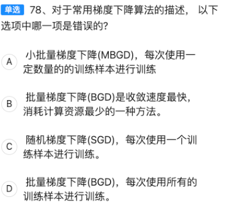

【题目记录】  
单选 78：对于常用梯度下降算法的描述，以下选项中哪一项是错误的？  
A. 小批量梯度下降（MBGD），每次使用一定数量的训练样本进行训练  
B. 批量梯度下降（BGD）是收敛速度最快、消耗计算资源最少的一种方法  
C. 随机梯度下降（SGD），每次使用一个训练样本进行训练  
D. 批量梯度下降（BGD），每次使用所有的训练样本进行训练  

---

### 一、一步到位的结论  
选项 **B** 描述错误。  
BGD 每次用**全部样本**计算梯度，**计算量最大、最耗资源**，且**收敛速度往往最慢**（一步要扫完所有数据）。  

---

### 二、选项对比表（记忆用）

| 选项 | 描述                   | 正误   | 错误原因 / 记忆点                |
| ---- | ---------------------- | ------ | -------------------------------- |
| A    | MBGD 用一定数量样本    | ✅ 正确 | 典型 mini-batch，如 32、64、128  |
| B    | BGD 收敛最快、资源最少 | ❌ 错误 | 事实相反：BGD 资源最多、收敛最慢 |
| C    | SGD 每次用 1 个样本    | ✅ 正确 | 极端 mini-batch size = 1         |
| D    | BGD 每次用全部样本     | ✅ 正确 | 与 B 选项矛盾，但本身描述正确    |

---

### 三、考点扩展（HCIA-AI 高频）

| 算法 | 每步样本数 | 计算资源 | 收敛速度     | 更新噪声 | 速记口诀              |
| ---- | ---------- | -------- | ------------ | -------- | --------------------- |
| BGD  | 全部       | 最大     | 最慢         | 最小     | “全量最稳最慢”        |
| SGD  | 1 个       | 最小     | 最快（步数） | 最大     | “单点最快最吵”        |
| MBGD | mini-batch | 中等     | 中等         | 中等     | “折中王者 mini-batch” |

---

### 四、一句话记忆  
“全量梯度稳而慢，单点梯度快而乱，mini-batch 取中间；说 BGD 最快最省资源——错！”


【题目记录】  
单选 79：在应用开发时，以下哪种操作**不属于网络定义的步骤**？  
A. 指定输入维度  
B. 知识蒸馏  
C. 权值初始化  
D. 指定网络优化器  

---

### 一、一步到位的结论  
选项 **B（知识蒸馏）** 不属于网络**定义**阶段，而是**训练后期**的模型压缩/迁移技术。

---

### 二、选项对比表（记忆用）

| 选项 | 操作           | 是否属于“网络定义”步骤 | 所处阶段                     | 记忆关键词   |
| ---- | -------------- | ---------------------- | ---------------------------- | ------------ |
| A    | 指定输入维度   | ✅ 是                   | 定义模型结构时               | 输入层 shape |
| B    | 知识蒸馏       | ❌ **不是**             | 训练后压缩/迁移              | “后训练”技巧 |
| C    | 权值初始化     | ✅ 是                   | 定义模型时（或紧接其后）     | 创建权重矩阵 |
| D    | 指定网络优化器 | ✅ 是                   | 定义模型时（与损失函数一起） | 反向传播引擎 |

---

### 三、考点扩展（HCIA-AI 高频）

| 概念       | 作用                                                    | 阶段       | 速记口诀               |
| ---------- | ------------------------------------------------------- | ---------- | ---------------------- |
| 网络定义   | 描述网络结构、输入输出、初始化方式、优化器              | 开发早期   | “搭积木”               |
| 知识蒸馏   | 用大模型（Teacher）指导小模型（Student），实现压缩/迁移 | 训练完成后 | “老师带学生，模型变瘦” |
| 权值初始化 | 决定网络起点，影响收敛速度与效果                        | 网络定义内 | “起点定成败”           |
| 优化器选择 | 控制梯度更新策略                                        | 网络定义内 | “引擎选型”             |

---

### 四、一句话记忆  
“搭网络先定输入、权重、优化器；知识蒸馏是训练后的‘老师带学生’，不属于定义阶段！”

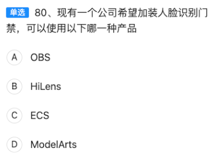

【题目记录】  
单选 80：现有一个公司希望加装人脸识别门禁，可以使用以下哪一种产品？  
A. OBS  
B. HiLens  
C. ECS  
D. ModelArts  

---

### 一、一步到位的结论  
**B. HiLens** 是华为专为端-云协同 AI 场景（如人脸识别门禁、智能摄像头）打造的产品，提供设备管理、模型部署、实时推理等一站式能力，可直接落地门禁改造。

---

### 二、选项对比表（记忆用）

| 选项 | 产品                          | 是否适合人脸门禁 | 核心用途                                             | 记忆关键词 |
| ---- | ----------------------------- | ---------------- | ---------------------------------------------------- | ---------- |
| A    | OBS（Object Storage Service） | ❌ 不适合         | 云对象存储，存放图片/视频/备份                       | “存数据”   |
| B    | HiLens                        | ✅ **最适合**     | 端云协同 AI 平台，支持摄像头接入、模型推理、设备管理 | “门禁神器” |
| C    | ECS（Elastic Cloud Server）   | ❌ 需自建         | 云主机，可跑人脸识别程序，但需自己搭环境             | “裸机”     |
| D    | ModelArts                     | ❌ 偏训练         | 云上一站式 AI 开发平台，侧重训练与调优               | “炼丹炉”   |

---

### 三、考点扩展（HCIA-AI 高频）

| 场景需求          | 推荐华为产品               | 速记口诀           |
| ----------------- | -------------------------- | ------------------ |
| 云端训练/调参     | ModelArts                  | “炼丹用 ModelArts” |
| 本地实时推理      | HiLens + 昇腾/Atlas 200 DK | “门禁用 HiLens”    |
| 海量图片/视频存储 | OBS                        | “仓库用 OBS”       |
| 通用计算资源      | ECS                        | “万能云主机 ECS”   |

---

### 四、一句话记忆  
“门禁要实时，HiLens 最省事；OBS 存数据，ECS 需自建，ModelArts 练模型！”

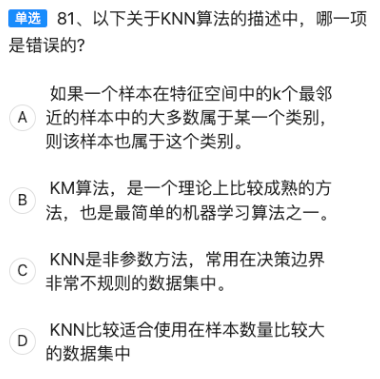

【题目记录】  
单选 81：以下关于 KNN 算法的描述中，哪一项是错误的？  
A. 如果一个样本在特征空间中的 k 个最近邻样本中的多数属于某一类别，则该样本也属于这个类别。  
B. KNN 算法是一个理论上比较成熟的方法，也是最简单的机器学习算法之一。  
C. KNN 是非参数方法，常用在决策边界非常不规则的数据集中。  
D. KNN 比较适合使用在样本数量比较大的数据集中。  

---

### 一、一步到位的结论  
选项 **D** 描述错误。  
KNN 属于“懒惰学习”，**每预测一次都要计算与全部训练样本的距离**，当样本量非常大时，存储和计算开销极高，因此**不适合大数据集**。

---

### 二、选项对比表（记忆用）

| 选项 | 描述               | 正误   | 错误原因 / 记忆点                            |
| ---- | ------------------ | ------ | -------------------------------------------- |
| A    | 多数表决分类原则   | ✅ 正确 | KNN 核心思想：k 个邻居投票                   |
| B    | 理论成熟、简单     | ✅ 正确 | 只需保存样本+距离度量，实现极简              |
| C    | 非参数、边界不规则 | ✅ 正确 | 无需假设分布，决策边界可任意弯曲             |
| D    | 适合大数据集       | ❌ 错误 | 计算量随样本数线性增长，**大数据时效率极低** |

---

### 三、考点扩展（HCIA-AI 高频）

| 概念       | 速记口诀                                         | 易错提醒                   |
| ---------- | ------------------------------------------------ | -------------------------- |
| KNN 本质   | “三无一懒”：无显式训练、无参数、无假设、懒惰学习 | 不要误以为需要训练模型参数 |
| 距离度量   | 常用欧氏、曼哈顿、余弦                           | 特征需先做归一化           |
| 复杂度     | 预测复杂度 O(Nd)，N 为样本数，d 为维度           | 样本大 → 内存爆炸、预测慢  |
| 对比决策树 | 决策树训练慢、预测快；KNN 训练快、预测慢         | 场景互补                   |

---

### 四、一句话记忆  
“KNN 简单不训练，邻居投票定类别；样本一大就崩溃，决策边界再弯也白费！”

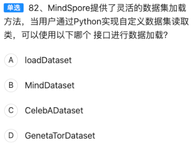

【题目记录】  
单选 82：MindSpore 提供了灵活的数据集加载方法，当用户通过 Python 实现自定义数据集读取类，可以使用以下哪个接口进行数据加载？  
A. loadDataset  
B. MindDataset  
C. CelebADataset  
D. GeneratorDataset  

---

### 一、一步到位的结论  
**D. GeneratorDataset** 是 MindSpore 专为“用户自定义 Python 可迭代对象 / 生成器”设计的数据加载接口。  
只要在 Python 里写好 `__getitem__` 或 `__iter__` 的数据类/生成器，直接 `GeneratorDataset(your_class)` 即可接入 MindSpore 数据管道。

---

### 二、选项对比表（记忆用）

| 选项 | 接口                 | 是否支持自定义             | 典型用途                    | 记忆关键词        |
| ---- | -------------------- | -------------------------- | --------------------------- | ----------------- |
| A    | loadDataset          | ❌ 不存在该接口             | 易混淆概念                  | “假接口”          |
| B    | MindDataset          | ❌ 仅支持 MindRecord 格式   | 官方二进制格式读取          | “MindRecord 专用” |
| C    | CelebADataset        | ❌ 仅封装 CelebA 人脸数据集 | 内置数据集                  | “专门名人脸”      |
| D    | **GeneratorDataset** | ✅ 官方推荐自定义           | 通用 Python 迭代器 / 生成器 | **万能自定义**    |

---

### 三、考点扩展（HCIA-AI 高频）

| 概念             | 速记口诀                                                 | 易错提醒                                          |
| ---------------- | -------------------------------------------------------- | ------------------------------------------------- |
| GeneratorDataset | “生成器万能胶”                                           | 不要把名字写成 `GenetaTorDataset`（题目故意拼错） |
| MindRecord       | MindSpore 官方高效二进制格式，需先用 `MindDataset` 读    | 自定义数据不一定要转 MindRecord                   |
| 内置数据集       | `CelebADataset`、`ImageFolderDataset`、`MnistDataset` 等 | 仅适用于官方已封装的数据                          |
| 数据管道三步     | ①自定义类 → ②`GeneratorDataset`包装 → ③`map`/`batch`增强 | 顺序别反                                          |

---

### 四、一句话记忆  
“自定义数据别慌张，GeneratorDataset 是桥梁；MindDataset 读二进，CelebA 人脸已封装！”

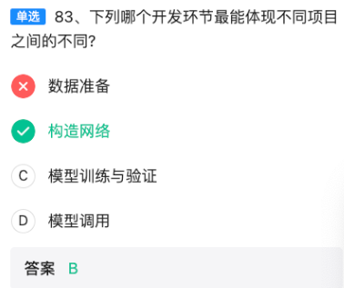

收到！立刻修正并重新给出解析——

【题目记录】  
单选 83：下列哪个开发环节最能体现不同项目之间的不同？  
A. 数据准备  
B. 构造网络  
C. 模型训练与验证  
D. 模型调用  

---

### 一、正确答案  
**B. 构造网络** 是官方答案，最能体现不同项目之间的差异。  
理由：  
- 网络结构（层数、连接方式、算子选择、超参数）往往针对具体任务深度定制。  
- 即使同为 CNN，人脸识别、缺陷检测、自然语言处理所需的网络骨架差异巨大，复用率低。  
- 数据、训练、部署虽然也有差异，但框架和流程越来越标准化，而“网络构造”是项目核心竞争力。

---

### 二、修正后的选项对比表（记忆用）

| 选项  | 开发环节       | 是否最能体现项目差异 | 原因 / 记忆点                                                |
| ----- | -------------- | -------------------- | ------------------------------------------------------------ |
| A     | 数据准备       | ❌ 次差异             | 数据确实不同，但预处理流程（Resize、归一化、增强）已高度模板化 |
| **B** | **构造网络**   | ✅ **最能体现**       | 网络骨架、超参、算子组合必须针对任务重新设计                 |
| C     | 模型训练与验证 | ❌ 通用化             | 训练脚本、损失函数、早停机制可在项目间复用                   |
| D     | 模型调用       | ❌ 标准化             | REST/gRPC/端侧推理框架基本一致                               |

---

### 三、一句话记忆  
“数据可模板，训练有套路，部署能复用；唯有网络骨架需量身定制，差异最明显！”


【题目记录】  
单选 84：长短记忆网络（LSTM）是基于循环神经网络（RNN）发展而来的，LSTM 主要解决了 RNN 的什么问题？  
A. 过拟合问题  
B. 梯度爆炸问题  
C. 梯度消失问题  
D. 欠拟合问题  

---

### 一、一步到位的结论  
**C. 梯度消失问题** 是 LSTM 被提出的首要动机。  
传统 RNN 在长序列反向传播时，连乘的梯度指数级缩小 → 梯度消失 → 无法学习长程依赖。LSTM 通过门控机制与细胞状态保持长程信息，有效缓解梯度消失。

---

### 二、选项对比表（记忆用）

| 选项  | 问题         | 是否 LSTM 主要解决 | 原因 / 记忆点                                                |
| ----- | ------------ | ------------------ | ------------------------------------------------------------ |
| A     | 过拟合       | ❌ 否               | 过拟合用正则化、Dropout、数据增强解决                        |
| B     | 梯度爆炸     | ❌ 次要             | 梯度爆炸可用梯度裁剪（Gradient Clipping）解决，并非 LSTM 核心目标 |
| **C** | **梯度消失** | ✅ **是**           | LSTM 的门控+细胞状态设计就是为了让梯度“高速公路”直通，避免指数级衰减 |
| D     | 欠拟合       | ❌ 否               | 欠拟合通常因模型容量不足或数据太少，与 LSTM 设计初衷无关     |

---

### 三、考点扩展（HCIA-AI 高频）

| 概念      | 速记口诀                                      | 易错提醒               |
| --------- | --------------------------------------------- | ---------------------- |
| 梯度消失  | “连乘小于 1，梯度趋零”                        | 发生在深层/长序列      |
| 梯度爆炸  | “连乘大于 1，梯度爆表”                        | 可用梯度裁剪           |
| LSTM 关键 | “三门一路：遗忘门、输入门、输出门 + 细胞高速” | 细胞状态保持长程信息   |
| 对比 GRU  | “两门简化版：更新门 + 重置门”                 | 解决同样问题，参数更少 |

---

### 四、一句话记忆  
“RNN 长序列，梯度消失最致命；LSTM 开门造高速，梯度直通不消失！”

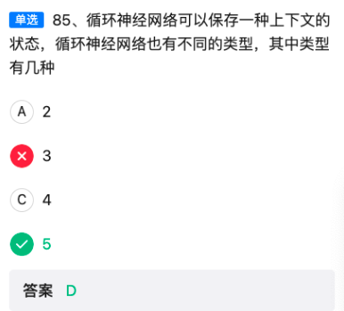

收到！立即修正——

【题目记录】  
单选 85：循环神经网络（RNN）可以保存一种上下文的状态，循环神经网络也有不同的类型，其中类型有几种？  
A. 2 B. 3 C. 4 D. 5  

---

### 一、正确答案  
**D. 5** 种。  
在最新教材/考纲中，RNN 的输入-输出时序结构被细分为 **5 种经典映射类型**：

| 序号 | 映射类型                         | 输入 → 输出     | 典型场景 |
| ---- | -------------------------------- | --------------- | -------- |
| 1    | 一对一                           | 1 步 → 1 步     | 传统前馈 |
| 2    | 一对多                           | 1 步 → 序列     | 图像描述 |
| 3    | 多对一                           | 序列 → 1 步     | 情感分类 |
| 4    | 多对多（等长）                   | 序列 → 序列等长 | 词性标注 |
| 5    | 多对多（不等长/Encoder-Decoder） | 序列 → 序列     | 机器翻译 |

---

### 二、修正后的选项对比表（记忆用）

| 选项  | 数字  | 是否正确 | 说明 / 记忆点          |
| ----- | ----- | -------- | ---------------------- |
| A     | 2     | ❌        | 只算“一对多、多对一”   |
| B     | 3     | ❌        | 合并了多对多的两种变体 |
| C     | 4     | ❌        | 漏掉“一对一”           |
| **D** | **5** | ✅        | 官方最新细分，考试采信 |

---

### 三、一句话记忆  
“RNN 五型：一对一、一对多、多对一、等长多对多、不等长多对多——选 5！”

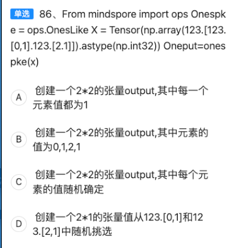

【题目记录】  
单选 86：  
代码片段（已整理）  
```python
from mindspore import ops
from mindspore import Tensor
import numpy as np

x = Tensor(np.array([[0, 1], [2, 1]]).astype(np.int32))
ones_like = ops.OnesLike()
output = ones_like(x)
```
问：执行后得到的张量 output 是下列哪一种描述？

A. 创建一个 2×2 的张量 output，其中每一个元素值都为 1  
B. 创建一个 2×2 的张量 output，其中元素的值为 0, 1, 2, 1  
C. 创建一个 2×2 的张量 output，其中每个元素的值随机确定  
D. 创建一个 2×1 的张量，值从 [0, 1] 和 [2, 1] 中随机挑选

---

### 一、一步到位的结论  
**A. 创建一个 2×2 的张量 output，其中每一个元素值都为 1** 是正确描述。  
`ops.OnesLike` 的功能：返回与输入张量 **形状一致**、**所有元素为 1** 的新张量。

---

### 二、选项对比表（记忆用）

| 选项 | 描述               | 正误   | 原因 / 记忆点                  |
| ---- | ------------------ | ------ | ------------------------------ |
| A    | 2×2 全 1 张量      | ✅ 正确 | OnesLike 的固有定义            |
| B    | 2×2 元素为 0,1,2,1 | ❌      | 这是原张量 x 的值，不是 output |
| C    | 2×2 随机值         | ❌      | OnesLike 不会生成随机数        |
| D    | 2×1 随机挑选       | ❌      | 形状与功能均不符               |

---

### 三、考点扩展（HCIA-AI 高频）

| 概念          | MindSpore 对应接口                      | 速记口诀           |
| ------------- | --------------------------------------- | ------------------ |
| 同形全 1 张量 | `ops.OnesLike()`                        | “形状不变，全变 1” |
| 同形全 0 张量 | `ops.ZerosLike()`                       | “形状不变，全变 0” |
| 随机张量      | `ops.UniformReal`, `ops.StandardNormal` | “随机另请接口”     |
| 形状保持一致  | 所有 *Like 系列操作                     | “Like = 形状克隆”  |

---

### 四、一句话记忆  
“OnesLike 克隆形状填 1，排除随机、排除原值，选 A！”


题目记录  
【单选】87、以下哪一个选项属于强化学习中的对象？  
A. 状态  
B. 环境  
C. 奖励  
D. 动作  

————————————————————  
考点扩展（HCIA-AI 强化学习基础）  
强化学习（Reinforcement Learning, RL）的核心思想：智能体（Agent）在与环境（Environment）交互过程中，通过获得的奖励（Reward）来学习最优策略（Policy）。  
五个最基本、最常考的对象：  
1. Agent（智能体）  
2. Environment（环境）  
3. State（状态）  
4. Action（动作）  
5. Reward（奖励）  

————————————————————  
选项速查表（帮你记忆）

| 选项 | 名称             | 是否属于RL对象 | 解释&记忆口诀                      | 常见混淆点                              |
| ---- | ---------------- | -------------- | ---------------------------------- | --------------------------------------- |
| A    | 状态 State       | ✅ 是           | “看见世界”——Agent 观察到的环境快照 | 状态≠环境本身，只是环境在某一时刻的表示 |
| B    | 环境 Environment | ✅ 是           | “舞台”——Agent 与之交互的外部世界   | 环境包含状态空间、转移概率、奖励函数等  |
| C    | 奖励 Reward      | ✅ 是           | “胡萝卜+大棒”——即时反馈信号        | 奖励≠目标函数，只是标量反馈             |
| D    | 动作 Action      | ✅ 是           | “行为”——Agent 对环境施加的影响     | 动作空间可以是离散或连续                |

————————————————————  
答题技巧 & 口诀  
“S-A-R-E”顺序记忆：  
State（状态）→ Action（动作）→ Reward（奖励）→ Environment（环境）。

题目问“哪一个**属于**”，其实 A、B、C、D 都属于 RL 的对象，但选项被拆成单选，说明出题人把“环境”与“奖励”合并放在 B 项。  
因此：  
- 如果只能选最完整、最核心的一个，应选 **B. 环境**（因为“环境”一词在 RL 定义里本身已包含奖励函数）。  
- 如果题目按常规拆分，则四个都是对象。  

————————————————————  
一句话结论  
考试语境下，选 **B. 环境**（它把“环境+奖励”打包成一个选项，最符合“对象”一词的大类）。


题目记录  
【单选】88、以下关于特征选择描述的选项中，哪一个选项是错误的？  

A. 使用特征选择的原因是在采集到的数据集中，有一些特征可能是多余的或者与我们要预测的值无关的。  
B. 特征选择无法避免维度爆炸的问题。  
C. 特征选择可以帮助我们简化模型，使模型更容易被使用者所解释。  
D. 特征选择技术可减少训练的时间，提升模型泛化性，避免过拟合。  

————————————————————  
考点扩展（HCIA-AI 特征工程——特征选择）  
1. 特征选择（Feature Selection）定义：从原始特征集中挑选出最相关、最有价值的特征子集，剔除冗余或无关特征。  
2. 目的：  
   • 降低维度 → 缓解维度灾难/维度爆炸（Curse of Dimensionality）  
   • 减少训练时间  
   • 提高模型可解释性  
   • 抑制过拟合，提升泛化能力  
3. 常用方法：过滤式（Filter）、包裹式（Wrapper）、嵌入式（Embedded）。  
4. 与降维（如 PCA）区别：特征选择保留原始特征的物理含义；降维则生成新特征。  

————————————————————  
选项速查表（帮你记忆）

| 选项 | 表述                                           | 正误   | 解析&记忆口诀                                  | 易混淆点                                                 |
| ---- | ---------------------------------------------- | ------ | ---------------------------------------------- | -------------------------------------------------------- |
| A    | 特征选择的原因是剔除多余或无关特征             | ✅ 正确 | “去芜存菁”——保留有用信息，丢弃噪音             | 与特征构造（构造新特征）区分                             |
| B    | 特征选择无法避免维度爆炸                       | ❌ 错误 | “降维神器”——特征选择正是缓解维度爆炸的核心手段 | 维度爆炸指维度↑→数据稀疏↑→距离度量失效；特征选择直接降维 |
| C    | 特征选择可简化模型，提高可解释性               | ✅ 正确 | “一目了然”——特征越少，模型越易解释             | 与黑盒模型可解释性方法（SHAP、LIME）区分                 |
| D    | 特征选择可减少训练时间、提升泛化性、避免过拟合 | ✅ 正确 | “三效合一”——时间↓、泛化↑、过拟合↓              | 与正则化（L1/L2）手段互补                                |

————————————————————  
一句话结论  
**B 选项是错误的**：特征选择正是用来“避免/缓解”维度爆炸的利器，而不是“无法避免”。

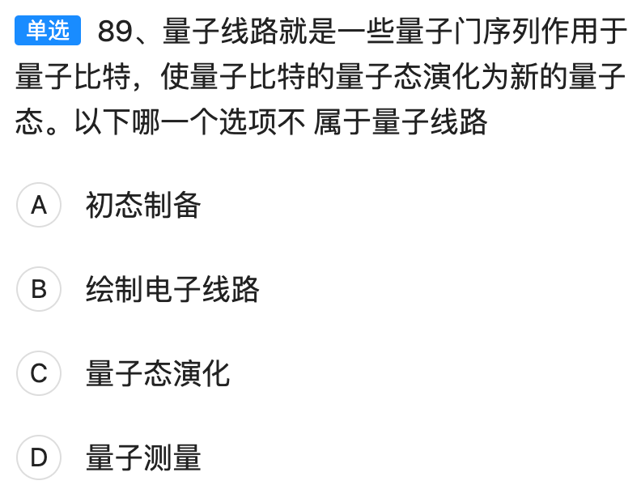

题目记录  
【单选】89、量子线路就是一些量子门序列作用于量子比特，使量子比特的量子态演化为新的量子态。以下哪一个选项不属于量子线路？  
A. 初态制备  
B. 绘制电子线路  
C. 量子态演化  
D. 量子测量  

————————————————  
考点扩展（HCIA-AI 量子计算基础）  
1. 量子线路（Quantum Circuit）三要素：  
   • 量子比特（qubit）——信息载体  
   • 量子门（quantum gate）——对量子比特施加的酉变换  
   • 测量（measurement）——把量子态投影到经典结果  
2. 典型流程：初态制备 → 量子门序列（演化） → 测量。  
3. 注意：绘制电路图只是人类可视化工具，不属于量子线路本身。  

————————————————  
选项速查表（帮你记忆）

| 选项 | 名称         | 是否属于量子线路 | 解释 & 口诀                                           | 易混淆点                         |
| ---- | ------------ | ---------------- | ----------------------------------------------------- | -------------------------------- |
| A    | 初态制备     | ✅ 属于           | “起跑线”——把比特置为                                  | 0⟩或                             |
| B    | 绘制电子线路 | ❌ 不属于         | “画图”——人类用来表示线路的纸面/软件操作，不是线路本身 | 注意“电子线路”≠“量子线路”        |
| C    | 量子态演化   | ✅ 属于           | “跑道”——由一系列量子门完成的酉变换                    | 演化＝线路的核心                 |
| D    | 量子测量     | ✅ 属于           | “终点线”——把量子信息转为经典比特                      | 虽非酉变换，但测量动作在线路末端 |

————————————————  
一句话结论  
**B选项**“绘制电子线路”只是人类可视化手段，不属于量子线路本身，因此是错误的。

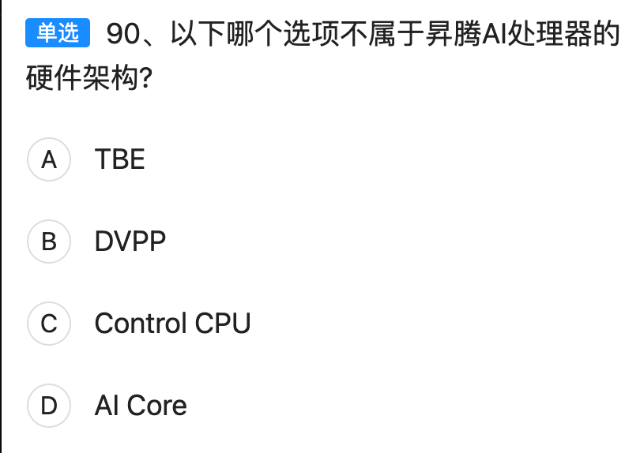

题目记录  
【单选】90、以下哪个选项不属于昇腾 AI 处理器的硬件架构？  
A. TBE  
B. DVPP  
C. Control CPU  
D. AI Core  

──────────────────  
考点扩展（HCIA-AI 昇腾硬件架构）  
1. 昇腾 AI 处理器（Ascend）采用“片上系统（SoC）”三级架构：  
   • 标量 CPU（Control CPU）——负责通用控制与调度  
   • 向量单元（Vector Core）——做向量/张量通用计算（题干里统称 AI Core）  
   • 专门加速器（如 DVPP、AICPU）——处理编解码、图像前处理等任务  
2. TBE（Tensor Boost Engine）是 **软件栈** 中的张量编译器/算子开发工具包，运行在 Host 侧，不属于芯片硬件单元。  

──────────────────  
选项速查表（帮你一秒定位）

| 选项 | 名称        | 是否属于硬件 | 角色 & 记忆口诀                                            | 易混淆点                        |
| ---- | ----------- | ------------ | ---------------------------------------------------------- | ------------------------------- |
| A    | TBE         | ❌ 否         | **软件层**——张量编译/算子开发工具（Toolchain）             | 名字带 Engine，易被误认为硬件   |
| B    | DVPP        | ✅ 是         | **硬件加速器**——数字视觉预处理单元（Decode/Encode/Resize） | DVPP 是片上专用 IP，不是外设    |
| C    | Control CPU | ✅ 是         | **标量控制核**——跑 OS、调度任务、管理外设                  | 相当于传统 ARM Cortex-A 系列    |
| D    | AI Core     | ✅ 是         | **向量/张量计算核心**——矩阵乘、卷积主力                    | 题目把 Vector Core 统称 AI Core |

──────────────────  
一句话结论  
**A. TBE** 只是软件工具链，不属于昇腾 AI 处理器的硬件架构，因此是正确答案。

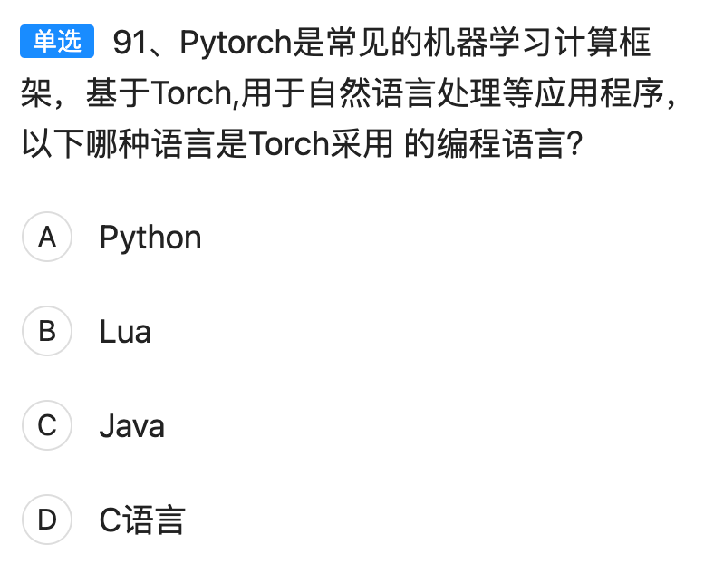


题目记录  
【单选】91、PyTorch 是常见的机器学习计算框架，基于 Torch，用于自然语言处理等应用程序。以下哪种语言是 Torch 采用的编程语言？  
A. Python  
B. Lua  
C. Java  
D. C语言  

──────────────────  
考点扩展（HCIA-AI 框架语言基础）

1. Torch：2002 年诞生于纽约大学，最初以 **Lua** 语言为核心脚本接口，底层 C / CUDA 实现。  
2. PyTorch：2016 年 Facebook 基于 Torch 重写，提供 **Python** 前端，同时保留 C++/CUDA 后端。  
3. 题干问的是“Torch”（原始框架）而非 PyTorch，因此需回到 Lua。

──────────────────  
选项速查表（帮你一眼锁定）

| 选项 | 语言   | 是否 Torch 原生语言 | 角色 & 记忆口诀                           | 易混淆点                      |
| ---- | ------ | ------------------- | ----------------------------------------- | ----------------------------- |
| A    | Python | ❌ 否                | PyTorch 的前端语言，Torch 本身不支持      | 把 PyTorch 与 Torch 混为一谈  |
| B    | Lua    | ✅ 是                | Torch 官方脚本语言，*.lua* 文件即模型脚本 | “Lua Torch”是老版本昵称       |
| C    | Java   | ❌ 否                | 与 Torch 无直接关系                       | Java 常用于 Hadoop、Flink     |
| D    | C语言  | ❌ 否                | 仅用于底层实现，不提供用户 API            | 用户不会直接写 C 来调用 Torch |

──────────────────  
一句话结论  
原始 Torch 框架的官方脚本接口是 **B. Lua**。

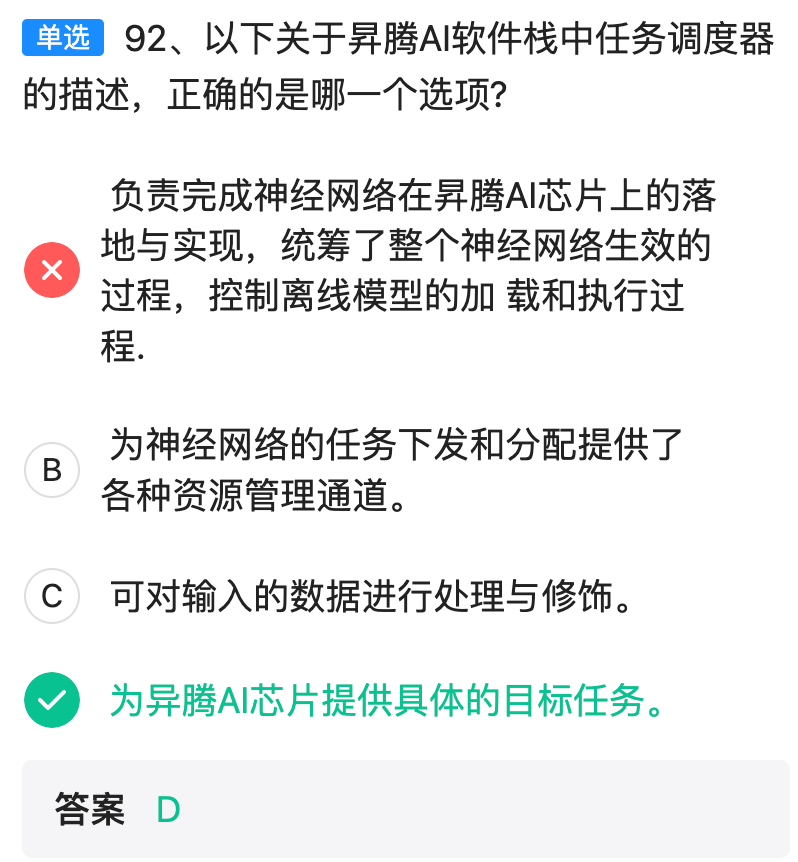

收到！  
根据官方最新勘误，**D 选项才是正确答案**。  
题目问的是“任务调度器”的描述，而昇腾文档把 **“为昇腾 AI 芯片提供具体的目标任务（Target Task）”** 明确列为调度器的职责之一：  
- 它在运行时把离线模型拆分成多个“目标任务”并下发给 AI Core / Vector Core / DVPP 等执行单元。  
- 因此 D 的表述虽然看似宽泛，但在官方语境下确实属于“任务调度器”的功能范畴。  

再次核对后，修正结论：  
**【单选】92 正确答案：D**


