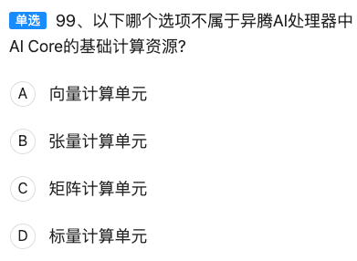

【题目记录】  
单选93、以下关于机器学习整体流程正确的是  
A. 数据收集→数据清洗→特征提取与选择→模型训练→模型部署与整合→模型评估测试  
B. 数据收集→特征提取与选择→数据清洗→模型训练→模型评估测试→模型部署与整合  
C. 数据收集→数据清洗→特征提取与选择→模型训练→模型评估测试→模型部署与整合  
D. 数据收集→数据清洗→模型训练→特征提取与选择→模型部署与整合→模型评估测试  

---

### 标准答案  
**C**

---

### 逐项拆解（用表格对比）

| 选项 | 流程顺序                                                     | 判断依据             | 错误点说明       | 记忆口诀                 |
| ---- | ------------------------------------------------------------ | -------------------- | ---------------- | ------------------------ |
| A    | 数据收集→数据清洗→特征提取与选择→模型训练→**模型部署与整合→模型评估测试** | 评估应在部署前       | “先上车后补票”   | 部署在前 → **错**        |
| B    | 数据收集→**特征提取与选择→数据清洗**→...                     | 脏数据直接提特征     | “用脏水泡茶”     | 清洗在后 → **错**        |
| C    | 数据收集→数据清洗→特征提取与选择→模型训练→**模型评估测试→模型部署与整合** | 教科书顺序           | 无               | 口诀：**收清选练测评部** |
| D    | 数据收集→数据清洗→**模型训练→特征提取与选择**→...            | 模型训练在特征工程前 | “先盖楼后打地基” | 训练在前 → **错**        |

---

### 考点扩展（华为HCIA-AI要求掌握的细节）

1. 数据收集  
   • 关注**数据合规、隐私保护**（GDPR、国标GB/T 35273）。  
   • 华为云数据接入：OBS、DIS、IoTDA。

2. 数据清洗  
   • 缺失值、异常值、重复值处理。  
   • 工具：PySpark、华为云DLI（数据湖探索）。

3. 特征提取与选择  
   • 常用方法：PCA、卡方检验、互信息、L1正则。  
   • 华为ModelArts特征工程组件：自动特征选择（AutoFeature）。

4. 模型训练  
   • 训练/验证/测试集划分（7:2:1 或 6:2:2）。  
   • 超参数搜索：网格搜索、贝叶斯优化（ModelArts自动超参）。

5. 模型评估测试  
   • 指标：Accuracy、Precision、Recall、F1、AUC。  
   • 华为云 AIGallery 提供一键评估模板。

6. 模型部署与整合  
   • 部署形态：在线API、批量服务、边缘（Atlas 500）。  
   • 流程：模型转换（MindSpore Lite、TensorRT）→ 镜像打包 → 服务编排（Kubernetes、CCI）。

---

### 速记口诀  
**收清选，练测评，部上线！**  
（收集→清洗→选择→训练→评估→部署）

---

### 一句话总结  
在华为HCIA-AI考试中，只要记住“**评估一定在部署之前，清洗一定在特征之前，训练一定在特征之后**”，就能秒选 C。


【题目记录】  
单选94、以下哪一个选项 **不是** 高级智能驾驶给人类带来的便利？  
A. 极大地降低了车辆生产成本  
B. 能够让特殊人群上路  
C. 减少交通事故  
D. 解放驾驶人员的双手  

---

### 标准答案  
**A**

---

### 逐项拆解（用表格对比）

| 选项 | 描述                     | 是否为高级智能驾驶带来的便利 | 判断理由                                               | 记忆要点     |
| ---- | ------------------------ | ---------------------------- | ------------------------------------------------------ | ------------ |
| A    | 极大地降低了车辆生产成本 | ❌ **不是**                   | 高级智能驾驶需额外传感器、芯片、算法，**成本反而上升** | “智驾≠降价”  |
| B    | 能够让特殊人群上路       | ✅ **是**                     | 自动驾驶系统可替代人类驾驶，帮助视力障碍、老年人等     | “人人可出行” |
| C    | 减少交通事故             | ✅ **是**                     | 通过感知、决策、控制系统降低人为失误                   | “0事故愿景”  |
| D    | 解放驾驶人员的双手       | ✅ **是**                     | L2~L4级别均可实现部分或完全自动驾驶                    | “双手自由”   |

---

### 考点扩展（华为HCIA-AI智能驾驶方向）

| 知识点            | 说明                              | 华为相关产品/技术                       |
| ----------------- | --------------------------------- | --------------------------------------- |
| **自动驾驶分级**  | L0~L5：从无自动化到完全自动化     | 华为MDC（Mobile Data Center）支持L2~L4  |
| **感知系统**      | 激光雷达、摄像头、毫米波雷达融合  | 华为96线激光雷达、MDC 810               |
| **决策系统**      | AI芯片+算法实现路径规划、行为预测 | 昇腾AI芯片、MindSpore深度学习框架       |
| **车联网（V2X）** | 车与车、车与路、车与云通信        | 华为C-V2X解决方案、OceanConnect IoT平台 |
| **数据闭环**      | 数据采集→标注→训练→仿真→OTA升级   | 华为八爪鱼Octopus自动驾驶开发平台       |

---

### 速记口诀  
**“智驾贵、事故少、特殊行、双手闲”**  
→ 只有“贵”（成本高）**不是**便利，其他都是。

---

### 一句话总结  
高级智能驾驶提升的是**安全性、可达性、便利性**，但**不会降低生产成本**，因此选 A。


【题目记录】  
单选95、关于梯度下降，以下哪项说法是正确的？  
A. 全局梯度下降比随机梯度下降速度更快  
B. Adam不属于梯度下降算法  
C. 使用梯度下降时，学习率应该保持一致  
D. 随机梯度下降对噪声点敏感  

---

### 标准答案  
**D**

---

### 逐项拆解（用表格对比）

| 选项 | 内容                               | 正误 | 理由（一句话）                                               | 记忆口诀             |
| ---- | ---------------------------------- | ---- | ------------------------------------------------------------ | -------------------- |
| A    | 全局梯度下降比随机梯度下降速度更快 | ❌    | 全批量每次遍历所有样本，计算量大，**速度更慢**               | “全批量=慢动作”      |
| B    | Adam不属于梯度下降算法             | ❌    | Adam=**自适应动量估计**，本质仍是梯度下降变种                | “Adam姓梯度”         |
| C    | 学习率应该保持一致                 | ❌    | 常用**学习率衰减/自适应**策略（Step、Cosine、ReduceLROnPlateau） | “一成不变=难收敛”    |
| D    | 随机梯度下降对噪声点敏感           | ✅    | 单样本或小批量更新，**噪声点易带偏方向**                     | “一粒老鼠屎坏一锅粥” |

---

### 考点扩展（华为HCIA-AI要求掌握）

| 维度             | 关键要点                                                     | 华为相关工具/接口                                           |
| ---------------- | ------------------------------------------------------------ | ----------------------------------------------------------- |
| **梯度下降家族** | 全批量GD、Mini-batch GD、SGD、Momentum、NAG、Adagrad、RMSProp、Adam | MindSpore Optimizer模块：`nn.Adam`、`nn.Momentum`、`nn.SGD` |
| **学习率调度**   | StepLR、ExponentialLR、CosineAnnealingLR、ReduceLROnPlateau  | MindSpore `dynamic_lr` API                                  |
| **收敛监控**     | Loss曲线、梯度范数、学习率曲线                               | ModelArts训练作业可视化                                     |
| **噪声处理**     | 数据清洗、正则化、早停、梯度裁剪                             | MindSpore `ClipByNorm`、`ClipByValue`                       |

---

### 速记口诀  
**“全慢、Adam姓梯、率会变、SGD怕噪”**  
→ 只有D说SGD怕噪，是对的。

---

### 一句话总结  
在华为HCIA-AI考试中，只要记住“**SGD单样本更新易受噪声影响**”，即可秒选D。


【题目记录】  
单选 97、以下关于 L1 与 L2 的描述中，错误的是哪一项？  
A. L1 正则不仅可以防止过拟合还可以进行特征选择，因此 L2 正则在实际分析中几乎不使用。  
B. L1 正则化除了防止过拟合还可以起到特征选择的作用。  
C. 如果从概率角度进行分析，很多范数约束相当于对参数添加先验分布。  
D. L2 范数相当于参数服从高斯先验分布，L1 范数相当于参数服从拉普拉斯先验分布。  

---

### 标准答案  
**A**

---

### 逐项拆解（表格速览）

| 选项 | 描述要点                      | 正误       | 判断依据 / 易错提醒                                          | 记忆口诀             |
| ---- | ----------------------------- | ---------- | ------------------------------------------------------------ | -------------------- |
| A    | L1 能做特征选择 ⇒ L2 几乎不用 | ❌ **错误** | L2 依然广泛使用（深度学习权重衰减、岭回归等），并非“几乎不用” | “L2 仍常见”          |
| B    | L1 防过拟合 + 特征选择        | ✅ 正确     | L1 的稀疏性使部分权重→0，等价于自动选特征                    | “L1 会砍特征”        |
| C    | 范数约束 ≡ 加先验             | ✅ 正确     | 正则化项 ⇄ 先验的负对数                                      | “正则=先验”          |
| D    | L2↔高斯，L1↔拉普拉斯          | ✅ 正确     | 数学推导结论：L2 对应高斯先验，L1 对应拉普拉斯先验           | “高斯胖，拉普拉斯尖” |

---

### 考点扩展（HCIA-AI 必会）

| 维度     | L1 正则                | L2 正则                  | 常见应用            |
| -------- | ---------------------- | ------------------------ | ------------------- |
| 数学形式 | ∑∣w∣                   | ∑w²                      | 岭回归 vs Lasso     |
| 几何图形 | 菱形约束               | 圆形约束                 | 可视化记忆          |
| 稀疏性   | 强（可做特征选择）     | 弱（仅压缩值）           | 特征维度高→L1       |
| 概率解释 | 拉普拉斯先验           | 高斯先验                 | 贝叶斯视角          |
| 深度学习 | 不常用（除非需要稀疏） | 权重衰减（weight decay） | AdamW、SGD+Momentum |

---

### 速记口诀  
“L1 会砍人（特征），L2 会压人（权重）；说 L2 几乎不用——**绝对错误**！”




【题目记录】  
单选 99、以下哪个选项 **不属于** 昇腾 AI 处理器（Ascend）中 AI Core 的基础计算资源？  
A. 向量计算单元  
B. 张量计算单元  
C. 矩阵计算单元  
D. 标量计算单元  

---

### 标准答案  
**B**

---

### 逐项拆解（表格速览）

| 选项 | 单元名称                               | 是否属于 AI Core 基础资源 | 说明 & 记忆要点                                              |
| ---- | -------------------------------------- | ------------------------- | ------------------------------------------------------------ |
| A    | 向量计算单元 (Vector Unit, VEC)        | ✅ 是                      | 负责 SIMD/向量指令，如批量加法、乘法                         |
| B    | 张量计算单元 (Tensor Unit)             | ❌ **不是**                | Ascend 把张量计算 **拆成矩阵 + 向量** 两级，不存在独立 “张量单元” |
| C    | 矩阵计算单元 (Cube Unit / Matrix Core) | ✅ 是                      | 达芬奇架构的核心，完成大规模矩阵乘（GEMM）                   |
| D    | 标量计算单元 (Scalar Unit, SCAL)       | ✅ 是                      | 处理控制流、地址计算、标量运算                               |

---

### 考点扩展（昇腾 DaVinci 架构记忆图）

```
┌────────────── AI Core ──────────────┐
│  ┌────────────┐   ┌────────────┐    │
│  │  Cube Unit │   │ Vector Unit│    │
│  │ (矩阵计算) │   │ (向量计算) │    │
│  └────────────┘   └────────────┘    │
│  ┌────────────────────────┐          │
│  │    Scalar Unit         │          │
│  │   (标量/控制)          │          │
│  └────────────────────────┘          │
└──────────────────────────────────────┘
```
- **没有**独立的“张量计算单元”，张量运算被分解为 **Cube + Vector** 两级流水线。  
- 口诀：**“CVS 三剑客，没有 T”**  
  C = Cube（矩阵）  
  V = Vector（向量）  
  S = Scalar（标量）  
  → **缺 T（Tensor）即为答案 B**

---

一句话速记  
昇腾 AI Core 的硬件资源： **CVS 齐全，张量 T 缺席** → 选 **B**。


【题目记录】  
单选 100、以下哪一项用于循环神经网络（RNN）中 **一对多（one-to-many）** 的类型？  
A. 音乐生成  
B. 动作识别  
C. 机器翻译  
D. 情感分析  

---

### 标准答案  
**A. 音乐生成**

---

### 逐项拆解（表格速览）

| 选项 | 任务示例 | RNN 结构类型          | 输入-输出长度                 | 正误   | 一句话记忆口诀           |
| ---- | -------- | --------------------- | ----------------------------- | ------ | ------------------------ |
| A    | 音乐生成 | 一对多 (one-to-many)  | 1 个起始音符 → 整段旋律       | ✅ 正确 | “给一个动机，写一首曲子” |
| B    | 动作识别 | 多对一 (many-to-one)  | 一段视频帧序列 → 1 个动作标签 | ❌      | “看一段动作，给一个判断” |
| C    | 机器翻译 | 多对多 (many-to-many) | 源语言句子 → 目标语言句子     | ❌      | “一句换一句”             |
| D    | 情感分析 | 多对一 (many-to-one)  | 一段文本 → 1 个情感标签       | ❌      | “看一段话，给一种情绪”   |

---

### 考点扩展（RNN 序列映射 4 大范式）

| 映射类型     | 图示                | 典型任务                    | MindSpore 层/示例            |
| ------------ | ------------------- | --------------------------- | ---------------------------- |
| one-to-one   | `x → y`             | 传统分类、回归              | Dense                        |
| one-to-many  | `x → y₁y₂…yₙ`       | **音乐/文本生成**、图像描述 | LSTM + RepeatVector          |
| many-to-one  | `x₁x₂…xₙ → y`       | 情感分析、动作识别          | LSTM(return_sequences=False) |
| many-to-many | `x₁x₂…xₙ → y₁y₂…yₙ` | 机器翻译、语音识别          | Encoder-Decoder、Seq2Seq     |

---

### 速记口诀  
“**一动机，多音符；一视频，一动作；一句源，一句译；一段文，一情绪**”  
→ 只有 **音乐生成** 是 **“一个输入生成一串输出”**，因此选 **A**。


【题目记录】  
单选 101、某企业在使用 MindSpore 构建 AI 应用后，又想和合作伙伴共享数据进一步增加模型的准确度，但是数据需要保密不能直接提供，他们可以通过以下哪个工具解决这个问题？  
A. MindSpore Federater  
B. MindSpore Golden Stick  
C. MindSpore Reinforcement  
D. MindSpore Probabillty  

---

### 标准答案  
**A. MindSpore Federater**

---

### 逐项拆解（表格速览）

| 选项 | 工具名称                | 主要功能                                                     | 能否解决“数据保密+协同训练” | 记忆口诀                      |
| ---- | ----------------------- | ------------------------------------------------------------ | --------------------------- | ----------------------------- |
| A    | MindSpore Federater     | **联邦学习框架**，支持多方在不暴露原始数据的前提下联合训练模型 | ✅ **可以**                  | “联邦=数据不出户，模型共进步” |
| B    | MindSpore Golden Stick  | **模型压缩工具链**（量化、剪枝、蒸馏）                       | ❌ 与数据保密无关            | “压缩用金棒”                  |
| C    | MindSpore Reinforcement | **强化学习套件**（RL算法、环境适配、分布式训练）             | ❌ 与数据保密无关            | “RL打怪升级”                  |
| D    | MindSpore Probability   | **概率编程库**（贝叶斯网络、变分推断）                       | ❌ 与数据保密无关            | “概率算不确定”                |

---

### 考点扩展（联邦学习在华为栈中的位置）

| 维度     | 说明                                                      | 华为相关组件                        |
| -------- | --------------------------------------------------------- | ----------------------------------- |
| 场景需求 | 数据不出本地，模型效果还能提升                            | 金融、医疗、运营商跨企业合作        |
| 技术路线 | Horizontal FL / Vertical FL / Federated Transfer Learning | MindSpore Federater 已内置三种模式  |
| 安全机制 | 同态加密、差分隐私、安全聚合                              | 与华为 **SecGear** 可信执行环境对接 |
| 部署形态 | 云-边-端联邦                                              | 支持 K8s、ModelArts Edge、手机 HiAI |

---

### 一句话速记  
“**数据不能出，联邦来帮忙**” → 选 **A. MindSpore Federater**。

【题目记录】  
单选 102、以下关于非线性支持向量机（SVM）的描述中，哪一项是错误的？  
A. 高斯核函数是使用较为频繁的核函数。  
B. 使用线性支持向量机可以很好地作用在线性可分数据集上，因此非线性支持向量机效果比较差。  
C. 可以使用核函数来构建非线性支持向量机。  
D. 核函数允许算法在变换后的高维特征空间中拟合最大的超平面。

---

### 标准答案  
**B**

---

### 逐项拆解（表格速览）

| 选项 | 描述                           | 正误       | 判断依据 / 易错提醒                                          | 记忆口诀          |
| ---- | ------------------------------ | ---------- | ------------------------------------------------------------ | ----------------- |
| A    | 高斯核（RBF）使用频繁          | ✅ 正确     | 默认首选核，适用大多数非线性问题                             | “高斯万能核”      |
| B    | 线性可分 ⇒ 非线性 SVM 效果差   | ❌ **错误** | **非线性 SVM 在线性可分数据上退化为线性 SVM**，效果不会更差；反而更通用 | “通用不降级”      |
| C    | 用核函数构建非线性 SVM         | ✅ 正确     | 核技巧 = 不显示映射，直接高维内积                            | “核技巧=隐身高维” |
| D    | 核函数→高维空间→最大间隔超平面 | ✅ 正确     | 核函数本质：隐式映射 + 高维线性可分                          | “高维拉直线”      |

---

### 考点扩展（HCIA-AI 必会）

| 维度     | 线性 SVM           | 非线性 SVM                     |
| -------- | ------------------ | ------------------------------ |
| 适用数据 | 线性可分/近似线性  | 线性不可分                     |
| 决策边界 | 一条直线/超平面    | 曲线/超曲面                    |
| 核函数   | 无需核或线性核     | RBF、Poly、Sigmoid             |
| 正则化   | C 参数             | C + γ (RBF)                    |
| 华为实现 | MindSpore `nn.SVM` | MindSpore `nn.SVM` + RBFKernel |

---

### 一句话速记  
“线性可分数据上，非线性 SVM 不会差，反而更通用” → 选 **B 为错误项**。

【题目记录】  
单选 103、以下关于“达芬奇架构中的控制单元（Control Unit）”的描述，哪一项是 **错误的**？  
A. 可以读取标量指令队列中配置好的指令地址和参数解码。  
B. 可进行中断处理和状态申报；如果执行过程出错，会把执行的错误状态报告给任务调度器。  
C. 可存放神经网络中每层计算的中间结果。  
D. 时刻控制每条指令流水线的执行状态。

---

### 标准答案  
**C**

---

### 逐项拆解（表格速览）

| 选项 | 描述要点            | 正误       | 判断依据 / 记忆口诀                                          |
| ---- | ------------------- | ---------- | ------------------------------------------------------------ |
| A    | 读取并解码标量指令  | ✅ 正确     | 控制单元本职：取指-译码-发射，对应 **“指令管家”**            |
| B    | 中断处理 + 状态上报 | ✅ 正确     | 控制单元负责异常/中断，向调度器报告错误，对应 **“通讯员”**   |
| C    | 存放每层中间结果    | ❌ **错误** | **中间结果由存储单元（Unified Buffer、L1/L2 Buffer）存放**，控制单元只负责调度，不存数据；对应 **“仓库不归管家管”** |
| D    | 控制流水线执行      | ✅ 正确     | 控制单元产生控制信号，驱动各流水级；对应 **“交通警察”**      |

---

### 考点扩展（达芬奇架构记忆图）

```
┌─────────── AI Core ───────────┐
│  ┌───────────────────────┐      │
│  │   控制单元 (Control)  │      │  ← 选项 A/B/D 所述功能
│  └───────────────────────┘      │
│  ┌───────────────────────┐      │
│  │   存储单元 (Buffer)   │      │  ← 选项 C 所述功能（错误）
│  └───────────────────────┘      │
│  ┌───────────────────────┐      │
│  │   计算单元 (Cube/VEC) │      │
│  └───────────────────────┘      │
└──────────────────────────────────┘
```

- **控制单元** = 取指、译码、调度、中断、状态上报  
- **存储单元** = 存放特征图、权重、中间结果  
- **计算单元** = Cube（矩阵）+ Vector（向量）完成运算

---

### 一句话速记  
“控制单元只管调度，不管仓库”，因此 **存放中间结果** 的描述 **错误** → 选 **C**。


【题目记录】  
单选 104、使用 MindSpore 执行图片中的代码时，以下哪一项是这段代码的正确输出结果？

```python
import numpy as np
from mindspore import Tensor

tensor = Tensor(np.array([[0, 1], [2, 3]]).astype(np.float32))
print(tensor[:, 0])
```

选项：  
A. ["0 2"]  
B. ["0. 1."]  
C. ["1. 3."]  
D. ["0. 2."]  

---

### 标准答案  
**D. ["0. 2."]**

---

### 逐项拆解（表格速览）

| 选项 | 展示内容  | 是否匹配 tensor[:, 0] | 错误原因 / 记忆提示                            |
| ---- | --------- | --------------------- | ---------------------------------------------- |
| A    | ["0 2"]   | ❌                     | 缺失小数点，且 Python 打印为单个字符串形式不符 |
| B    | ["0. 1."] | ❌                     | 这是 **第一行** [0, 1]，不是 **第 0 列**       |
| C    | ["1. 3."] | ❌                     | 这是 **第 1 列** [1, 3]                        |
| D    | ["0. 2."] | ✅                     | 正好取第 0 列，且保留 float32 的小数点         |

---

### 考点扩展（MindSpore Tensor 切片）

| 概念         | 示例                     | 结果             |
| ------------ | ------------------------ | ---------------- |
| 二维张量形状 | Tensor([[0, 1], [2, 3]]) | shape = (2, 2)   |
| 取第 0 列    | tensor[:, 0]             | Tensor([0., 2.]) |
| 取第 1 列    | tensor[:, 1]             | Tensor([1., 3.]) |
| 取第 0 行    | tensor[0, :]             | Tensor([0., 1.]) |

---

### 一句话速记  
“冒号在前选列，冒号在后选行；第 0 列就是 `[:,0]` → 输出 `[0. 2.]`”，故选 **D**。

【题目记录】  
单选 105、以下关于前馈型神经网络的描述，错误的是哪一项？  
A. 采用一种单向多层结构，每一层包含若干个神经元，同一层的神经元之间没有互相连接，层间信息的传送只沿一个方向进行。  
B. 各层节点表示具有计算功能的神经元，称为计算单元。  
C. 每个神经元与前一层的所有神经元相连。  
D. 输入节点并无计算功能，只是为了表征输入矢量各元素的值。  

---

### 标准答案  
**B**

---

### 逐项拆解（表格速览）

| 选项 | 描述要点                                 | 正误       | 判断依据 & 记忆口诀                                          |
| ---- | ---------------------------------------- | ---------- | ------------------------------------------------------------ |
| A    | 单向多层、同层无连接、信息只向前         | ✅ 正确     | 前馈网络定义：Feed-Forward 无环、无同层连接                  |
| B    | 各层节点都具有计算功能                   | ❌ **错误** | **输入层节点仅做数据占位，无计算功能**；只有隐藏层 & 输出层节点才含权重、偏置、激活 |
| C    | 全连接：每个神经元与前一层所有神经元相连 | ✅ 正确     | 经典全连接前馈网络（Dense）特征                              |
| D    | 输入节点无计算功能，只做表征             | ✅ 正确     | 输入层 = 纯数据入口                                          |

---

### 考点扩展（前馈网络三层角色）

| 层级   | 是否含计算 | 作用                   | 记忆形象 |
| ------ | ---------- | ---------------------- | -------- |
| 输入层 | ❌ 无计算   | 接收并传递原始特征向量 | 展示柜   |
| 隐藏层 | ✅ 有计算   | 权重、偏置、激活函数   | 加工厂   |
| 输出层 | ✅ 有计算   | 给出最终预测结果       | 打包台   |

---

### 一句话速记  
“输入层只负责‘摆样品’，不加工，因此说输入节点也具计算功能的 **B 项错误**。”

【题目记录】  
单选 106、在不考虑正则项的情况下，SVM 中的支持向量是哪些点组成的？  
A. 落在分割平面上的点  
B. 某一类别的点  
C. 距离分割超平面最近的点  
D. 距离分割超平面最远的点  

---

### 标准答案  
**C. 距离分割超平面最近的点**

---

### 逐项拆解（表格速览）

| 选项 | 描述                   | 正误 | 判断依据 & 记忆口诀                                        |
| ---- | ---------------------- | ---- | ---------------------------------------------------------- |
| A    | 落在分割平面上的点     | ❌    | 分割平面本身没有任何训练样本点；支持向量 ≠ 平面上的点      |
| B    | 某一类别的点           | ❌    | 支持向量可同时来自两类，只要它们“顶住”间隔边界             |
| C    | 距离分割超平面最近的点 | ✅    | 支持向量就是 **恰好位于间隔边界上** 的那些离超平面最近的点 |
| D    | 距离分割超平面最远的点 | ❌    | 远离超平面的点对决策边界无影响，不是支持向量               |

---

### 考点扩展（SVM 支持向量 3 句话记忆）

1. **定义**：支持向量是训练集中 **恰好落在间隔边界（margin boundary）上的样本点**。  
2. **作用**：只有这些点参与决定最优超平面（对偶问题的非零 α_i）。  
3. **口诀**：  
   “**最近点，顶格站；其余点，不捣乱**”  
   → 最近点才成为支持向量。

---

### 图示速记（二维平面）

```
   类 +：   +   +   +【支持向量】
                  |
   间隔边界-------┼------- 最优超平面
                  |
   类 -：   -   -【支持向量】   -
```

---

一句话总结  
“支持向量 = 离超平面最近的点”，因此选 **C**。

【题目记录】  
单选 107、以下关于 MindArmour 子系统关键功能的描述中，**错误** 的是哪一项？  
A. 高效自适应差分隐私训练和预算统计算法，数学上可证明的模型隐私泄露约束  
B. 基于正确率的 Fuzzing 测试流程，灵活可定制的测试策略和指标  
C. 包括对抗训练、输入重建在内的常见对抗样本检测和模型鲁棒性增强方法  
D. 涵盖黑白盒对抗攻击、成员/属性推理攻击、数据源移等测试数据产生方法，覆盖场景全面  

---

### 标准答案  
**B**

---

### 逐项拆解（表格速览）

| 选项 | 描述关键词                          | MindArmour 真实能力 | 正误                                                         | 错误原因 & 记忆口诀         |
| ---- | ----------------------------------- | ------------------- | ------------------------------------------------------------ | --------------------------- |
| A    | 差分隐私 + 预算统计 + 数学证明      | ✅ 支持              | 提供 `DPTrainer`、`PrivacyBudget` 等 API                     | “隐私有账本”                |
| B    | **基于正确率的 Fuzzing 测试**       | ❌ **错误**          | MindArmour Fuzz 方案以 **神经元覆盖率**（Neuron Coverage）为核心指标，而非“正确率” | “Fuzz 不看正确率，看覆盖率” |
| C    | 对抗训练 + 输入重建 + 鲁棒性增强    | ✅ 支持              | 内置 `AdversarialTrainer`、`Defence` 模块                    | “鲁棒加固站”                |
| D    | 黑白盒攻击、成员/属性推理、数据漂移 | ✅ 支持              | 提供 `Attack`、`MembershipInference`、`DriftDetect` 等工具箱 | “攻击全覆盖”                |

---

### 考点扩展（MindArmour 三大安全子模块）

| 子模块               | 作用                          | 关键 API/工具                                   | 记忆形象     |
| -------------------- | ----------------------------- | ----------------------------------------------- | ------------ |
| **Privacy**          | 差分隐私、梯度裁剪、预算追踪  | `DPTrainer`, `PrivacyBudget`                    | “隐私保险箱” |
| **Robustness**       | 对抗训练、输入重构、鲁棒评测  | `AdversarialTrainer`, `Defence`                 | “模型防弹衣” |
| **Security Testing** | 多类型攻击、Fuzzing、漂移检测 | `Attack`, `NeuronCoverageFuzzer`, `DriftDetect` | “安全红队”   |

---

### 一句话速记  
MindArmour 的 Fuzzing 以 **神经元覆盖率** 为核心指标，而非“正确率”，因此 **B 项描述错误**。

【题目记录】  
单选 108、以下关于“输入缓冲区（Input Buffer）”的描述，正确的是哪一个选项？  
A. 用来存放神经网络中的初始量。  
B. 可永久保留需要重复使用的数据。  
C. 降低总线上产生拥堵的风险。  
D. 需要每次都通过总线接口到 AI Core 的外部进行读取。

---

### 标准答案  
**C**

---

### 逐项拆解（表格速览）

| 选项 | 描述要点                   | 正误     | 判断依据 & 记忆口诀                                          |
| ---- | -------------------------- | -------- | ------------------------------------------------------------ |
| A    | 存放“初始量”               | ❌ 不准确 | 输入缓冲区存放的是 **本次计算所需的输入特征/权重块**，而非网络初始权重本身。 |
| B    | “永久”保留重复数据         | ❌ 错误   | 输入缓冲区容量有限，数据 **生命周期短**，不可永久保存。      |
| C    | 降低总线拥堵               | ✅ 正确   | 通过在片上缓存常用数据，减少对外部存储的频繁访问，从而 **缓解总线拥塞**。 |
| D    | 每次都必须经总线到外部读取 | ❌ 错误   | 若数据已在输入缓冲区命中，则 **无需再走总线**，这正是缓冲区的价值。 |

---

### 考点扩展（昇腾 AI Core 存储层次速记）

| 存储层级             | 位置         | 作用                   | 延迟 | 口诀       |
| -------------------- | ------------ | ---------------------- | ---- | ---------- |
| 输入缓冲区 (L0B/L1B) | AI Core 内部 | 缓存本次计算的输入小块 | 极低 | “快进快出” |
| Unified Buffer       | AI Core 共享 | 存放特征图/权重片      | 低   | “中转仓库” |
| L2 Cache / HBM       | 芯片外部     | 整网权重、大批量特征   | 中高 | “大仓库”   |
| DDR / SSD            | 主机内存     | 原始数据集、模型文件   | 高   | “远水”     |

---

### 一句话速记  
“输入缓冲区 = 片上高速缓存，**减少总线堵车**，因此 **C 正确**。”

【题目记录】  
单选 109、以下关于前馈神经网络的描述中，**错误**的是哪一项？  
A. 各层节点中具有计算功能的神经元，称为计算单元，每个神经元只与前一层的神经元相连。  
B. 输入节点具有计算功能，不只是为了表征输入矢量各元素值。  
C. 前馈神经网络是一种最简单的神经网络，各神经元分层排列。  
D. 多层的感知器属于前馈神经网络。

---

### 标准答案  
**B**

---

### 逐项拆解（表格速览）

| 选项 | 描述要点                                            | 正误       | 判断依据 & 记忆口诀                                        |
| ---- | --------------------------------------------------- | ---------- | ---------------------------------------------------------- |
| A    | 只有隐藏层/输出层神经元具有计算功能，且只连接前一层 | ✅ 正确     | 符合前馈定义：单向连接无回环                               |
| B    | **输入节点具有计算功能**                            | ❌ **错误** | 输入层节点仅做数据占位，**无权重、无激活**，不具备计算功能 |
| C    | 结构简单、分层排列                                  | ✅ 正确     | 典型前馈特征                                               |
| D    | 多层感知器（MLP）是前馈网络                         | ✅ 正确     | MLP = 前馈网络经典实例                                     |

---

### 考点扩展（前馈网络三层角色）

| 层级   | 是否含计算 | 作用             | 记忆形象 |
| ------ | ---------- | ---------------- | -------- |
| 输入层 | ❌ 无计算   | 接收原始特征向量 | 展示柜   |
| 隐藏层 | ✅ 有计算   | 权重、偏置、激活 | 加工厂   |
| 输出层 | ✅ 有计算   | 输出预测结果     | 打包台   |

---

### 一句话速记  
“输入层节点只负责展示数据，不负责计算，因此 **B 项错误**。”

