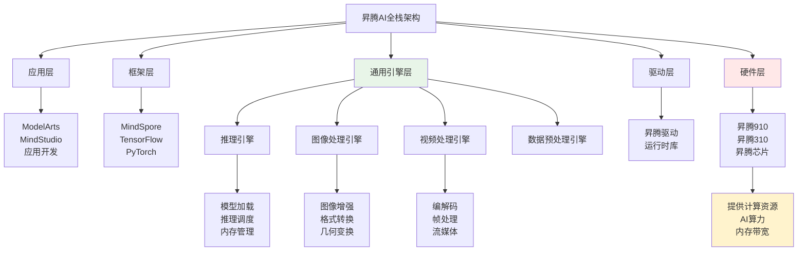

# HCIA-AI 题目分析 - 昇腾AI软件栈通用引擎

## 题目内容

**问题**: 以下关于昇腾AI软件栈的通用引擎描述错误的是哪些选项？

**选项**:
- A. 提供视频或图像处理的算法封装
- B. 为昇腾AI提供计算资源
- C. 提供通用的神经网络推理能力
- D. 支持在线和离线模型的加速模型

## 选项分析表格

| 选项 | 内容 | 正确性 | 详细分析 | 知识点 |
|------|------|--------|----------|--------|
| A | 提供视频或图像处理的算法封装 | ✅ | 这个描述是正确的。昇腾AI软件栈的通用引擎确实提供了丰富的视频和图像处理算法封装，包括图像预处理、后处理、视频编解码等功能，方便开发者快速集成 | 算法封装与API |
| B | 为昇腾AI提供计算资源 | ❌ | 这个描述是错误的。通用引擎本身不提供计算资源，计算资源是由昇腾AI处理器硬件提供的。通用引擎是软件层面的抽象，负责调度和管理计算资源，而不是提供计算资源 | 软硬件分层架构 |
| C | 提供通用的神经网络推理能力 | ✅ | 这个描述是正确的。通用引擎提供了标准化的神经网络推理接口和能力，支持多种深度学习框架的模型推理，是昇腾AI软件栈的核心功能之一 | 推理引擎 |
| D | 支持在线和离线模型的加速模型 | ✅ | 这个描述是正确的。通用引擎支持在线推理（实时推理）和离线推理（批处理）两种模式，并提供相应的模型加速优化能力 | 推理模式 |

## 正确答案
**答案**: B

**解题思路**: 
1. 理解昇腾AI软件栈的分层架构
2. 区分软件层和硬件层的职责
3. 通用引擎属于软件抽象层，负责算法封装、推理调度等
4. 计算资源由昇腾AI处理器硬件提供，不是通用引擎的功能

## 概念图解

## 知识点总结

### 核心概念
- **通用引擎**: 昇腾AI软件栈中的中间抽象层，提供标准化的AI算法和推理能力
- **软硬件分离**: 通用引擎负责软件抽象，硬件负责提供计算资源
- **算法封装**: 将复杂的AI算法封装成易用的API接口
- **推理引擎**: 提供高效的神经网络模型推理能力

### 昇腾AI软件栈分层
1. **应用层**: ModelArts、MindStudio等开发工具
2. **框架层**: MindSpore、TensorFlow、PyTorch等
3. **通用引擎层**: 推理引擎、图像处理引擎等
4. **驱动层**: 昇腾驱动、运行时库
5. **硬件层**: 昇腾AI处理器

### 通用引擎功能
- **推理能力**: 支持多种模型格式的高效推理
- **算法封装**: 提供图像、视频处理算法库
- **资源调度**: 管理和调度硬件计算资源
- **性能优化**: 模型加速、内存优化等

### 记忆要点
- **职责分离**: 软件提供能力，硬件提供资源
- **通用引擎**: 算法封装 + 推理调度，不提供计算资源
- **昇腾芯片**: 提供AI算力和计算资源
- **分层架构**: 应用→框架→引擎→驱动→硬件

## 扩展学习

### 相关技术
- **昇腾CANN**: 异构计算架构，包含通用引擎
- **AscendCL**: 昇腾计算语言，底层API接口
- **MindX**: 昇腾AI推理引擎和开发套件
- **Atlas系列**: 基于昇腾芯片的AI计算产品

### 实践应用
- **图像识别**: 使用图像处理引擎进行预处理
- **视频分析**: 利用视频处理引擎进行实时分析
- **语音识别**: 通过推理引擎部署语音模型
- **自然语言处理**: 使用通用推理能力处理NLP任务

### 开发工具
- **MindStudio**: 昇腾AI全流程开发工具链
- **ModelArts**: 华为云AI开发平台
- **昇腾社区**: 提供丰富的算法样例和文档
- **CANN开发套件**: 底层开发和优化工具