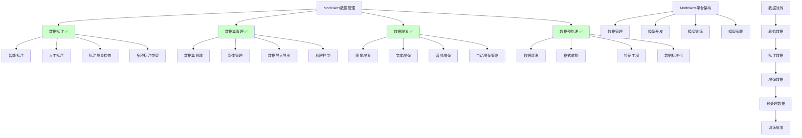

# HCIA-AI 题目分析 - ModelArts数据管理功能

## 题目内容

**问题**: 华为云ModelArts的数据管理功能包括以下哪些？

**选项**:
- A. 数据标注
- B. 数据集管理
- C. 数据增强
- D. 数据预处理

## 选项分析表格

| 选项 | 内容 | 正确性 | 详细分析 | 知识点 |
|------|------|--------|----------|--------|
| A | 数据标注 | ✅ | 正确。ModelArts提供智能数据标注功能，支持图像分类、目标检测、文本分类等多种标注任务，包括人工标注和智能标注。 | ModelArts数据标注 |
| B | 数据集管理 | ✅ | 正确。ModelArts提供完整的数据集管理功能，包括数据集创建、版本管理、数据导入导出、数据集共享等。 | 数据集生命周期管理 |
| C | 数据增强 | ✅ | 正确。ModelArts支持多种数据增强技术，如图像旋转、缩放、裁剪、噪声添加等，帮助扩充训练数据集。 | 数据增强技术 |
| D | 数据预处理 | ✅ | 正确。ModelArts提供数据预处理功能，包括数据清洗、格式转换、特征工程、数据标准化等预处理操作。 | 数据预处理流水线 |

## 正确答案
**答案**: ABCD

**解题思路**: 
1. 理解ModelArts作为一站式AI开发平台的数据管理能力
2. 分析AI开发流程中的数据管理需求：
   - 数据标注：为监督学习准备标签
   - 数据集管理：组织和版本控制
   - 数据增强：扩充训练样本
   - 数据预处理：清洗和转换数据
3. 确认ModelArts覆盖完整的数据管理生命周期

## 概念图解

## 知识点总结

### 核心概念
- **一站式平台**: ModelArts提供从数据到模型的全流程AI开发能力
- **数据标注**: 支持图像、文本、音频等多模态数据标注
- **数据集管理**: 提供企业级数据资产管理能力
- **数据增强**: 通过算法自动扩充训练数据

### 相关技术
- **智能标注**: 基于预训练模型的自动标注
- **版本控制**: 数据集的版本管理和回滚
- **增强算法**: 几何变换、颜色变换、噪声添加等
- **预处理流水线**: 可视化的数据处理工作流

### 记忆要点
- **全覆盖**: ModelArts数据管理覆盖AI开发全流程
- **四大功能**: 标注、管理、增强、预处理
- **智能化**: 提供AI辅助的数据处理能力
- **企业级**: 支持大规模数据和团队协作

## 扩展学习

### 相关文档
- 华为云ModelArts用户指南
- ModelArts数据管理最佳实践
- 华为云AI开发平台技术白皮书

### 实践应用
- **项目实战**: 使用ModelArts完成端到端AI项目开发
- **数据标注**: 体验智能标注和人工标注流程
- **数据增强**: 实践不同场景下的数据增强策略
- **流水线设计**: 构建自动化的数据预处理流水线