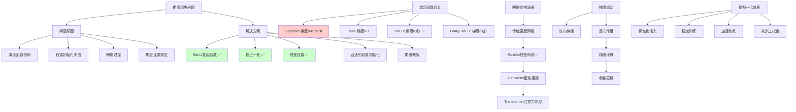

# HCIA-AI 题目分析 - 深度学习梯度消失问题

## 题目内容

**问题**: 在深度学习中，以下哪些方法可以有效缓解梯度消失问题？

**选项**:
- A. 使用ReLU激活函数
- B. 批归一化（Batch Normalization）
- C. 残差连接（Residual Connection）
- D. 使用Sigmoid激活函数

## 选项分析表格

| 选项 | 内容 | 正确性 | 详细分析 | 知识点 |
|------|------|--------|----------|--------|
| A | 使用ReLU激活函数 | ✅ | 正确。ReLU函数在正值区域梯度为1，避免了Sigmoid/Tanh函数的梯度饱和问题，有效缓解梯度消失。ReLU的导数要么是0要么是1，不会像Sigmoid那样在深层网络中导致梯度指数衰减。 | ReLU激活函数特性 |
| B | 批归一化（Batch Normalization） | ✅ | 正确。批归一化通过标准化每层的输入分布，保持激活值在合适范围内，防止梯度过小或过大，显著改善梯度流动，是解决梯度消失的重要技术。 | 批归一化原理 |
| C | 残差连接（Residual Connection） | ✅ | 正确。残差连接通过跳跃连接直接传递梯度，使梯度可以直接从输出层流向输入层，绕过中间层的梯度衰减，是ResNet等深度网络成功的关键。 | 残差网络架构 |
| D | 使用Sigmoid激活函数 | ❌ | 错误。Sigmoid函数是梯度消失问题的主要原因之一。其导数最大值仅为0.25，在深层网络中会导致梯度指数级衰减，加剧梯度消失问题。 | Sigmoid函数缺陷 |

## 正确答案
**答案**: ABC

**解题思路**: 
1. 理解梯度消失问题的根本原因：
   - 激活函数导数过小
   - 权重初始化不当
   - 网络层数过深
2. 分析各方法的作用机制：
   - ReLU：避免梯度饱和
   - 批归一化：稳定梯度流
   - 残差连接：提供梯度直通路径
   - Sigmoid：加剧梯度消失
3. 识别有效解决方案和问题根源

## 概念图解

## 知识点总结

### 核心概念
- **梯度消失**: 深层网络中梯度在反向传播过程中逐层衰减至接近零
- **ReLU优势**: 正值区域梯度恒为1，避免梯度饱和
- **批归一化**: 标准化层输入，稳定梯度分布
- **残差连接**: 提供梯度的直通路径，绕过中间层衰减

### 相关技术
- **激活函数选择**: ReLU、Leaky ReLU、ELU、Swish等
- **网络架构**: ResNet、DenseNet、Highway Networks
- **初始化方法**: Xavier初始化、He初始化
- **优化技术**: Adam、RMSprop等自适应优化器

### 记忆要点
- **ReLU是关键**: 解决激活函数饱和问题
- **批归一化必备**: 现代深度网络的标准组件
- **残差连接革命**: 使训练超深网络成为可能
- **Sigmoid是陷阱**: 加剧而非缓解梯度消失

## 扩展学习

### 相关文档
- "Deep Residual Learning for Image Recognition" (ResNet论文)
- "Batch Normalization: Accelerating Deep Network Training"
- 《深度学习》第8章：深度模型中的优化

### 实践应用
- **网络设计**: 在深度网络中合理使用ReLU、BN和残差连接
- **训练监控**: 观察梯度范数变化，诊断梯度消失问题
- **架构选择**: 根据任务选择合适的深度网络架构
- **超参调优**: 调整学习率、批大小等缓解梯度问题