# HCIA-AI 题目分析 - 华为云语音识别音频格式

## 题目内容

**问题**: 华为云语音识别服务支持以下哪些音频格式？

**选项**:
- A. WAV
- B. MP3
- C. FLAC
- D. AAC

## 选项分析表格

| 选项 | 内容 | 正确性 | 详细分析 | 知识点 |
|------|------|--------|----------|--------|
| A | WAV | ✅ | 正确。WAV是无损音频格式，音质高，是语音识别服务的标准支持格式。华为云ASR服务完全支持WAV格式，推荐使用16kHz采样率的单声道WAV文件。 | WAV音频格式 |
| B | MP3 | ✅ | 正确。MP3是常见的有损压缩音频格式，华为云语音识别服务支持MP3格式输入，但建议使用较高比特率以保证识别准确率。 | MP3音频格式 |
| C | FLAC | ✅ | 正确。FLAC是无损压缩音频格式，在保持音质的同时减小文件大小，华为云ASR服务支持FLAC格式，适合对音质要求较高的场景。 | FLAC音频格式 |
| D | AAC | ✅ | 正确。AAC是高效的有损压缩音频格式，音质优于同比特率的MP3，华为云语音识别服务支持AAC格式输入。 | AAC音频格式 |

## 正确答案
**答案**: ABCD

**解题思路**: 
1. 了解华为云ASR服务的技术规格和支持能力
2. 分析常见音频格式的特点：
   - WAV：无损，高质量，标准格式
   - MP3：有损压缩，普及度高
   - FLAC：无损压缩，平衡质量和大小
   - AAC：高效压缩，现代标准
3. 确认华为云ASR的广泛格式兼容性

## 概念图解

```mermaid
flowchart TD
    A[华为云语音识别ASR] --> B[支持音频格式]
    
    B --> B1[WAV ✅]
    B --> B2[MP3 ✅]
    B --> B3[FLAC ✅]
    B --> B4[AAC ✅]
    
    C[音频格式特性] --> C1[无损格式]
    C --> C2[有损格式]
    
    C1 --> C11[WAV: 未压缩，高质量]
    C1 --> C12[FLAC: 无损压缩，平衡]
    
    C2 --> C21[MP3: 普及度高，兼容性好]
    C2 --> C22[AAC: 高效压缩，现代标准]
    
    D[技术参数] --> D1[采样率: 8kHz/16kHz]
    D --> D2[声道: 单声道推荐]
    D --> D3[比特率: 影响识别准确率]
    D --> D4[时长: 最大60秒/次]
    
    E[华为云ASR架构] --> E1[音频预处理]
    E --> E2[特征提取]
    E --> E3[声学模型]
    E --> E4[语言模型]
    E --> E5[后处理]
    
    F[应用场景] --> F1[实时语音识别]
    F --> F2[录音文件转写]
    F --> F3[语音助手]
    F --> F4[会议记录]
    
    G[格式转换] --> G1[FFmpeg工具]
    G --> G2[在线转换服务]
    G --> G3[SDK内置转换]
    
    H[最佳实践] --> H1[16kHz采样率]
    H --> H2[单声道音频]
    H --> H3[清晰录音环境]
    H --> H4[适当音频长度]
    
    style B1 fill:#ccffcc
    style B2 fill:#ccffcc
    style B3 fill:#ccffcc
    style B4 fill:#ccffcc
```

## 知识点总结

### 核心概念
- **音频格式兼容性**: 华为云ASR支持主流音频格式
- **无损vs有损**: 不同格式对识别准确率的影响
- **技术参数**: 采样率、声道、比特率等关键参数
- **格式选择**: 根据应用场景选择合适的音频格式

### 相关技术
- **音频编码**: PCM、ADPCM、MP3、AAC等编码技术
- **音频处理**: 降噪、增强、格式转换
- **ASR引擎**: 深度学习语音识别模型
- **API接口**: RESTful API和WebSocket实时接口

### 记忆要点
- **全格式支持**: 华为云ASR支持所有主流音频格式
- **推荐配置**: 16kHz单声道WAV格式最佳
- **质量影响**: 音频质量直接影响识别准确率
- **实用性**: 支持多格式提高服务易用性

## 扩展学习

### 相关文档
- 华为云语音识别服务API参考
- 华为云ASR最佳实践指南
- 音频格式技术规范文档

### 实践应用
- **格式测试**: 比较不同音频格式的识别效果
- **参数优化**: 调整采样率、比特率等参数
- **预处理**: 音频降噪和增强处理
- **集成开发**: 在应用中集成多格式音频识别能力