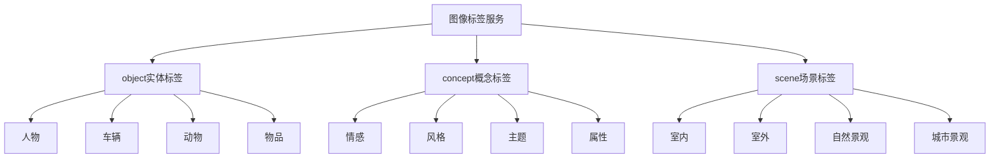

# HCIA-AI 题目分析 - 图像标签服务类型

## 题目内容

**问题**: 图像标签服务调用成功时返回的type包含下列哪些类型？

**选项**:
- A. object:实体标签
- B. concept:概念标签
- C. sport:运动标签
- D. scene:场景标签

## 选项分析表格

| 选项 | 内容 | 正确性 | 详细分析 | 知识点 |
|------|------|--------|----------|--------|
| A | object:实体标签 | ✅ | 正确。实体标签是图像标签服务的核心类型之一，用于识别图像中的具体物体，如人、车、动物等实体对象 | 华为云图像标签服务 |
| B | concept:概念标签 | ✅ | 正确。概念标签用于描述图像的抽象概念或属性，如情感、风格、主题等非具体实体的概念性内容 | 华为云图像标签服务 |
| C | sport:运动标签 | ❌ | 错误。虽然运动相关的标签可能存在，但sport不是图像标签服务返回的标准type类型，运动相关内容通常归类到其他标准类型中 | 图像标签分类 |
| D | scene:场景标签 | ✅ | 正确。场景标签用于识别图像的场景类型，如室内、室外、海滩、森林等环境场景信息 | 华为云图像标签服务 |

## 正确答案
**答案**: ABD

**解题思路**: 
1. 华为云图像标签服务主要提供三种标准类型的标签
2. object类型用于识别具体的实体对象
3. concept类型用于识别抽象概念和属性
4. scene类型用于识别场景环境
5. sport不是标准的返回类型

## 概念图解

## 知识点总结

### 核心概念
- **实体标签(object)**: 识别图像中的具体物体和实体
- **概念标签(concept)**: 识别图像的抽象概念和属性特征
- **场景标签(scene)**: 识别图像的环境场景类型

### 相关技术
- 华为云图像标签服务API
- 计算机视觉目标检测技术
- 深度学习图像分类算法

### 记忆要点
- 记住三个标准类型：object、concept、scene
- 注意区分具体实体和抽象概念
- sport等特定领域标签不是标准返回类型

## 扩展学习

### 相关文档
- 华为云图像标签服务官方文档
- 华为云AI服务开发指南

### 实践应用
- 电商商品自动标签
- 社交媒体内容分析
- 智能相册分类管理