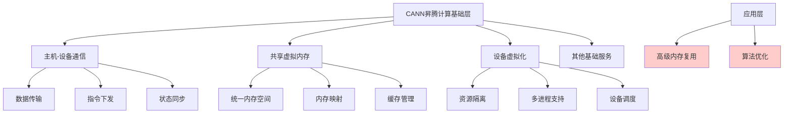

# HCIA-AI 题目分析 - CANN昇腾计算基础层服务

## 题目内容

**问题**: 以下哪些选项属于CANN中昇腾计算基础层提供的服务？

**选项**:
- A. 主机-设备通信
- B. 共享虚拟内存
- C. 高级内存复用
- D. 设备虚拟化

## 选项分析表格

| 选项 | 内容 | 正确性 | 详细分析 | 知识点 |
|------|------|--------|----------|--------|
| A | 主机-设备通信 | ✅ | 正确。昇腾计算基础层提供主机CPU与昇腾AI处理器之间的通信服务，包括数据传输、指令下发等基础通信功能 | CANN架构基础服务 |
| B | 共享虚拟内存 | ✅ | 正确。昇腾计算基础层提供统一的虚拟内存管理，支持主机和设备之间的内存共享，提高数据访问效率 | 内存管理服务 |
| C | 高级内存复用 | ❌ | 错误。高级内存复用属于更高层次的优化功能，不是基础层直接提供的服务，而是在应用层或框架层实现的优化策略 | 内存优化技术 |
| D | 设备虚拟化 | ✅ | 正确。昇腾计算基础层提供设备虚拟化服务，支持多进程、多用户共享昇腾AI处理器资源，实现资源隔离和管理 | 设备资源管理 |

## 正确答案
**答案**: ABD

**解题思路**: 
1. CANN昇腾计算基础层主要提供底层基础服务
2. 主机-设备通信是基础的数据传输服务
3. 共享虚拟内存是基础的内存管理服务
4. 设备虚拟化是基础的资源管理服务
5. 高级内存复用属于上层优化功能，不是基础层服务

## 概念图解

## 知识点总结

### 核心概念
- **昇腾计算基础层**: CANN架构的底层，提供基础的硬件抽象和资源管理服务
- **主机-设备通信**: CPU与AI处理器之间的数据和控制信息交换
- **共享虚拟内存**: 统一的内存管理机制，支持主机和设备内存共享
- **设备虚拟化**: 将物理AI处理器虚拟化为多个逻辑设备

### 相关技术
- CANN (Compute Architecture for Neural Networks)
- 昇腾AI处理器架构
- 华为昇腾生态系统

### 记忆要点
- 基础层主要提供底层硬件抽象服务
- 区分基础服务和高级优化功能
- 通信、内存、虚拟化是三大核心基础服务
- 高级功能通常在上层实现

## 扩展学习

### 相关文档
- CANN开发者指南
- 昇腾AI处理器编程指南
- 华为昇腾计算平台文档

### 实践应用
- AI模型训练加速
- 推理服务部署
- 多租户AI计算平台