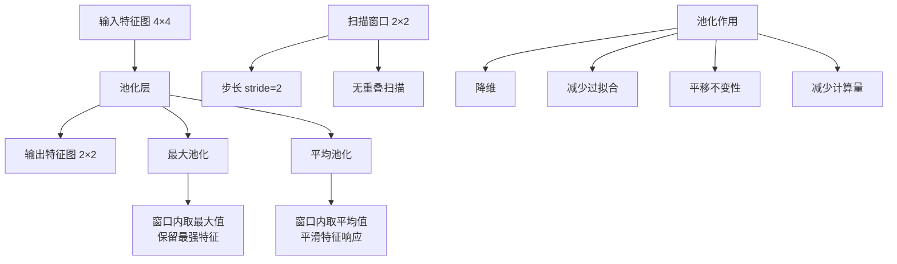

# HCIA-AI 题目分析 - 卷积神经网络池化层

## 题目内容

**问题**: 关于卷积神经网络池化层，以下哪些描述是正确的？

**选项**:
- A. 经过池化的特征图像变小了
- B. 常用的池化方法有最大池化和平均池化
- C. 池化层可以起到降维的作用
- D. 池化操作采用扫描窗口实现

## 选项分析表格

| 选项 | 内容 | 正确性 | 详细分析 | 知识点 |
|------|------|--------|----------|--------|
| A | 经过池化的特征图像变小了 | ❌ | 错误。池化操作会减小特征图的空间尺寸(高度和宽度)，但不会改变特征图的数量。这里说"图像变小"表述不够准确，应该是"特征图尺寸变小" | 池化操作原理 |
| B | 常用的池化方法有最大池化和平均池化 | ✅ | 正确。最大池化(Max Pooling)选择窗口内的最大值，平均池化(Average Pooling)计算窗口内的平均值，这是两种最常用的池化方法 | 池化方法类型 |
| C | 池化层可以起到降维的作用 | ✅ | 正确。池化层通过减小特征图的空间维度来降低数据维度，减少参数数量和计算量，同时保持重要特征信息 | 降维技术 |
| D | 池化操作采用扫描窗口实现 | ✅ | 正确。池化操作使用固定大小的窗口(如2×2)在特征图上滑动扫描，对每个窗口区域进行池化计算 | 池化实现机制 |

## 正确答案
**答案**: BCD

**解题思路**: 
1. 分析池化层的基本原理和作用
2. 池化确实会减小特征图尺寸，但A选项表述不够准确
3. 最大池化和平均池化是标准的池化方法
4. 池化的主要作用之一就是降维
5. 扫描窗口是池化操作的标准实现方式

## 概念图解

## 知识点总结

### 核心概念
- **池化层**: 卷积神经网络中用于下采样的层，减小特征图空间尺寸
- **最大池化**: 在池化窗口中选择最大值，保留最强的特征响应
- **平均池化**: 计算池化窗口中所有值的平均值，提供平滑的特征表示
- **降维作用**: 减少特征图的空间维度，降低模型复杂度

### 相关技术
- 卷积神经网络(CNN)架构
- 特征提取和表示学习
- 深度学习中的正则化技术

### 记忆要点
- 池化减小空间尺寸但不改变通道数
- 最大池化保留强特征，平均池化提供平滑效果
- 池化提供平移不变性和降维效果
- 扫描窗口是标准实现方式
- 注意区分"图像变小"和"特征图尺寸变小"

## 扩展学习

### 相关文档
- 深度学习经典教材(Goodfellow等)
- PyTorch/TensorFlow池化层文档
- CNN架构设计指南

### 实践应用
- 图像分类网络(LeNet、AlexNet、VGG)
- 目标检测算法
- 语义分割网络