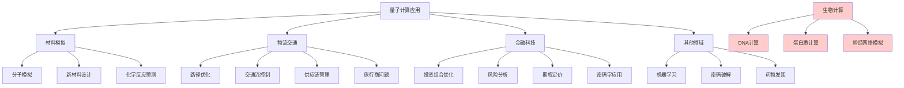

# HCIA-AI 题目分析 - 量子计算应用领域

## 题目内容

**问题**: 量子计算可以应用在以下哪些领域？

**选项**:
- A. 生物计算
- B. 材料模拟
- C. 物流交通
- D. 金融科技

## 选项分析表格

| 选项 | 内容 | 正确性 | 详细分析 | 知识点 |
|------|------|--------|----------|--------|
| A | 生物计算 | ❌ | 错误。虽然量子计算在某些生物信息学问题上有潜在应用，但生物计算本身不是量子计算的主要应用领域。生物计算更多指的是利用生物系统进行计算 | 计算领域分类 |
| B | 材料模拟 | ✅ | 正确。量子计算在材料科学中有重要应用，可以模拟分子和材料的量子行为，预测新材料性质，这是量子计算的优势领域之一 | 量子模拟应用 |
| C | 物流交通 | ✅ | 正确。量子计算可以解决复杂的优化问题，如旅行商问题、路径规划、交通流优化等，在物流和交通领域有广泛应用前景 | 组合优化问题 |
| D | 金融科技 | ✅ | 正确。量子计算在金融领域有多种应用，包括投资组合优化、风险分析、期权定价、加密货币安全等方面 | 金融量子算法 |

## 正确答案
**答案**: BCD

**解题思路**: 
1. 量子计算主要优势在于解决特定类型的复杂问题
2. 材料模拟利用量子计算的天然量子特性
3. 物流交通涉及大量组合优化问题，适合量子算法
4. 金融科技需要复杂的数学计算和优化
5. 生物计算是一个独立的计算范式，不是量子计算的应用领域

## 概念图解

## 知识点总结

### 核心概念
- **量子计算**: 利用量子力学原理进行信息处理的计算模式
- **材料模拟**: 使用量子计算模拟材料的量子行为和性质
- **组合优化**: 在有限的解空间中寻找最优解的问题
- **生物计算**: 利用生物系统或模拟生物过程进行计算的方法

### 相关技术
- 量子算法(Shor算法、Grover算法)
- 量子退火算法
- 变分量子算法(VQE)
- 量子近似优化算法(QAOA)

### 记忆要点
- 量子计算擅长解决特定的数学和优化问题
- 材料模拟是量子计算的天然应用领域
- 物流和金融都涉及大量优化计算
- 区分量子计算应用和生物计算概念
- 量子计算在密码学、机器学习等领域也有应用

## 扩展学习

### 相关文档
- 量子计算基础理论教材
- IBM Qiskit量子计算平台文档
- 量子算法研究论文

### 实践应用
- 量子化学计算软件
- 量子机器学习算法
- 量子密码学协议
- 量子优化算法实现