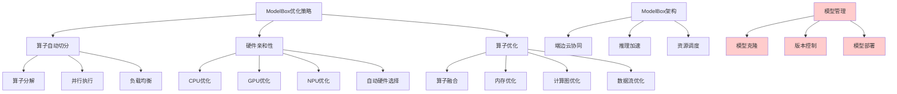

# HCIA-AI 题目分析 - ModelBox优化策略

## 题目内容

**问题**: 华为云ModelArts中推出了ModelBox用于端边云联合开发，以下哪些选项属于其优化策略？

**选项**:
- A. 算子自动切分
- B. 硬件亲和性
- C. 模型克隆
- D. 算子优化

## 选项分析表格

| 选项 | 内容 | 正确性 | 详细分析 | 知识点 |
|------|------|--------|----------|--------|
| A | 算子自动切分 | ✅ | 正确。ModelBox支持算子自动切分，将复杂的算子分解为更小的计算单元，便于在不同硬件上并行执行，提高计算效率 | 算子优化技术 |
| B | 硬件亲和性 | ✅ | 正确。ModelBox具有硬件亲和性优化，能够根据不同硬件平台(CPU、GPU、NPU)的特性自动选择最优的执行策略和算子实现 | 硬件适配优化 |
| C | 模型克隆 | ❌ | 错误。模型克隆不是ModelBox的优化策略，而是模型管理功能。ModelBox主要关注推理性能优化，而不是模型复制管理 | 模型管理功能 |
| D | 算子优化 | ✅ | 正确。ModelBox提供算子级别的优化，包括算子融合、内存优化、计算图优化等，这是其核心优化策略之一 | 计算图优化 |

## 正确答案
**答案**: ABD

**解题思路**: 
1. ModelBox是华为云ModelArts的推理优化框架
2. 算子自动切分提高并行计算效率
3. 硬件亲和性确保在不同硬件上的最优性能
4. 算子优化是推理框架的核心功能
5. 模型克隆属于模型管理而非性能优化策略

## 概念图解

## 知识点总结

### 核心概念
- **ModelBox**: 华为云ModelArts的推理优化框架，支持端边云联合开发
- **算子自动切分**: 将复杂算子分解为更小单元，提高并行度
- **硬件亲和性**: 根据硬件特性自动选择最优执行策略
- **算子优化**: 包括算子融合、内存优化等多种优化技术

### 相关技术
- 华为云ModelArts平台
- 端边云协同计算
- AI推理优化技术
- 异构计算平台适配

### 记忆要点
- ModelBox专注于推理性能优化
- 三大核心优化策略：切分、亲和性、算子优化
- 区分优化策略和管理功能
- 硬件亲和性支持多种计算平台
- 算子级优化是推理加速的关键

## 扩展学习

### 相关文档
- 华为云ModelArts开发者指南
- ModelBox框架技术文档
- 端边云协同开发最佳实践

### 实践应用
- AI模型推理部署
- 边缘计算场景优化
- 多硬件平台适配
- 推理性能调优