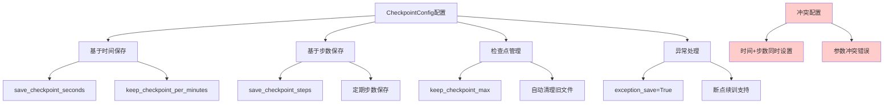

# HCIA-AI 题目分析 - MindSpore模型保存CheckpointConfig

## 题目内容

**问题**: John在使用MindSpore训练模型时，想要将模型保存在本地文件中，以下选项中能实现他想法的选项有哪些？From mindspore.traincallback import CheckpointConfig

**选项**:
- A. 每隔30秒保存一个CheckPoint文件，每隔3分钟保留一个CheckPoint文件: CheckpointConfig (save_checkpoint_seconds=30,keepcheckpoint per minutes=3)
- B. 每隔30秒保存一个CheckPoint文件且每隔32个step保存一个CheckPoint文件: CheckpointConfig(save_checkpoint_steps=32, save_checkpoint_seconds=30)
- C. 每隔32个step保存一个CheckPoint文件，且最多保存10个CheckPoint文件:CheckpointConfig (save_checkpoint_steps=32, keep_checkpointmax=10)
- D. 开启断点续训功能:CheckpointConfig(save_checkpoint_steps=32，keep_checkpoint_max=10, exception_save=True)

## 选项分析表格

| 选项 | 内容 | 正确性 | 详细分析 | 知识点 |
|------|------|--------|----------|--------|
| A | 每隔30秒保存一个CheckPoint文件，每隔3分钟保留一个CheckPoint文件 | ✅ | 正确。CheckpointConfig支持基于时间的保存策略，save_checkpoint_seconds=30表示每30秒保存一次，keep_checkpoint_per_minutes=3表示每3分钟保留一个检查点 | MindSpore检查点配置 |
| B | 每隔30秒保存一个CheckPoint文件且每隔32个step保存一个CheckPoint文件 | ❌ | 错误。同时设置save_checkpoint_steps和save_checkpoint_seconds会产生冲突，MindSpore不支持同时基于步数和时间的保存策略 | 检查点保存策略冲突 |
| C | 每隔32个step保存一个CheckPoint文件，且最多保存10个CheckPoint文件 | ✅ | 正确。save_checkpoint_steps=32表示每32步保存一次，keep_checkpoint_max=10表示最多保留10个检查点文件，这是常用的配置 | 基于步数的检查点保存 |
| D | 开启断点续训功能 | ✅ | 正确。exception_save=True参数用于开启异常保存功能，当训练过程中出现异常时自动保存检查点，支持断点续训 | 断点续训功能 |

## 正确答案
**答案**: ACD

**解题思路**: 
1. 分析MindSpore CheckpointConfig的各种参数配置
2. save_checkpoint_seconds用于基于时间的保存
3. save_checkpoint_steps用于基于步数的保存
4. 两种保存策略不能同时使用
5. keep_checkpoint_max控制保留的检查点数量
6. exception_save用于异常情况下的自动保存

## 概念图解

## 知识点总结

### 核心概念
- **CheckpointConfig**: MindSpore中用于配置模型检查点保存策略的类
- **基于时间保存**: 使用save_checkpoint_seconds参数按时间间隔保存
- **基于步数保存**: 使用save_checkpoint_steps参数按训练步数保存
- **检查点管理**: 通过keep_checkpoint_max等参数管理检查点文件数量

### 相关技术
- MindSpore深度学习框架
- 模型训练检查点机制
- 断点续训技术
- 训练过程监控

### 记忆要点
- 时间保存和步数保存不能同时使用
- keep_checkpoint_max控制保留文件数量
- exception_save支持异常情况下的自动保存
- 检查点保存是模型训练的重要保障机制
- 合理配置检查点策略可以平衡存储空间和训练安全性

## 扩展学习

### 相关文档
- MindSpore官方文档 - 模型保存与加载
- MindSpore API参考 - CheckpointConfig
- 深度学习训练最佳实践

### 实践应用
- 长时间训练任务的检查点策略
- 分布式训练中的模型保存
- 生产环境中的模型版本管理
- 训练过程的容错处理