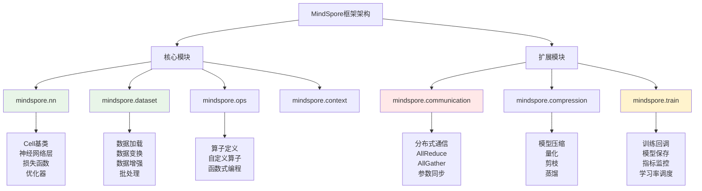

# HCIA-AI 题目分析 - MindSpore组件描述

## 题目内容

**问题**: 以下关于MindSpore组件的描述中，正确的有哪几项？

**选项**:
- A. communication: 负责处理CPU与内存的数据流通信。
- B. dataset: 数据集处理模块，如数据加载和预处理。
- C. nn: MindSpore cell(神经网络单元)，损失函数，优化器的定义。
- D. train: 训练模型相关及模型量化模块。

## 选项分析表格

| 选项 | 内容 | 正确性 | 详细分析 | 知识点 |
|------|------|--------|----------|--------|
| A | communication: 负责处理CPU与内存的数据流通信 | ❌ | 这个描述是错误的。MindSpore中的communication模块主要负责分布式训练中不同设备（如多GPU、多节点）之间的通信，包括参数同步、梯度聚合等，而不是CPU与内存之间的数据流通信 | 分布式训练通信 |
| B | dataset: 数据集处理模块，如数据加载和预处理 | ✅ | 这个描述是正确的。mindspore.dataset模块提供了丰富的数据处理功能，包括数据加载、数据变换、数据增强、批处理等预处理操作，是MindSpore数据处理的核心模块 | 数据处理模块 |
| C | nn: MindSpore cell(神经网络单元)，损失函数，优化器的定义 | ✅ | 这个描述是正确的。mindspore.nn模块包含了神经网络的基本构建块，包括Cell类（神经网络单元）、各种层定义、损失函数、优化器等，是构建神经网络模型的核心模块 | 神经网络构建 |
| D | train: 训练模型相关及模型量化模块 | ❌ | 这个描述是错误的。MindSpore中没有独立的train模块。训练相关功能分布在不同模块中：训练循环通常在用户代码中实现，模型量化功能在mindspore.compression或mindspore.nn.quant模块中 | 模块架构理解 |

## 正确答案
**答案**: BC

**解题思路**: 
1. 逐一分析MindSpore各个模块的实际功能
2. 区分分布式通信与CPU-内存通信的概念
3. 理解MindSpore的模块化架构设计
4. 识别不存在的模块（train模块）

## 概念图解



## 知识点总结

### 核心概念
- **Cell**: MindSpore中神经网络的基本构建单元，类似PyTorch的Module
- **Dataset**: 数据处理管道，支持高效的数据加载和预处理
- **Communication**: 分布式训练中的设备间通信机制
- **模块化设计**: MindSpore采用模块化架构，功能清晰分离

### MindSpore主要模块详解

#### mindspore.nn模块
- **Cell类**: 所有神经网络层的基类
- **层定义**: Dense、Conv2d、BatchNorm等
- **损失函数**: SoftmaxCrossEntropyWithLogits、MSELoss等
- **优化器**: Adam、SGD、Momentum等

#### mindspore.dataset模块
- **数据加载**: ImageFolderDataset、MindDataset等
- **数据变换**: Resize、Normalize、RandomCrop等
- **数据增强**: RandomHorizontalFlip、ColorJitter等
- **批处理**: batch、shuffle、repeat等操作

#### mindspore.communication模块
- **初始化**: init()函数初始化分布式环境
- **通信原语**: AllReduce、AllGather、ReduceScatter
- **参数同步**: 梯度聚合和参数更新
- **多卡训练**: 支持数据并行和模型并行

### 常见误区
- **Communication功能**: 不是CPU-内存通信，而是设备间通信
- **Train模块**: MindSpore没有独立的train模块
- **量化位置**: 量化功能在compression模块，不在train模块
- **模块职责**: 每个模块有明确的功能边界

### 记忆要点
- **nn模块**: Cell + 层 + 损失 + 优化器
- **dataset模块**: 数据加载 + 预处理 + 增强
- **communication模块**: 分布式 + 多设备 + 参数同步
- **架构特点**: 模块化 + 功能分离 + 清晰职责

## 扩展学习

### 代码示例

#### nn模块使用
```python
import mindspore.nn as nn
from mindspore import Tensor

# 定义网络
class Net(nn.Cell):
    def __init__(self):
        super(Net, self).__init__()
        self.dense = nn.Dense(784, 10)
        
    def construct(self, x):
        return self.dense(x)

# 损失函数和优化器
net = Net()
loss_fn = nn.SoftmaxCrossEntropyWithLogits()
optimizer = nn.Adam(net.trainable_params())
```

#### dataset模块使用
```python
import mindspore.dataset as ds
import mindspore.dataset.transforms.c_transforms as C

# 数据加载和预处理
dataset = ds.ImageFolderDataset("/path/to/data")
dataset = dataset.map(operations=[C.Resize((224, 224)), 
                                 C.Normalize(mean=[0.485, 0.456, 0.406],
                                           std=[0.229, 0.224, 0.225])])
dataset = dataset.batch(32)
```

#### communication模块使用
```python
from mindspore.communication import init, get_rank, get_group_size

# 初始化分布式环境
init()
rank = get_rank()
group_size = get_group_size()
```

### 实践应用
- **单机训练**: 主要使用nn和dataset模块
- **分布式训练**: 额外使用communication模块
- **模型压缩**: 使用compression模块进行量化和剪枝
- **模型部署**: 使用export功能导出推理模型

### 相关文档
- MindSpore官方API文档
- MindSpore教程和样例代码
- 分布式训练最佳实践
- 模型压缩和优化指南