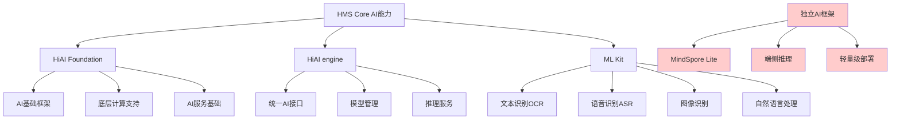

# HCIA-AI 题目分析 - HMS Core提供的AI能力

## 题目内容

**问题**: 以下哪些选项属于HMS Core提供的AI能力？

**选项**:
- A. HiAI Foundation
- B. MindSpore Lite
- C. HiAI engine
- D. ML Kit

## 选项分析表格

| 选项 | 内容 | 正确性 | 详细分析 | 知识点 |
|------|------|--------|----------|--------|
| A | HiAI Foundation | ✅ | 正确。HiAI Foundation是HMS Core的AI基础能力之一，提供底层AI计算框架和基础服务，支持各种AI应用的开发 | HMS Core AI基础服务 |
| B | MindSpore Lite | ❌ | 错误。MindSpore Lite是华为的轻量级深度学习推理框架，主要用于端侧AI推理，不是HMS Core直接提供的服务，而是独立的AI框架 | 端侧AI推理框架 |
| C | HiAI engine | ✅ | 正确。HiAI engine是HMS Core提供的AI引擎服务，为开发者提供统一的AI能力调用接口，支持多种AI算法和模型 | HMS Core AI引擎 |
| D | ML Kit | ✅ | 正确。ML Kit是HMS Core的机器学习服务套件，提供文本识别、语音识别、图像识别等开箱即用的AI能力 | HMS Core机器学习套件 |

## 正确答案
**答案**: ACD

**解题思路**: 
1. HMS Core是华为移动服务的核心，提供多种AI能力
2. HiAI Foundation提供AI基础框架支持
3. HiAI engine提供统一的AI引擎服务
4. ML Kit提供丰富的机器学习API
5. MindSpore Lite是独立的推理框架，不属于HMS Core服务

## 概念图解

## 知识点总结

### 核心概念
- **HMS Core**: 华为移动服务核心，为开发者提供丰富的移动应用开发能力
- **HiAI Foundation**: HMS Core的AI基础能力，提供底层AI计算框架
- **HiAI engine**: HMS Core的AI引擎，提供统一的AI服务调用接口
- **ML Kit**: HMS Core的机器学习套件，提供开箱即用的AI能力

### 相关技术
- 华为移动服务生态系统
- 移动端AI应用开发
- 云端AI服务集成
- 跨平台AI能力调用

### 记忆要点
- HMS Core包含三大AI能力：Foundation、engine、ML Kit
- MindSpore Lite是独立框架，不属于HMS Core
- HiAI Foundation提供基础AI框架支持
- ML Kit提供丰富的预训练AI服务
- 区分HMS Core服务和独立AI框架

## 扩展学习

### 相关文档
- HMS Core开发者官方文档
- HiAI开发指南
- ML Kit API参考文档
- 华为移动服务集成指南

### 实践应用
- 移动应用AI功能集成
- 智能相机应用开发
- 语音助手功能实现
- 文档扫描识别应用