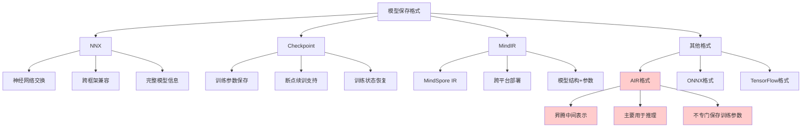

# HCIA-AI 题目分析 - 网络模型格式

## 题目内容

**问题**: 以下网络模型格式中，可以用于保存训练参数和网络模型的有哪些选项？

**选项**:
- A. NNX
- B. Checkpoint
- C. AIR
- D. MindIR

## 选项分析表格

| 选项 | 内容 | 正确性 | 详细分析 | 知识点 |
|------|------|--------|----------|--------|
| A | NNX | ✅ | 正确。NNX是一种神经网络交换格式，支持保存完整的网络结构和训练参数，可以在不同框架间进行模型转换和部署 | 神经网络交换格式 |
| B | Checkpoint | ✅ | 正确。Checkpoint是深度学习中常用的模型保存格式，专门用于保存训练过程中的模型参数和状态，支持断点续训 | 模型检查点格式 |
| C | AIR | ❌ | 错误。AIR通常指的是Ascend Intermediate Representation，主要用于华为昇腾芯片的模型表示，虽然可以保存模型结构，但不是专门用于保存训练参数的格式 | 昇腾中间表示格式 |
| D | MindIR | ✅ | 正确。MindIR是MindSpore的中间表示格式，可以保存完整的网络模型结构和参数，支持跨平台部署和推理 | MindSpore中间表示 |

## 正确答案
**答案**: ABD

**解题思路**: 
1. 分析各种模型格式的特点和用途
2. NNX支持网络结构和参数的完整保存
3. Checkpoint专门用于保存训练参数和状态
4. MindIR可以保存完整的模型信息
5. AIR主要用于模型表示，不是专门的参数保存格式

## 概念图解

## 知识点总结

### 核心概念
- **NNX**: 神经网络交换格式，支持跨框架的模型和参数保存
- **Checkpoint**: 训练检查点格式，专门用于保存训练过程中的模型状态
- **MindIR**: MindSpore的中间表示格式，支持完整的模型信息保存
- **AIR**: 昇腾中间表示格式，主要用于推理优化

### 相关技术
- 深度学习模型序列化
- 跨平台模型部署
- 训练过程管理
- 模型格式转换

### 记忆要点
- NNX、Checkpoint、MindIR都支持参数保存
- Checkpoint专门用于训练过程的状态保存
- AIR主要用于推理，不是训练参数保存格式
- 不同格式适用于不同的应用场景
- 选择合适的格式对模型管理很重要

## 扩展学习

### 相关文档
- 深度学习框架模型格式文档
- MindSpore模型保存与加载指南
- ONNX模型交换标准
- 华为昇腾AI处理器开发指南

### 实践应用
- 模型训练过程管理
- 跨框架模型迁移
- 生产环境模型部署
- 模型版本控制系统