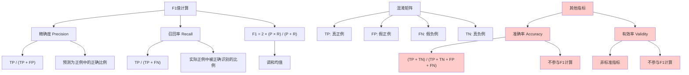

# HCIA-AI 题目分析 - F1值计算指标

## 题目内容

**问题**: 评判分类模型的F1值是以下哪些指标的调和均值？

**选项**:
- A. 召回率(recall)
- B. 有效率(validity)
- C. 准确率(accuracy)
- D. 精确度(precision)

## 选项分析表格

| 选项 | 内容 | 正确性 | 详细分析 | 知识点 |
|------|------|--------|----------|--------|
| A | 召回率(recall) | ✅ | 正确。F1值是精确度(precision)和召回率(recall)的调和均值，公式为F1 = 2 × (precision × recall) / (precision + recall) | 分类评估指标 |
| B | 有效率(validity) | ❌ | 错误。有效率不是机器学习中的标准评估指标，也不参与F1值的计算。F1值只涉及精确度和召回率 | 非标准评估指标 |
| C | 准确率(accuracy) | ❌ | 错误。准确率是分类模型的重要指标，但不参与F1值的计算。F1值专门针对精确度和召回率的平衡 | 分类准确性指标 |
| D | 精确度(precision) | ✅ | 正确。精确度是F1值计算的两个核心指标之一，与召回率一起构成F1值的调和均值计算 | 分类评估指标 |

## 正确答案
**答案**: AD

**解题思路**: 
1. F1值是机器学习中重要的分类评估指标
2. F1值专门用于平衡精确度和召回率
3. 调和均值公式：F1 = 2 × (precision × recall) / (precision + recall)
4. 准确率和有效率不参与F1值计算
5. F1值特别适用于不平衡数据集的评估

## 概念图解

## 知识点总结

### 核心概念
- **F1值**: 精确度和召回率的调和均值，用于评估分类模型性能
- **精确度(Precision)**: 预测为正例中实际为正例的比例
- **召回率(Recall)**: 实际正例中被正确预测为正例的比例
- **调和均值**: 对精确度和召回率进行平衡的数学方法

### 相关技术
- 机器学习模型评估
- 分类问题性能度量
- 不平衡数据集处理
- 模型选择和优化

### 记忆要点
- F1值只涉及精确度和召回率两个指标
- 调和均值公式：F1 = 2 × (P × R) / (P + R)
- F1值适用于不平衡数据集的评估
- 准确率虽然重要但不参与F1计算
- F1值在0-1之间，越接近1表示性能越好

## 扩展学习

### 相关文档
- 机器学习评估指标详解
- scikit-learn分类报告文档
- 不平衡数据集处理方法
- 模型评估最佳实践

### 实践应用
- 医疗诊断模型评估
- 欺诈检测系统评估
- 信息检索系统评估
- 推荐系统性能评估