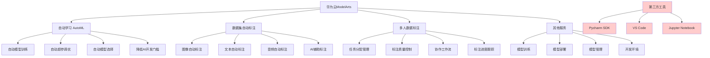

# HCIA-AI 题目分析 - 华为云ModelArts服务

## 题目内容

**问题**: 以下哪些选项属于华为云ModelArts提供的服务？

**选项**:
- A. 自动学习
- B. Pycharm SDK
- C. 数据集自动标注
- D. 多人数据标注

## 选项分析表格

| 选项 | 内容 | 正确性 | 详细分析 | 知识点 |
|------|------|--------|----------|--------|
| A | 自动学习 | ✅ | 正确。ModelArts提供自动学习(AutoML)服务，支持自动化的模型训练、调参和优化，降低AI开发门槛，无需深度的机器学习专业知识 | ModelArts AutoML服务 |
| B | Pycharm SDK | ❌ | 错误。Pycharm SDK不是ModelArts提供的服务，而是JetBrains公司开发的Python IDE的软件开发工具包，与华为云ModelArts无关 | 第三方开发工具 |
| C | 数据集自动标注 | ✅ | 正确。ModelArts提供智能数据标注服务，支持图像、文本、音频等多种数据类型的自动标注，大大提高数据准备效率 | 智能数据标注服务 |
| D | 多人数据标注 | ✅ | 正确。ModelArts支持多人协作的数据标注功能，允许多个标注人员同时对数据集进行标注，提供标注任务分配和质量管理功能 | 协作标注服务 |

## 正确答案
**答案**: ACD

**解题思路**: 
1. ModelArts是华为云的一站式AI开发平台
2. 自动学习是ModelArts的核心AutoML服务
3. 数据标注是AI开发的重要环节，ModelArts提供完整的标注解决方案
4. 多人协作标注提高标注效率和质量
5. Pycharm SDK是第三方IDE工具，不属于ModelArts服务

## 概念图解

## 知识点总结

### 核心概念
- **ModelArts**: 华为云一站式AI开发平台，提供全流程AI开发服务
- **自动学习(AutoML)**: 自动化的机器学习服务，简化模型开发过程
- **智能数据标注**: AI辅助的数据标注服务，提高标注效率和质量
- **协作标注**: 支持多人同时进行数据标注的协作功能

### 相关技术
- 华为云AI服务生态
- 自动化机器学习技术
- 数据标注和预处理
- 云端AI开发平台

### 记忆要点
- ModelArts提供完整的AI开发生命周期服务
- AutoML降低AI开发技术门槛
- 数据标注是AI项目的重要基础工作
- 多人协作提高标注项目的效率
- 区分ModelArts服务和第三方开发工具

## 扩展学习

### 相关文档
- 华为云ModelArts官方文档
- AutoML技术原理和应用
- 数据标注最佳实践指南
- AI项目管理和协作方法

### 实践应用
- 企业AI项目快速开发
- 大规模数据集标注项目
- 无代码/低代码AI应用开发
- AI模型生产化部署