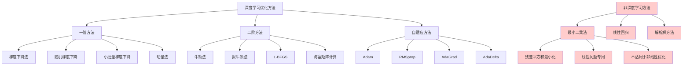

# HCIA-AI 题目分析 - 深度学习优化方法

## 题目内容

**问题**: 以下哪些项可以作为深度学习的优化方法？

**选项**:
- A. 梯度下降法
- B. 最小二乘法
- C. 牛顿法
- D. 拟牛顿法

## 选项分析表格

| 选项 | 内容 | 正确性 | 详细分析 | 知识点 |
|------|------|--------|----------|--------|
| A | 梯度下降法 | ✅ | 正确。梯度下降法是深度学习中最基础和最重要的优化算法，通过计算损失函数的梯度来更新参数，包括批量梯度下降、随机梯度下降和小批量梯度下降等变种 | 基础优化算法 |
| B | 最小二乘法 | ❌ | 错误。最小二乘法主要用于线性回归问题的参数估计，通过最小化残差平方和来求解，不适用于深度学习中的非线性优化问题 | 线性回归方法 |
| C | 牛顿法 | ✅ | 正确。牛顿法是二阶优化方法，利用海塞矩阵(Hessian)信息进行优化，虽然计算复杂度高，但在某些深度学习场景中仍有应用，收敛速度快 | 二阶优化方法 |
| D | 拟牛顿法 | ✅ | 正确。拟牛顿法是牛顿法的改进版本，避免直接计算海塞矩阵，使用近似方法，在深度学习中有一定应用，如L-BFGS算法 | 准二阶优化方法 |

## 正确答案
**答案**: ACD

**解题思路**: 
1. 深度学习优化主要解决非凸优化问题
2. 梯度下降法是最基础的一阶优化方法
3. 牛顿法和拟牛顿法属于二阶优化方法
4. 最小二乘法主要用于线性问题，不适用于深度学习
5. 现代深度学习还有Adam、RMSprop等自适应优化算法

## 概念图解

## 知识点总结

### 核心概念
- **梯度下降法**: 通过负梯度方向更新参数的一阶优化方法
- **牛顿法**: 利用二阶导数信息的快速收敛优化方法
- **拟牛顿法**: 近似牛顿法，避免直接计算海塞矩阵
- **最小二乘法**: 线性回归中的参数估计方法，不适用于深度学习

### 相关技术
- 反向传播算法
- 自适应学习率方法
- 正则化技术
- 批量归一化

### 记忆要点
- 梯度下降法是深度学习的基础优化方法
- 二阶方法收敛快但计算复杂度高
- 最小二乘法不适用于非线性深度学习问题
- 现代深度学习多使用自适应优化算法
- 选择优化方法需考虑计算效率和收敛性

## 扩展学习

### 相关文档
- 深度学习优化算法综述
- PyTorch和TensorFlow优化器文档
- 数值优化理论基础
- 机器学习中的凸优化

### 实践应用
- 神经网络训练优化
- 超参数调优策略
- 大规模深度学习训练
- 分布式优化算法