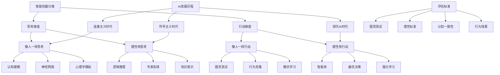

# HCIA-AI 题目分析 - 智能机器分类

## 题目内容

**问题**: 人工智能研究在国际上至今没有统一的定义，目前普遍将智能机器分为以下哪几类？

**选项**:
- A. 理性地行动
- B. 理性地思考
- C. 像人一样思考
- D. 像人一样行动

## 选项分析表格

| 选项 | 内容 | 正确性 | 详细分析 | 知识点 |
|------|------|--------|----------|--------|
| A | 理性地行动 | ✅ | 正确。这是AI的四大类别之一，强调机器能够基于逻辑推理和最优决策来执行行动，追求最佳结果，代表了现代AI系统的主要发展方向 | 理性智能体 |
| B | 理性地思考 | ✅ | 正确。这类AI强调逻辑推理和符号处理，通过形式化的逻辑系统进行思考，是早期AI研究的重要方向，如专家系统和知识表示 | 符号主义AI |
| C | 像人一样思考 | ✅ | 正确。这类AI试图模拟人类的认知过程和思维方式，包括学习、记忆、推理等心理过程，是认知科学与AI结合的研究方向 | 认知建模 |
| D | 像人一样行动 | ✅ | 正确。这类AI强调模拟人类的外在行为表现，通过图灵测试等方式评估，不关注内部实现机制，只要行为结果与人类相似即可 | 行为模拟 |

## 正确答案
**答案**: ABCD

**解题思路**: 
1. 这是AI领域的经典分类框架，由Russell和Norvig提出
2. 按照两个维度分类：思考vs行动，人类vs理性
3. 四个象限构成完整的AI分类体系
4. 每种类型代表不同的AI研究路径和目标
5. 现代AI系统往往结合多种类型的特征

## 概念图解

## 知识点总结

### 核心概念
- **像人一样思考**: 模拟人类认知过程，关注内在思维机制
- **理性地思考**: 基于逻辑和形式化推理的思考方式
- **像人一样行动**: 模拟人类外在行为，通过图灵测试评估
- **理性地行动**: 基于最优决策理论的智能行为

### 相关技术
- 认知科学与AI结合
- 符号主义AI系统
- 连接主义神经网络
- 智能体和多智能体系统

### 记忆要点
- AI分类的四个维度：思考/行动 × 人类/理性
- 每种类型都有其独特的研究方法和应用场景
- 现代AI系统往往融合多种类型的特征
- 不同时期AI研究侧重点不同
- 理解分类有助于把握AI发展脉络

## 扩展学习

### 相关文档
- 《人工智能：一种现代方法》Russell & Norvig
- AI哲学和认知科学基础
- 图灵测试和AI评估标准
- 智能体理论和设计原则

### 实践应用
- AI系统设计和评估
- 人机交互界面设计
- 智能决策系统开发
- 认知计算平台构建