# HCIA-AI 题目分析 - Softmax函数描述

## 题目内容

**问题**: 以下关于Softmax函数的描述中，哪些选项是错误的？

**选项**:
- A. Softmax函数的本质就是将一个K维的任意实数向量压缩（映射）成另一个K维的实数向量，其中向量中的每个元素取值都介于（0，1）之间。
- B. 逻辑回归只能用于二分类问题，如果是多分类问题，我们通常使用Softmax函数。
- C. Softmax回归是逻辑回归的一般化，适用于二分类的问题。
- D. Softmax为多类问题中的每个分类分配了概率值，这些概率值加起来不一定等于1。

## 选项分析表格

| 选项 | 内容 | 正确性 | 详细分析 | 知识点 |
|------|------|--------|----------|--------|
| A | Softmax函数的本质就是将一个K维的任意实数向量压缩（映射）成另一个K维的实数向量，其中向量中的每个元素取值都介于（0，1）之间。 | ✅ | 正确描述。Softmax函数确实将任意实数向量映射为概率分布，每个元素值在(0,1)区间内，这是Softmax的基本数学性质 | Softmax数学性质 |
| B | 逻辑回归只能用于二分类问题，如果是多分类问题，我们通常使用Softmax函数。 | ❌ | 错误。逻辑回归可以通过一对多(OvR)或一对一(OvO)策略扩展到多分类问题，不是只能用于二分类。Softmax是多分类的一种方法，但不是唯一方法 | 分类算法应用 |
| C | Softmax回归是逻辑回归的一般化，适用于二分类的问题。 | ✅ | 正确描述。Softmax回归确实是逻辑回归的多分类扩展，当类别数为2时，Softmax退化为逻辑回归，所以适用于二分类问题 | 算法关系 |
| D | Softmax为多类问题中的每个分类分配了概率值，这些概率值加起来不一定等于1。 | ❌ | 错误。Softmax函数的重要性质是输出的所有概率值之和必须等于1，这是概率分布的基本要求，也是Softmax函数的数学定义 | 概率分布性质 |

## 正确答案
**答案**: BD

**解题思路**: 
1. 分析Softmax函数的数学性质和应用场景
2. A选项正确描述了Softmax的映射特性
3. B选项错误，逻辑回归可以扩展到多分类
4. C选项正确，Softmax是逻辑回归的泛化
5. D选项错误，Softmax输出概率和必须为1

## 概念图解

```mermaid
graph TD
    A[Softmax函数] --> B[数学性质]
    A --> C[应用场景]
    A --> D[与其他算法关系]
    
    B --> B1["输入: K维实数向量"]
    B --> B2["输出: K维概率向量"]
    B --> B3["每个元素 ∈ (0,1)"]
    B --> B4["所有元素和 = 1"]
    
    C --> C1[多分类问题]
    C --> C2[神经网络输出层]
    C --> C3[概率分布建模]
    C --> C4[注意力机制]
    
    D --> D1[逻辑回归的泛化]
    D --> D2["当K=2时退化为Sigmoid"]
    D --> D3[多项式逻辑回归]
    
    E[常见误解] --> E1[逻辑回归只能二分类]
    E --> E2[概率和不等于1]
    E --> E3[只适用于多分类]
    
    F[Softmax公式] --> F1["σ(z_i) = e^(z_i) / Σe^(z_j)"]
    F --> F2[指数归一化]
    F --> F3[温度参数调节]
    
    G[逻辑回归扩展] --> G1[一对多策略]
    G --> G2[一对一策略]
    G --> G3[多项式逻辑回归]
    
    style E fill:#ffcccc
    style E1 fill:#ffcccc
    style E2 fill:#ffcccc
    style E3 fill:#ffcccc
```

## 知识点总结

### 核心概念
- **Softmax函数**: 将实数向量转换为概率分布的激活函数
- **概率归一化**: 输出所有概率值之和等于1
- **多分类扩展**: 逻辑回归在多分类问题中的泛化
- **温度参数**: 控制概率分布的平滑程度

### 相关技术
- 神经网络分类层设计
- 交叉熵损失函数
- 梯度计算和反向传播
- 注意力机制实现

### 记忆要点
- Softmax输出概率和必须为1
- 逻辑回归可以扩展到多分类问题
- Softmax是逻辑回归的泛化形式
- 输出值在(0,1)区间内，不包括端点
- 常用于神经网络的最后一层

## 扩展学习

### 相关文档
- 深度学习中的激活函数详解
- 多分类算法比较研究
- 概率论和数理统计基础
- 神经网络设计原理

### 实践应用
- 图像分类模型设计
- 自然语言处理分类任务
- 推荐系统概率建模
- 强化学习策略网络