# HCIA-AI 题目分析 - 数据预处理方法

## 题目内容

**问题**: 以下哪些选项是常见的数据预处理方法？

**选项**:
- A. 零均值化
- B. 主成分分析
- C. 数据漂移
- D. 白化

## 选项分析表格

| 选项 | 内容 | 正确性 | 详细分析 | 知识点 |
|------|------|--------|----------|--------|
| A | 零均值化 | ✅ | 正确。零均值化(Zero-centering)是常见的数据预处理方法，通过减去均值使数据中心化，有助于梯度下降算法的收敛和神经网络的训练稳定性 | 数据标准化 |
| B | 主成分分析 | ❌ | 错误。主成分分析(PCA)是降维技术和特征提取方法，虽然在数据处理流程中使用，但不属于传统意义上的数据预处理方法，而是特征工程技术 | 降维技术 |
| C | 数据漂移 | ❌ | 错误。数据漂移(Data Drift)是指数据分布随时间发生变化的现象，是需要检测和处理的问题，而不是数据预处理的方法 | 数据质量问题 |
| D | 白化 | ✅ | 正确。白化(Whitening)是重要的数据预处理技术，通过线性变换使数据各维度去相关且方差为1，常用于深度学习和信号处理中 | 数据去相关 |

## 正确答案
**答案**: AD

**解题思路**: 
1. 数据预处理是机器学习流程的重要环节
2. 零均值化是基础的数据标准化方法
3. 白化是高级的数据预处理技术
4. PCA属于特征工程而非预处理
5. 数据漂移是问题而非解决方法

## 概念图解

```mermaid
graph TD
    A[数据预处理方法] --> B[零均值化]
    A --> C[白化]
    A --> D[其他预处理方法]
    
    B --> B1["x' = x - μ"]
    B --> B2[中心化数据]
    B --> B3[改善收敛性]
    B --> B4[减少数值不稳定]
    
    C --> C1[去相关化]
    C --> C2[方差归一化]
    C --> C3["Σ = I (单位矩阵)"]
    C --> C4[PCA白化/ZCA白化]
    
    D --> D1[归一化]
    D --> D2[标准化]
    D --> D3[缺失值处理]
    D --> D4[异常值检测]
    
    E[非预处理方法] --> F[主成分分析]
    E --> G[数据漂移]
    
    F --> F1[降维技术]
    F --> F2[特征提取]
    F --> F3[特征工程范畴]
    
    G --> G1[数据质量问题]
    G --> G2[分布变化检测]
    G --> G3[模型监控指标]
    
    H[预处理流程] --> H1[数据清洗]
    H --> H2[数据变换]
    H --> H3[数据标准化]
    H --> H4[特征工程]
    
    style E fill:#ffcccc
    style F fill:#ffcccc
    style G fill:#ffcccc
    style F1 fill:#ffcccc
    style F2 fill:#ffcccc
    style F3 fill:#ffcccc
    style G1 fill:#ffcccc
    style G2 fill:#ffcccc
    style G3 fill:#ffcccc
```

## 知识点总结

### 核心概念
- **零均值化**: 通过减去均值使数据中心化，改善算法收敛性
- **白化**: 去除数据相关性并标准化方差的高级预处理技术
- **数据预处理**: 为机器学习算法准备高质量输入数据的过程
- **特征工程**: 包括特征提取、选择和构造的更高层次处理

### 相关技术
- 数据标准化和归一化
- 协方差矩阵计算
- 线性代数变换
- 统计学数据分析

### 记忆要点
- 零均值化是基础的数据中心化方法
- 白化同时实现去相关和方差标准化
- PCA是降维技术，不是预处理方法
- 数据漂移是问题现象，不是处理方法
- 预处理目标是提高算法性能和稳定性

## 扩展学习

### 相关文档
- 机器学习数据预处理指南
- 深度学习中的数据标准化技术
- 统计学习理论基础
- scikit-learn预处理模块文档

### 实践应用
- 神经网络训练数据准备
- 计算机视觉图像预处理
- 自然语言处理文本标准化
- 时间序列数据预处理