# HCIA-AI 题目分析 - 多层感知机图像处理弊端

## 题目内容

**问题**: 以下哪些项是多层感知机（全连接结构）在处理图像时的弊端？

**选项**:
- A. 多层感知机的输入形式会破坏图像像素的空间关系。
- B. 多层感知机无法解决图像不变性的问题。
- C. 人是通过图像的局部特征来理解图像，而多层感知机中每个神经元都处理整幅图像的像素点。
- D. 计算机存储和处理图像的方式会使多层感知知机模型参数巨大。

## 选项分析表格

| 选项 | 内容 | 正确性 | 详细分析 | 知识点 |
|------|------|--------|----------|--------|
| A | 多层感知机的输入形式会破坏图像像素的空间关系。 | ❌ | 错误。多层感知机将2D图像展平为1D向量输入，虽然改变了数据结构，但并不"破坏"空间关系，只是没有显式利用空间信息，这是设计局限而非破坏 | 数据结构处理 |
| B | 多层感知机无法解决图像不变性的问题。 | ✅ | 正确。多层感知机缺乏平移、旋转、缩放等不变性，对图像中目标的位置变化敏感，无法有效处理同一物体在不同位置或姿态下的识别问题 | 图像不变性 |
| C | 人是通过图像的局部特征来理解图像，而多层感知机中每个神经元都处理整幅图像的像素点。 | ✅ | 正确。人类视觉系统具有局部感受野特性，而全连接网络每个神经元都与所有输入像素连接，缺乏局部特征提取能力，不符合视觉认知原理 | 局部特征提取 |
| D | 计算机存储和处理图像的方式会使多层感知知机模型参数巨大。 | ✅ | 正确。全连接结构导致参数数量随图像尺寸急剧增长，例如1000×1000图像需要百万级参数，造成存储和计算负担，容易过拟合 | 参数复杂度 |

## 正确答案
**答案**: BCD

**解题思路**: 
1. 分析多层感知机在图像处理中的结构特点
2. A选项表述过于绝对，空间关系未被"破坏"
3. B选项正确，缺乏图像不变性是重要弊端
4. C选项正确，全连接违背局部特征原理
5. D选项正确，参数爆炸是实际问题

## 概念图解

```mermaid
graph TD
    A[多层感知机图像处理弊端] --> B[图像不变性问题]
    A --> C[局部特征提取问题]
    A --> D[参数复杂度问题]
    A --> E[空间信息利用问题]
    
    B --> B1[平移不变性缺失]
    B --> B2[旋转不变性缺失]
    B --> B3[缩放不变性缺失]
    B --> B4[位置敏感性强]
    
    C --> C1[全连接结构]
    C --> C2[缺乏局部感受野]
    C --> C3[无法提取局部特征]
    C --> C4[违背视觉认知原理]
    
    D --> D1[参数数量爆炸]
    D --> D2["O(W×H×N) 复杂度"]
    D --> D3[存储需求大]
    D --> D4[计算开销高]
    D --> D5[容易过拟合]
    
    E --> E1[图像展平为向量]
    E --> E2[空间结构信息丢失]
    E --> E3[相邻像素关系忽略]
    
    F[CNN解决方案] --> F1[卷积操作]
    F --> F2[参数共享]
    F --> F3[局部连接]
    F --> F4[池化操作]
    
    F1 --> F1A[局部特征提取]
    F2 --> F2A[减少参数数量]
    F3 --> F3A[模拟感受野]
    F4 --> F4A[平移不变性]
    
    G[人类视觉系统] --> G1[层次化特征提取]
    G --> G2[局部到全局]
    G --> G3[边缘检测]
    G --> G4[形状识别]
    
    style E fill:#ffffcc
    style E1 fill:#ffffcc
    style E2 fill:#ffffcc
    style E3 fill:#ffffcc
```

## 知识点总结

### 核心概念
- **图像不变性**: 模型对图像变换(平移、旋转、缩放)的鲁棒性
- **局部特征**: 图像中局部区域的特征信息，是视觉理解的基础
- **参数爆炸**: 全连接结构导致的参数数量急剧增长问题
- **空间信息**: 图像像素间的位置关系和邻域结构

### 相关技术
- 卷积神经网络设计
- 参数共享机制
- 局部连接策略
- 池化和下采样技术

### 记忆要点
- 多层感知机缺乏图像处理的关键特性
- 全连接结构不适合图像的空间特性
- 参数数量随图像尺寸平方增长
- CNN通过卷积和池化解决这些问题
- 局部特征提取是视觉任务的关键

## 扩展学习

### 相关文档
- 卷积神经网络原理详解
- 计算机视觉基础理论
- 深度学习中的参数优化
- 图像处理和模式识别

### 实践应用
- CNN架构设计原理
- 图像分类模型优化
- 计算机视觉系统开发
- 深度学习模型压缩技术