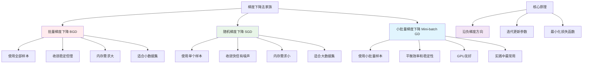

# HCIA-AI 题目分析 - 梯度下降法描述

## 题目内容

**问题**: 12. 以下关于梯度下降法的描述中，正确的有哪几项？(1.00分)

**选项**:
- A. 梯度下降法的思想是让损失函数沿着梯度的方向进行搜索，不断迭代更新参数，最终使得损失函数最小化。❌
- B. 全局梯度下降法收敛过程比较慢，因为每次更新权值都需要计算所有的训练样例。✅
- C. 小批量梯度下降法每次使用一小批固定尺寸的样例来更新权值，兼顾了效率和精度的稳定性。✅
- D. 随机梯度下降根据每一个样例来更新权值，往往难以收敛到极值。❌

## 选项分析表格

| 选项 | 内容 | 正确性 | 详细分析 | 知识点 |
|------|------|--------|----------|--------|
| A | 梯度下降法沿着梯度方向搜索 | ❌ | 这个描述是错误的。梯度下降法是沿着**负梯度方向**进行搜索，而不是梯度方向。梯度指向函数增长最快的方向，而我们要最小化损失函数，所以要沿着负梯度方向(函数下降最快的方向)进行搜索。 | 梯度下降原理、搜索方向 |
| B | 全局梯度下降法收敛慢 | ✅ | 正确。批量梯度下降法(BGD)每次更新都需要计算所有训练样本的梯度，计算量大，收敛速度慢，但收敛过程稳定。特别是在大数据集上，每次迭代的计算开销非常大。 | 批量梯度下降、计算复杂度 |
| C | 小批量梯度下降法的优势 | ✅ | 正确。Mini-batch梯度下降法使用固定大小的小批量样本(如32、64、128等)来计算梯度，既避免了BGD的计算开销过大问题，又避免了SGD的收敛不稳定问题，是实践中最常用的方法。 | 小批量梯度下降、效率平衡 |
| D | 随机梯度下降难以收敛 | ❌ | 这个描述不准确。SGD虽然收敛过程有噪声和震荡，但在适当的学习率调度下是可以收敛的。实际上，SGD的随机性有助于跳出局部最优，在某些情况下反而能找到更好的解。关键是要合理设置学习率。 | 随机梯度下降、收敛性 |

## 正确答案
**答案**: BC

**解题思路**: 
1. 分析每个选项关于梯度下降法的描述是否正确
2. A选项错误：应该是沿着负梯度方向，不是梯度方向
3. B选项正确：BGD确实收敛慢，因为每次都要计算所有样本
4. C选项正确：Mini-batch确实平衡了效率和稳定性
5. D选项错误：SGD在合适条件下是可以收敛的

## 概念图解



## 知识点总结

### 核心概念
- **梯度下降法**: 基于梯度信息的一阶优化算法
- **负梯度方向**: 函数值下降最快的方向
- **迭代优化**: 通过多次迭代逐步逼近最优解
- **学习率**: 控制每次更新的步长大小

### 三种梯度下降法对比

#### 1. 批量梯度下降法 (Batch Gradient Descent, BGD)
```python
# 伪代码
for epoch in range(num_epochs):
    gradient = compute_gradient(all_samples)  # 使用全部样本
    parameters = parameters - learning_rate * gradient
```

**特点**:
- **优点**: 收敛稳定，梯度准确
- **缺点**: 计算慢，内存需求大
- **适用**: 小数据集，要求高精度

#### 2. 随机梯度下降法 (Stochastic Gradient Descent, SGD)
```python
# 伪代码
for epoch in range(num_epochs):
    for sample in shuffle(training_data):
        gradient = compute_gradient(sample)  # 使用单个样本
        parameters = parameters - learning_rate * gradient
```

**特点**:
- **优点**: 计算快，内存需求小，能跳出局部最优
- **缺点**: 收敛有噪声，可能震荡
- **适用**: 大数据集，在线学习

#### 3. 小批量梯度下降法 (Mini-batch Gradient Descent)
```python
# 伪代码
for epoch in range(num_epochs):
    for batch in get_batches(training_data, batch_size):
        gradient = compute_gradient(batch)  # 使用小批量样本
        parameters = parameters - learning_rate * gradient
```

**特点**:
- **优点**: 平衡效率和稳定性，GPU友好
- **缺点**: 需要调整批量大小超参数
- **适用**: 大多数实际应用场景

### 数学原理

#### 梯度下降更新公式
```
θ_{t+1} = θ_t - α ∇J(θ_t)

其中:
- θ: 参数向量
- α: 学习率
- ∇J(θ): 损失函数的梯度
- t: 迭代次数
```

#### 梯度计算
- **BGD**: ∇J(θ) = (1/m) Σ ∇J_i(θ)  (所有样本)
- **SGD**: ∇J(θ) ≈ ∇J_i(θ)  (单个样本)
- **Mini-batch**: ∇J(θ) = (1/b) Σ ∇J_i(θ)  (批量样本)

### 收敛性分析

#### 收敛条件
1. **学习率选择**: 0 < α < 2/L (L为Lipschitz常数)
2. **函数性质**: 凸函数有全局收敛保证
3. **梯度有界**: 梯度不能无限大

#### 收敛速度对比
| 方法 | 收敛速度 | 收敛稳定性 | 计算复杂度 |
|------|----------|------------|------------|
| BGD | 慢 | 高 | O(mn) |
| SGD | 快(初期) | 低 | O(n) |
| Mini-batch | 中等 | 中等 | O(bn) |

### 实践中的改进

#### 学习率调度
- **固定学习率**: α = constant
- **指数衰减**: α_t = α_0 × γ^t
- **阶梯衰减**: 每隔几个epoch减小学习率
- **自适应**: Adam, AdaGrad, RMSprop等

#### 动量方法
```python
# Momentum SGD
v_t = β × v_{t-1} + α × gradient
parameters = parameters - v_t
```

#### 批量大小选择
- **小批量(32-128)**: 适合大多数情况
- **中批量(256-512)**: 适合GPU集群
- **大批量(1024+)**: 需要特殊技巧

### 记忆要点
- 梯度下降沿**负梯度方向**，不是梯度方向
- BGD稳定但慢，SGD快但有噪声，Mini-batch平衡两者
- SGD在合适条件下可以收敛，不是"难以收敛"
- 实践中最常用Mini-batch方法

## 扩展学习

### 现代优化算法

#### Adam优化器
```python
# Adam算法结合了动量和自适应学习率
class Adam:
    def __init__(self, lr=0.001, beta1=0.9, beta2=0.999, eps=1e-8):
        self.lr = lr
        self.beta1 = beta1
        self.beta2 = beta2
        self.eps = eps
        self.m = 0  # 一阶矩估计
        self.v = 0  # 二阶矩估计
        self.t = 0  # 时间步
    
    def update(self, params, grads):
        self.t += 1
        self.m = self.beta1 * self.m + (1 - self.beta1) * grads
        self.v = self.beta2 * self.v + (1 - self.beta2) * grads**2
        
        m_hat = self.m / (1 - self.beta1**self.t)
        v_hat = self.v / (1 - self.beta2**self.t)
        
        params -= self.lr * m_hat / (np.sqrt(v_hat) + self.eps)
```

#### 其他优化算法
- **AdaGrad**: 自适应学习率，适合稀疏数据
- **RMSprop**: 改进的AdaGrad，解决学习率衰减问题
- **AdamW**: 改进的Adam，更好的权重衰减
- **RAdam**: 修正的Adam，更稳定的收敛

### MindSpore实现
```python
import mindspore.nn as nn

# 不同的优化器
sgd_optimizer = nn.SGD(params, learning_rate=0.01, momentum=0.9)
adam_optimizer = nn.Adam(params, learning_rate=0.001)
rmsprop_optimizer = nn.RMSprop(params, learning_rate=0.001)

# 学习率调度
from mindspore import nn
scheduler = nn.ExponentialDecayLR(learning_rate=0.1, decay_rate=0.9, decay_steps=100)
```

### 调试和监控
- **损失曲线**: 监控训练和验证损失
- **梯度监控**: 检查梯度消失/爆炸
- **学习率调整**: 根据收敛情况调整
- **早停机制**: 防止过拟合

### 实际应用技巧
1. **预处理**: 数据标准化，特征缩放
2. **初始化**: 合适的权重初始化方法
3. **正则化**: L1/L2正则化，Dropout
4. **批标准化**: 加速收敛，提高稳定性
5. **梯度裁剪**: 防止梯度爆炸