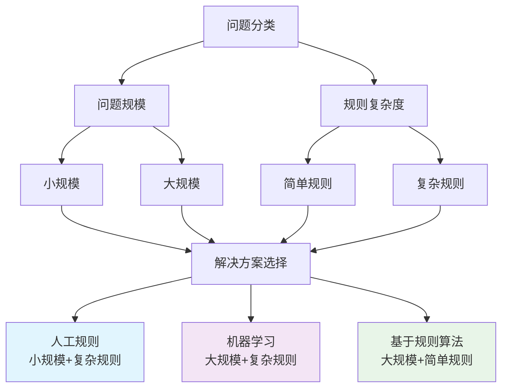

# HCIA-AI 题目分析 - 问题解决方法描述

## 题目内容

**问题**: 以下关于解决问题方法的描述中，哪些选项是正确的？

**选项**:
- A. 人工规则适用于解决问题规模小，规则复杂度高的问题
- B. 机器学习算法适用于解决问题规模大，规则复杂度高的问题
- C. 基于规则的算法适用于问题规模大，规则复杂度低的问题
- D. 问题规模大，规则复杂度低的问题属于简单问题

## 选项分析表格

| 选项 | 内容 | 正确性 | 详细分析 | 知识点 |
|------|------|--------|----------|--------|
| A | 人工规则适用于解决问题规模小，规则复杂度高的问题 | ✅ | 人工规则适合处理规模较小但规则复杂的问题，因为人工可以精确定义复杂的逻辑规则，但当问题规模扩大时，人工维护成本会急剧增加 | 人工智能方法选择 |
| B | 机器学习算法适用于解决问题规模大，规则复杂度高的问题 | ✅ | 机器学习特别适合处理大规模、复杂规则的问题，通过数据驱动的方式自动学习复杂的模式和规则，无需人工显式编程 | 机器学习应用场景 |
| C | 基于规则的算法适用于问题规模大，规则复杂度低的问题 | ✅ | 当问题规模大但规则相对简单时，基于规则的算法可以高效处理，因为规则简单易于实现和维护，且可以处理大量数据 | 规则引擎系统 |
| D | 问题规模大，规则复杂度低的问题属于简单问题 | ❌ | 虽然规则复杂度低，但问题规模大仍然会带来计算复杂性和系统设计挑战，不能简单归类为简单问题 | 问题复杂度评估 |

## 正确答案
**答案**: ABC

**解题思路**: 
1. 分析不同AI方法的适用场景
2. 考虑问题规模和规则复杂度两个维度
3. 人工规则：小规模+复杂规则
4. 机器学习：大规模+复杂规则
5. 基于规则算法：大规模+简单规则
6. 问题规模大不等于问题简单

## 概念图解

## 知识点总结

### 核心概念
- **人工规则系统**: 适合小规模、复杂逻辑的问题，人工可以精确控制规则
- **机器学习方法**: 适合大规模、复杂模式的问题，通过数据自动学习规则
- **基于规则算法**: 适合大规模、简单规则的问题，规则明确且易于实现

### 相关技术
- 专家系统（人工规则）
- 深度学习、神经网络（机器学习）
- 规则引擎、决策树（基于规则）

### 记忆要点
- 问题规模 ≠ 问题复杂度
- 选择AI方法需要同时考虑规模和复杂度
- 大规模问题不一定是简单问题

## 扩展学习

### 相关文档
- 人工智能方法论
- 机器学习算法选择指南
- 规则引擎设计原理

### 实践应用
- 华为云ModelArts中的算法选择
- 企业级规则引擎应用
- 大数据处理中的方法选择