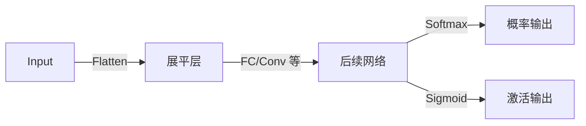

# HCIA-AI 题目分析 - MindSpore nn 相关算子

## 题目内容

**问题**: 以下哪几项属于 MindSpore 中与 nn（神经网络）相关算子？

**选项**:
- A. Flatten
- B. Softmax
- C. Sigmoid
- D. Mul

## 选项分析表格

| 选项 | 内容 | 正确性 | 详细分析 | 知识点 |
|------|------|--------|----------|--------|
| A | Flatten | ✅ | `Flatten` 是 MindSpore `mindspore.nn` 模块提供的层，用于将多维输入展平为二维张量，常见于 CNN 连接到全连接层时。 | Tensor 形状变换层 |
| B | Softmax | ✅ | `Softmax` 激活函数位于 `mindspore.nn`，将向量归一化为概率分布，常用于分类网络输出层。 | 激活函数，概率解释 |
| C | Sigmoid | ✅ | `Sigmoid` 激活函数同样在 `mindspore.nn`，输出范围 (0,1)，常用于二分类或门控结构。 | 激活函数，非线性 |
| D | Mul | ❌ | `Mul` 为张量算子，位于 `mindspore.ops` 而非 `mindspore.nn`，用于元素级乘法，不归类为 nn 层/算子。 | 基础张量运算 |

## 正确答案
**答案**: ABC

**解题思路**:
1. 识别 `mindspore.nn` 常见层与激活函数：Flatten、Softmax、Sigmoid 等。
2. 区分基础算子（`mindspore.ops`）与 nn 层：`Mul` 为一般张量运算，不属于 nn 模块。

## 概念图解 (如需要)

## 知识点总结

### 核心概念
- `mindspore.nn` 提供高阶网络层、激活函数与损失函数。
- `Flatten` 主要用于将高维特征图转为二维以便进入全连接层。
- `Softmax` 与 `Sigmoid` 为常见激活函数，作用于输出层或中间层。

### 相关技术
- MindSpore 张量与算子分层：`mindspore.ops`（基础算子） vs `mindspore.nn`（网络层）。

### 记忆要点
- 判断算子是否在 `mindspore.nn` 模块，可快速排除基础算子。

## 扩展学习

### 相关文档
- MindSpore 官方文档 `mindspore.nn` 模块说明

### 实践应用
- 在图像分类网络中经常 `Flatten` -> 全连接 -> `Softmax` 作为输出层。