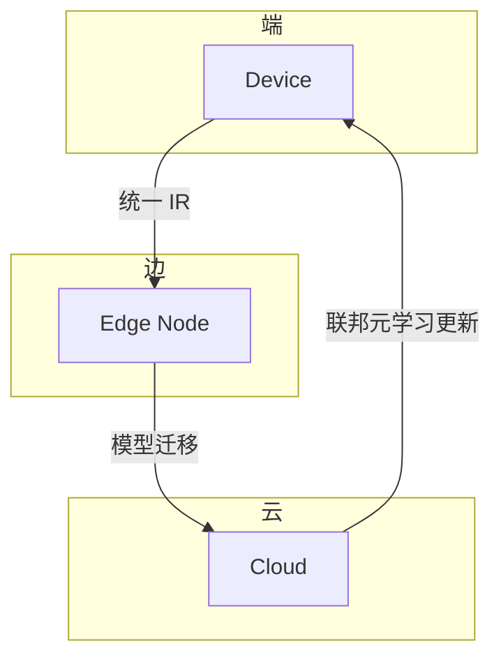

# HCIA-AI 题目分析 - MindSpore 端-边-云协作关键技术

## 题目内容

**问题**: MindSpore 支持端-边-云按需协作的关键技术包括？

**选项**:
- A. 统一模型 IR
- B. 集中式架构
- C. 软硬协同的图优化技术
- D. 端云协同 FederalMetaLearning

## 选项分析表格

| 选项 | 内容 | 正确性 | 详细分析 | 知识点 |
|------|------|--------|----------|--------|
| A | 统一模型 IR | ✅ | MindSpore 通过统一的中间表示（IR）确保模型在端、边、云不同硬件上无缝迁移与部署。 | 统一 IR 架构 |
| B | 集中式架构 | ❌ | 集中式架构不利于端-边-云分布式协同，MindSpore 采用分布式及模块化设计而非单一集中式。 | 分布式协同架构 |
| C | 软硬协同的图优化技术 | ✅ | MindSpore 结合软硬件特性进行计算图优化，提升异构硬件执行效率。 | 图优化、异构计算 |
| D | 端云协同 FederalMetaLearning | ✅ | 联邦元学习方案（Federal Meta-Learning）支持端云协同训练，在保护数据隐私的同时提升模型泛化能力。 | 联邦学习、元学习 |

## 正确答案
**答案**: ACD

**解题思路**:
1. 阅读 MindSpore 白皮书，识别端-边-云协同三大关键：统一 IR、软硬协同优化、联邦/分层训练方案。
2. 集中式架构与 MindSpore 分布式设计理念相悖，排除。

## 概念图解

## 知识点总结

### 核心概念
- 统一 IR：跨硬件编译统一表示。
- 图优化：编译期融合、调度、内存优化。
- 联邦/元学习：数据分散情况下的协同训练。

### 记忆要点
- 集中式≠协同；看关键词 “统一”“协同” 即正确选项。

### 实践应用
- 端侧推理 + 云侧训练增量更新；IR 统一降低维护复杂度。