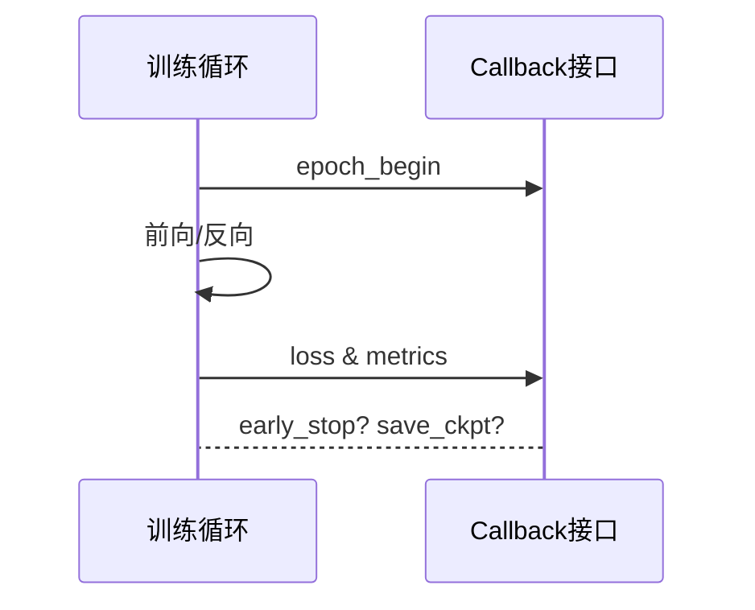

# HCIA-AI 题目分析 - MindSpore Callback 使用场景

## 题目内容

**问题**: John 在学习 MindSpore 框架时，学习了 callback 的使用并准备用于 AI 模型训练中，以下他可以使用的 callback 的场景有哪些？

**选项**:
- A. 提前终止训练
- B. 调整激活函数
- C. 监控训练过程中的 loss
- D. 保存模型参数

## 选项分析表格

| 选项 | 场景 | 正确性 | 详细分析 | 知识点 |
|------|------|--------|----------|--------|
| A | 提前终止训练 | ✅ | `EarlyStop` 或自定义 Callback 可根据验证集指标提前停止训练，避免过拟合。 | EarlyStopping 回调 |
| B | 调整激活函数 | ❌ | 激活函数属于网络结构，不依赖 callback 动态修改，需重新构建网络。 | 网络结构固定性 |
| C | 监控训练过程中的 loss | ✅ | `LossMonitor` Callback 用于打印与记录 loss，支持阈值判断。 | 训练过程监控 |
| D | 保存模型参数 | ✅ | `ModelCheckpoint` Callback 定时保存权重以便恢复或部署。 | Checkpoint 机制 |

## 正确答案
**答案**: ACD

**解题思路**:
1. 分析 MindSpore 常用回调功能：EarlyStop、LossMonitor、ModelCheckpoint 等。
2. 调整激活函数需改模型图，不是 callback 使用场景。

## 概念图解

## 知识点总结
- Callback 主要承担监控、记录、终止、保存等“训练过程控制”任务。
- 网络结构相关修改需重新定义模型。