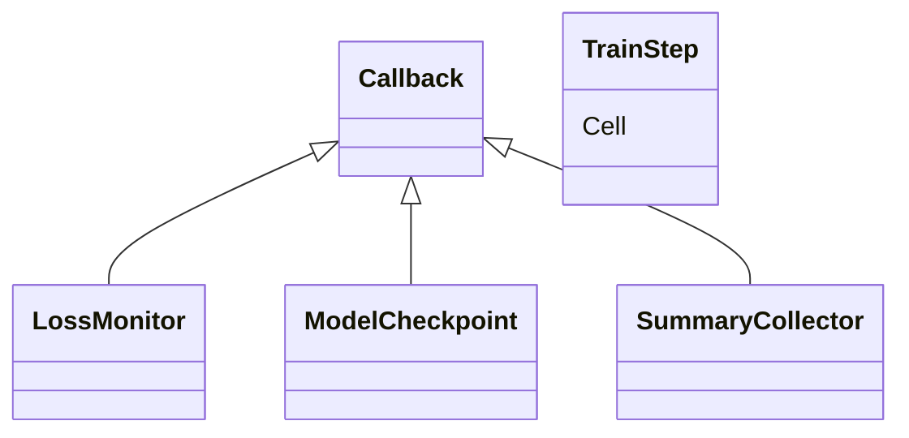

# HCIA-AI 题目分析 - MindSpore 提供的 Callback 选项

## 题目内容

**问题**: 以下属于 MindSpore 中提供 Callback 的选项有哪些？

**选项**:
- A. LossMonitor
- B. TrainStep
- C. ModelCheckpoint
- D. SummaryCollector

## 选项分析表格

| 选项 | 内容 | 正确性 | 详细分析 | 知识点 |
|------|------|--------|----------|--------|
| A | LossMonitor | ✅ | MindSpore 内置回调，用于监控并打印每 step/loss 值，可设置异常检测。 | 训练监控回调 |
| B | TrainStep | ❌ | `TrainStep` 是训练封装 Cell，不属于回调接口。 | 训练网络单元 |
| C | ModelCheckpoint | ✅ | 内置回调，定期保存模型参数与网络结构，支持最大 ckpt 数量和间隔配置。 | Checkpoint 管理 |
| D | SummaryCollector | ✅ | 用于收集并写入训练过程的 scalar、histogram、图像等信息到日志，便于可视化分析。 | 训练可视化回调 |

## 正确答案
**答案**: ACD

**解题思路**:
1. 查看 MindSpore `mindspore.train.callback` 模块列出的内置回调类。
2. TrainStep 属于 `Cell`，与 callback 概念不同，排除。

## 概念图解

## 知识点总结
- Callback 设计用于钩住训练循环的不同阶段，实现监控、保存、控制等功能。
- TrainStep 等 Cell 专注于前向+反向逻辑，与回调机制分离。