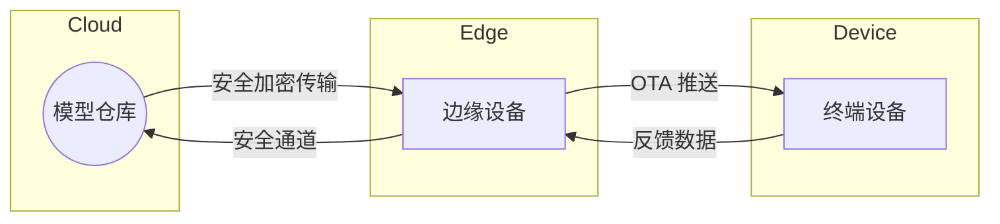

# HCIA-AI 题目分析 - 华为 AI 全栈端边云协同描述

## 题目内容

**问题**: 以下关于华为 AI 全栈端边云协同的描述，正确的是哪些选项？

**选项**:
- A. 模型推送/设备升级等均可远程完成
- B. 传输通道安全加密
- C. 边缘端口和中心侧分别使用不同开发架构
- D. 模型加密

## 选项分析表格

| 选项 | 内容 | 正确性 | 详细分析 | 知识点 |
|------|------|--------|----------|--------|
| A | 远程模型推送/设备升级 | ✅ | 华为端边云协同平台支持 OTA 与模型远程下发，提高运维效率。 | OTA、模型管理 |
| B | 传输通道安全加密 | ✅ | 通过 HTTPS/TLS、证书及密钥机制保证端边云数据传输安全。 | 传输安全 |
| C | 不同开发架构 | ❌ | 华为主张统一开发框架（MindSpore、ModelArts Pipeline 等）跨端边云复用，减少碎片化。 | 统一开发框架 |
| D | 模型加密 | ✅ | 提供模型加密和签名校验，防止恶意篡改与盗用。 | 模型安全 |

## 正确答案
**答案**: ABD

**解题思路**:
1. 查阅华为全栈 AI 端边云协同白皮书，提到远程运维、安全传输、模型加密等能力。
2. 华为强调“一次开发，多端部署”，不倡导完全不同的开发架构。

## 概念图解

## 知识点总结

### 核心概念
- 端边云协同强调统一框架、远程运维及安全体系。
- OTA、加密传输、模型加密确保模型生命周期安全。

### 记忆要点
- 关注“统一、安全、远程”关键词即为正确项。

### 实践应用
- 使用 ModelArts Model Management + IEF（IoT Edge）完成模型下发、监控与升级。