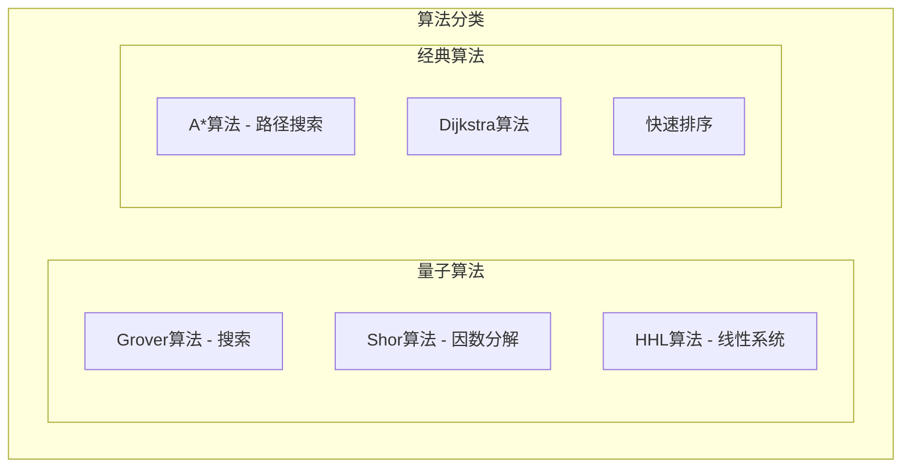

# HCIA-AI 题目分析 - 通用量子算法

## 题目内容

**问题**: 以下哪些选项属于通用量子算法？

**选项**:
- A. Grover算法
- B. Shor算法
- C. HHL算法
- D. A*算法

## 选项分析表格

| 选项 | 内容 | 正确性 | 详细分析 | 知识点 |
|------|------|--------|----------|--------|
| A | Grover算法 | ✅ | 正确。Grover算法是一种量子搜索算法，能在O(√N)时间内搜索N个未排序的条目，相比经典算法的O(N)有平方级加速，是核心的通用量子算法之一。 | 量子搜索 |
| B | Shor算法 | ✅ | 正确。Shor算法是一种用于整数分解的量子算法，其时间复杂度是多项式的，而经典最好的算法是亚指数的。它对现代密码学（如RSA）构成潜在威胁。 | 整数分解、量子密码 |
| C | HHL算法 | ✅ | 正确。HHL算法是用于求解线性方程组的量子算法，在特定条件下能实现指数级加速，是量子机器学习领域的基础算法。 | 量子线性代数 |
| D | A*算法 | ❌ | 错误。A* (A-star) 算法是一种经典的图搜索算法，用于在图中寻找路径，属于经典计算机科学领域的算法，而非量子算法。 | 经典图搜索算法 |

## 正确答案
**答案**: ABC

**解题思路**:
1.  **识别量子算法**: Grover、Shor、HHL都是量子计算领域非常著名的算法，经常在相关课程和资料中被提及。
2.  **识别经典算法**: A*算法是人工智能和游戏开发中常用的路径规划算法，它运行在经典计算机上。
3.  **排除法**: 明确A*算法是经典算法后，即可将其排除，从而确定ABC为正确答案。

**失分点分析**: 您选择了ABCD，错误地将A*算法归类为量子算法。这可能是因为对A*算法的领域归属不熟悉，或者在不确定的情况下选择了所有看起来像算法名称的选项。关键在于区分“量子”与“经典”算法。

## 概念图解 (如需要)

## 知识点总结

### 核心概念
-   **量子算法**: 利用量子力学原理（如叠加、纠缠）在量子计算机上执行的算法，旨在解决特定问题上比经典算法更高效。
-   **Grover算法**: 解决非结构化搜索问题。
-   **Shor算法**: 高效分解大整数，威胁RSA加密。
-   **HHL算法**: 求解特定类型的线性方程组。

### 记忆要点
-   记住几个标志性的量子算法：Grover（搜索）、Shor（破解密码）、HHL（解方程）。
-   A*是寻路算法，跟迷宫、地图导航相关，是经典AI的内容。

## 扩展学习

### 相关文档
-   可以了解一下华为云的量子计算服务HiQ，它提供了模拟和学习这些量子算法的平台。

### 实践应用
-   **Shor算法**的应用前景在于密码分析。
-   **Grover算法**可用于优化问题和数据库搜索。
-   **HHL算法**在机器学习、金融建模等领域有潜在应用。