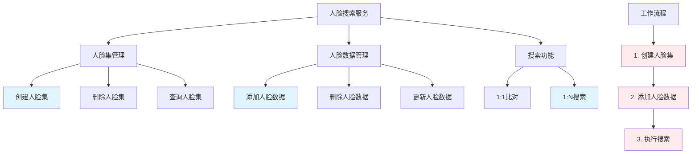

# HCIA-AI 题目分析 - 人脸搜索服务

## 题目内容

**问题**: 关于人脸搜索服务，下列哪些说法是正确的？

**选项**:
- A. 没有人脸集时，需要先创建人脸集，再添加人脸数据，然后才能进行搜索
- B. 一个人脸集的大小不能超过10000张图片
- C. 有专门的接口可以删除指定人脸集
- D. 有专门的接口可以删除某个人脸集中的人脸数据

## 选项分析表格

| 选项 | 内容 | 正确性 | 详细分析 | 知识点 |
|------|------|--------|----------|--------|
| A | 没有人脸集时，需要先创建人脸集，再添加人脸数据，然后才能进行搜索 | ✅ | 这是人脸搜索服务的标准工作流程：1)创建人脸集容器 2)向人脸集添加人脸特征数据 3)基于人脸集进行搜索匹配。没有人脸集就无法存储和检索人脸特征 | 人脸识别工作流程 |
| B | 一个人脸集的大小不能超过10000张图片 | ❌ | 这个限制是错误的。实际上，现代人脸搜索服务支持更大规模的人脸集，华为云等服务通常支持百万级别的人脸数据存储 | 人脸集容量限制 |
| C | 有专门的接口可以删除指定人脸集 | ✅ | 人脸搜索服务提供完整的CRUD操作，包括创建、查询、更新和删除人脸集的API接口，便于管理人脸数据集合 | 人脸集管理API |
| D | 有专门的接口可以删除某个人脸集中的人脸数据 | ✅ | 服务提供细粒度的数据管理功能，可以删除人脸集中的特定人脸数据，而不需要删除整个人脸集，提高数据管理的灵活性 | 人脸数据管理 |

## 正确答案
**答案**: ACD

**解题思路**: 
1. 理解人脸搜索服务的基本工作流程
2. 分析人脸集的容量限制（注意实际限制通常远大于10000）
3. 确认API接口的完整性（增删改查功能）
4. 区分人脸集管理和人脸数据管理的不同层级

## 概念图解

## 知识点总结

### 核心概念
- **人脸集**: 存储人脸特征数据的容器，是进行人脸搜索的基础
- **工作流程**: 创建→添加→搜索的标准流程
- **API管理**: 提供完整的增删改查功能

### 相关技术
- 华为云人脸搜索服务
- Face Recognition API
- 人脸特征提取和存储
- 向量数据库技术

### 记忆要点
- 人脸搜索必须先有人脸集
- 现代服务支持大规模人脸集（远超10000张）
- API提供完整的数据管理功能
- 支持集合级和数据级的删除操作

## 扩展学习

### 相关文档
- 华为云人脸搜索服务文档
- Face Recognition API参考
- 人脸识别技术原理

### 实践应用
- 企业员工考勤系统
- 安防监控人员识别
- 智能门禁系统
- 社交应用人脸标签