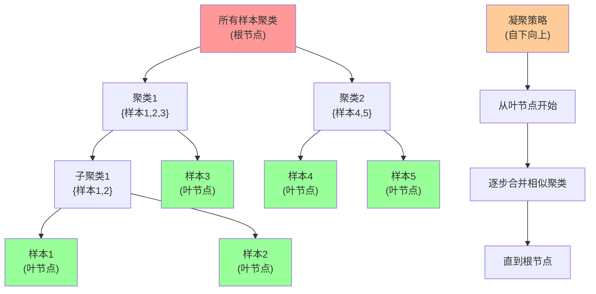

# HCIA-AI 题目分析 - 层次聚类特点

## 题目内容

**问题**: 以下关于层次聚类的说法中，哪些选项是正确的？

**选项**:
- A. 使用层次聚类时，数据集的划分可采用"自下向上"的聚合策略。
- B. 层次聚类帮助形成树形的聚类结构。
- C. 层次聚类得到的结果中，树根拥有所有样本的唯一聚类。
- D. 层次聚类到的结果中，叶子是仅有一个样本的聚类。

## 选项分析表格

| 选项 | 内容 | 正确性 | 详细分析 | 知识点 |
|------|------|--------|----------|--------|
| A | 使用层次聚类时，数据集的划分可采用"自下向上"的聚合策略 | ✅ | 这是凝聚层次聚类（Agglomerative Hierarchical Clustering）的核心思想。从每个样本作为单独聚类开始，逐步合并最相似的聚类，直到所有样本合并为一个聚类 | 凝聚层次聚类 |
| B | 层次聚类帮助形成树形的聚类结构 | ✅ | 层次聚类的结果是一个树状结构（树状图/dendrogram），清晰展示了聚类的层次关系和合并过程，这是层次聚类的核心特征 | 树状图结构 |
| C | 层次聚类得到的结果中，树根拥有所有样本的唯一聚类 | ✅ | 在层次聚类的树状结构中，根节点代表包含所有样本的最大聚类，这是聚合过程的最终结果 | 树状图根节点 |
| D | 层次聚类到的结果中，叶子是仅有一个样本的聚类 | ✅ | 在层次聚类的树状结构中，叶节点代表单个样本，这是聚合过程的起始点，每个叶子节点对应一个原始数据点 | 树状图叶节点 |

## 正确答案
**答案**: ABCD（全部正确）

**解题思路**: 这道题考查层次聚类的基本概念和特点。层次聚类有两种主要策略：凝聚（自下向上）和分裂（自上向下），其结果形成树状结构，根节点包含所有样本，叶节点为单个样本。

## 概念图解



## 知识点总结

### 核心概念

#### 1. 层次聚类类型
- **凝聚层次聚类（Agglomerative）**：自下向上策略
  - 起始：每个样本为一个聚类
  - 过程：逐步合并最相似的聚类
  - 终止：所有样本合并为一个聚类
- **分裂层次聚类（Divisive）**：自上向下策略
  - 起始：所有样本为一个聚类
  - 过程：逐步分割聚类
  - 终止：每个样本为独立聚类

#### 2. 树状图（Dendrogram）结构
- **根节点**：包含所有样本的聚类
- **内部节点**：中间层次的聚类
- **叶节点**：单个样本
- **边的长度**：表示聚类间的距离

#### 3. 距离计算方法
- **单链接（Single Linkage）**：最近邻距离
- **全链接（Complete Linkage）**：最远邻距离
- **平均链接（Average Linkage）**：平均距离
- **Ward方法**：最小化类内方差

### 算法流程

#### 凝聚层次聚类步骤
1. **初始化**：每个样本作为单独聚类
2. **计算距离**：计算所有聚类对之间的距离
3. **合并聚类**：合并距离最小的两个聚类
4. **更新距离**：重新计算新聚类与其他聚类的距离
5. **重复步骤**：直到只剩一个聚类

#### 时间复杂度
- **朴素算法**：O(n³)
- **优化算法**：O(n²log n)
- **空间复杂度**：O(n²)

### 优缺点分析

#### ✅ 优点
1. **无需预设聚类数**：不需要事先指定k值
2. **层次结构清晰**：提供完整的聚类层次信息
3. **结果稳定**：对于相同数据和参数，结果确定
4. **适用性广**：可处理任意形状的聚类

#### ❌ 缺点
1. **计算复杂度高**：不适合大规模数据
2. **对噪声敏感**：异常值可能影响整个聚类结构
3. **难以处理不同密度**：密度差异大的聚类效果不佳
4. **合并不可逆**：一旦合并无法撤销

### 实际应用

#### 1. 生物信息学
- **基因聚类**：分析基因表达模式
- **物种分类**：构建进化树
- **蛋白质分析**：功能域聚类

#### 2. 市场分析
- **客户细分**：根据购买行为聚类
- **产品分类**：相似产品归类
- **市场区域划分**：地理位置聚类

#### 3. 图像处理
- **图像分割**：像素聚类
- **特征提取**：相似特征归类
- **目标识别**：形状聚类

### 记忆要点

1. **两种策略**："凝聚（自下向上）和分裂（自上向下）"
2. **树状结构**："根节点全部样本，叶节点单个样本"
3. **距离方法**："单链接、全链接、平均链接、Ward"
4. **复杂度特点**："O(n³)时间复杂度，不适合大数据"

## 扩展学习

### Python实现示例

```python
from sklearn.cluster import AgglomerativeClustering
from scipy.cluster.hierarchy import dendrogram, linkage
import matplotlib.pyplot as plt
import numpy as np

# 生成示例数据
X = np.random.rand(10, 2)

# 凝聚层次聚类
clustering = AgglomerativeClustering(
    n_clusters=3,
    linkage='ward'
)
labels = clustering.fit_predict(X)

# 绘制树状图
linkage_matrix = linkage(X, method='ward')
dendrogram(linkage_matrix)
plt.title('层次聚类树状图')
plt.show()
```

### MindSpore中的实现

```python
import mindspore as ms
import mindspore.numpy as mnp
from mindspore import ops

def hierarchical_clustering(data, n_clusters):
    """
    简化的层次聚类实现
    """
    # 计算距离矩阵
    distances = ops.cdist(data, data, p=2)
    
    # 初始化聚类
    clusters = [[i] for i in range(len(data))]
    
    # 凝聚过程
    while len(clusters) > n_clusters:
        min_dist = float('inf')
        merge_idx = (0, 1)
        
        # 找到最近的两个聚类
        for i in range(len(clusters)):
            for j in range(i+1, len(clusters)):
                dist = calculate_cluster_distance(
                    clusters[i], clusters[j], distances
                )
                if dist < min_dist:
                    min_dist = dist
                    merge_idx = (i, j)
        
        # 合并聚类
        i, j = merge_idx
        clusters[i].extend(clusters[j])
        clusters.pop(j)
    
    return clusters
```

### 参数调优指南

#### 1. 链接方法选择
- **Ward**：适用于球形聚类，最小化类内方差
- **Complete**：适用于紧凑聚类，对异常值敏感
- **Average**：平衡选择，适用性较广
- **Single**：可发现任意形状聚类，但易受噪声影响

#### 2. 距离度量选择
- **欧几里得距离**：适用于连续数值特征
- **曼哈顿距离**：适用于高维稀疏数据
- **余弦距离**：适用于文本数据
- **汉明距离**：适用于分类特征

### 性能优化技巧

1. **数据预处理**：标准化、降维
2. **采样策略**：对大数据集进行采样
3. **并行计算**：距离计算并行化
4. **内存优化**：使用稀疏矩阵存储距离

### 评估指标

1. **轮廓系数（Silhouette Score）**：衡量聚类质量
2. **Calinski-Harabasz指数**：类间与类内方差比
3. **Davies-Bouldin指数**：聚类紧密度和分离度
4. **调整兰德指数（ARI）**：与真实标签的一致性