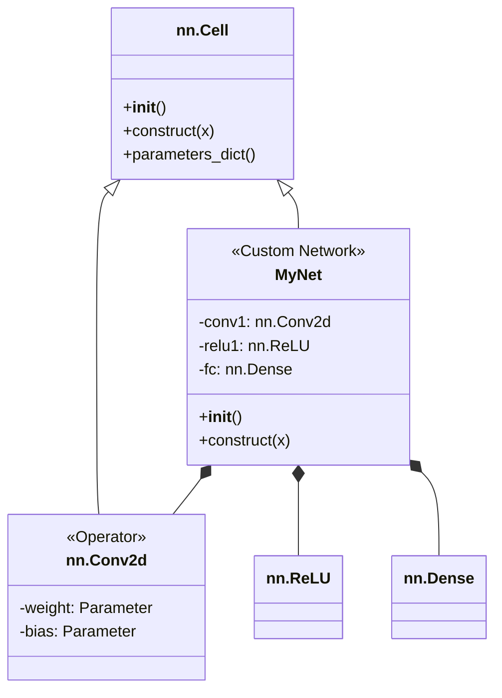

# HCIA-AI 题目分析 - MindSpore nn.Cell

## 题目内容

**问题**: 在MindSpore中，关于`nn.Cell`的描述，哪些是正确的？

**选项**:
- A. `nn.Cell`是MindSpore中所有网络（Net）和算子（Operator）的基类。
- B. 用户定义的网络模型需要继承`nn.Cell`，并在`__init__`方法中定义所需的层和算子。
- C. 网络的正向计算逻辑需要在`nn.Cell`的`forward`方法中定义。
- D. `nn.Cell`中定义的参数（Parameters）不会被自动添加到网络的参数列表中进行训练。

## 选项分析表格

| 选项 | 内容 | 正确性 | 详细分析 | 知识点 |
|------|------|--------|----------|--------|
| A | `nn.Cell`是MindSpore中所有网络和算子的基类。 | ✅ | 正确。`nn.Cell`是构建神经网络模块的核心抽象。无论是复杂的网络结构（如ResNet）还是单个的算子层（如`nn.Conv2d`），都是`nn.Cell`的子类。 | `nn.Cell`基类 |
| B | 用户定义的网络模型需要继承`nn.Cell`，并在`__init__`方法中定义所需的层和算子。 | ✅ | 正确。这是使用MindSpore构建自定义网络的标准范式。在构造函数`__init__`中实例化网络层，以便MindSpore能够追踪这些子模块。 | 网络构建范式 |
| C | 网络的正向计算逻辑需要在`nn.Cell`的`forward`方法中定义。 | ❌ | 错误。在MindSpore中，正向计算逻辑是在`construct`方法中定义的。这是MindSpore与PyTorch（使用`forward`）的一个关键区别。 | `construct`方法 |
| D | `nn.Cell`中定义的参数不会被自动添加到网络的参数列表中进行训练。 | ❌ | 错误。`nn.Cell`的一个核心功能就是自动收集和管理其所有子`Cell`中定义的`Parameter`对象。只要一个`Parameter`在`nn.Cell`的`__init__`中被正确定义，它就会被自动追踪并参与训练。 | 参数管理 |

## 正确答案
**答案**: AB

**解题思路**:
1.  **分析A选项**: `nn.Cell`是构建块的基石，这个描述符合其在框架中的定位。正确。
2.  **分析B选项**: 这是标准的面向对象网络搭建方式，在`__init__`中准备好“零件”（层和算子）。正确。
3.  **分析C选项**: 这是MindSpore的一个特色。它使用`construct`作为正向传播的执行方法，而不是业界更常见的`forward`。这是一个需要特别记忆的知识点。错误。
4.  **分析D选项**: 框架的一个重要作用就是简化开发，自动管理参数是其核心职责之一。如果需要手动管理，框架的价值会大打折扣。因此，`nn.Cell`会自动管理参数。错误。

**失分点分析**: 您选择了ABD，错误地判断了C和D。错误选择D可能是对框架的自动参数管理机制不熟悉。错误地认为C正确，是因为受到了其他框架（如PyTorch）的影响，混淆了正向传播方法的名称。请务必记住MindSpore的`construct`。

## 概念图解 (如需要)

*图示：自定义网络`MyNet`和算子`nn.Conv2d`都继承自`nn.Cell`。`MyNet`在`__init__`中定义其层，在`construct`中定义计算图。`nn.Cell`会自动收集所有`Parameter`。*

## 知识点总结

### 核心概念
-   **`nn.Cell`**: MindSpore中用于封装网络层和计算逻辑的基本单元。所有自定义网络和内置层都继承自它。
-   **`__init__()`**: 构造方法，用于定义和初始化网络中包含的子`Cell`（层、算子）。
-   **`construct()`**: **核心记忆点**。定义了该`Cell`的正向计算逻辑（数据如何流过网络层）。
-   **自动参数管理**: `nn.Cell`会自动递归地收集其所有成员`Cell`中定义的`Parameter`对象，形成一个参数列表，用于后续的梯度计算和优化。

### MindSpore vs. PyTorch
-   **正向传播方法**: MindSpore使用`construct`，PyTorch使用`forward`。

### 记忆要点
-   Cell是细胞，是构成神经网络这个“生物体”的基本单位。
-   `__init__`是“细胞分化”，确定细胞里有什么“细胞器”（网络层）。
-   `construct`是“细胞活动”，定义细胞如何处理输入的“营养”（数据）。

## 扩展学习

### 实践应用
-   构建任何复杂的神经网络，如CNN、RNN、Transformer，都必须通过继承`nn.Cell`并实现`__init__`和`construct`方法来完成。