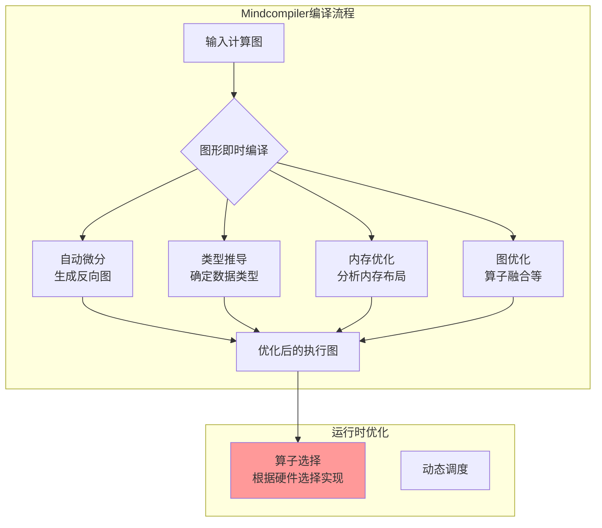

# HCIA-AI 题目分析 - Mindcompiler图形即时编译

## 题目内容

**问题**: Mindcompiler系统提供图形即时编译能力，以下哪几项功能是其面向应用所进行的优化操作？

**选项**:
- A. 自动微分
- B. 算子选择
- C. 内存优化
- D. 类型推导

## 选项分析表格

| 选项 | 内容 | 正确性 | 详细分析 | 知识点 |
|------|------|--------|----------|--------|
| A | 自动微分 | ✅ | 正确。自动微分是深度学习编译器的核心功能之一，Mindcompiler通过图形即时编译技术，能够自动为前向计算图生成对应的反向传播图，实现高效的梯度计算，这是面向深度学习应用的重要优化。 | 自动微分、编译优化 |
| B | 算子选择 | ❌ | 错误。算子选择通常是指在多个可用算子实现中选择最优的一个，这更多是运行时优化或者算子库层面的优化，而不是编译器层面的图形即时编译所主要关注的优化操作。 | 算子优化、运行时选择 |
| C | 内存优化 | ✅ | 正确。内存优化是编译器的重要功能，包括内存复用、内存池管理、减少内存碎片等。Mindcompiler通过分析计算图的数据流，可以优化张量的内存分配和释放策略，减少内存占用。 | 内存管理、编译优化 |
| D | 类型推导 | ✅ | 正确。类型推导是编译器的基础功能，Mindcompiler需要根据输入数据的类型和算子的特性，自动推导出中间结果和输出的数据类型（如float32、int64等），确保类型安全和计算正确性。 | 类型系统、静态分析 |

## 正确答案
**答案**: ACD

**解题思路**:
1. **理解编译器优化**: 图形即时编译器主要在编译时对计算图进行分析和优化，而非运行时动态选择。
2. **分析A选项**: 自动微分是深度学习编译器的核心能力，属于编译时优化。正确。
3. **分析B选项**: 算子选择更多是运行时根据硬件特性选择最优实现，不是编译时的图优化。错误。
4. **分析C选项**: 内存优化是编译器通过静态分析实现的重要优化。正确。
5. **分析D选项**: 类型推导是编译器的基础功能，确保类型安全。正确。

**失分点分析**: 您选择了ABD，错误地包含了B（算子选择）而遗漏了C（内存优化）。算子选择通常发生在运行时，根据具体硬件环境选择最优算子实现，而编译时优化主要关注图结构、内存布局、类型安全等静态可分析的方面。

## 概念图解 (如需要)

*图示：编译时优化（ACD）与运行时优化（B）的区别。Mindcompiler主要负责编译时的图优化。*

## 知识点总结

### 核心概念
- **图形即时编译 (Graph JIT Compilation)**: 在程序执行前或执行时，将计算图编译成优化的可执行代码的技术。
- **Mindcompiler**: 华为MindSpore框架的编译器组件，负责将Python定义的神经网络转换为高效的执行代码。

### 编译时优化 vs 运行时优化
- **编译时优化**: 在代码生成阶段进行的优化，如自动微分、类型推导、内存布局优化
- **运行时优化**: 在程序执行时进行的优化，如算子选择、动态调度

### Mindcompiler的主要功能
- **自动微分**: 自动生成反向传播图，支持高阶导数
- **类型推导**: 静态分析数据类型，确保类型安全
- **内存优化**: 分析数据生命周期，优化内存分配
- **图优化**: 算子融合、常量折叠、死代码消除等

### 记忆要点
- 编译器做"静态分析"的事情：类型、内存、微分图生成
- 运行时做"动态选择"的事情：根据硬件选算子、动态调度
- Mindcompiler = Mind（智能）+ Compiler（编译器）

## 扩展学习

### 相关技术
- **MLIR (Multi-Level Intermediate Representation)**: 现代AI编译器常用的中间表示
- **XLA (Accelerated Linear Algebra)**: Google的机器学习编译器
- **TVM**: 开源的深度学习编译器栈

### 华为AI编译技术栈
- **MindSpore**: 深度学习框架
- **Mindcompiler**: 图编译器
- **CANN**: 异构计算架构
- **Ascend**: AI处理器