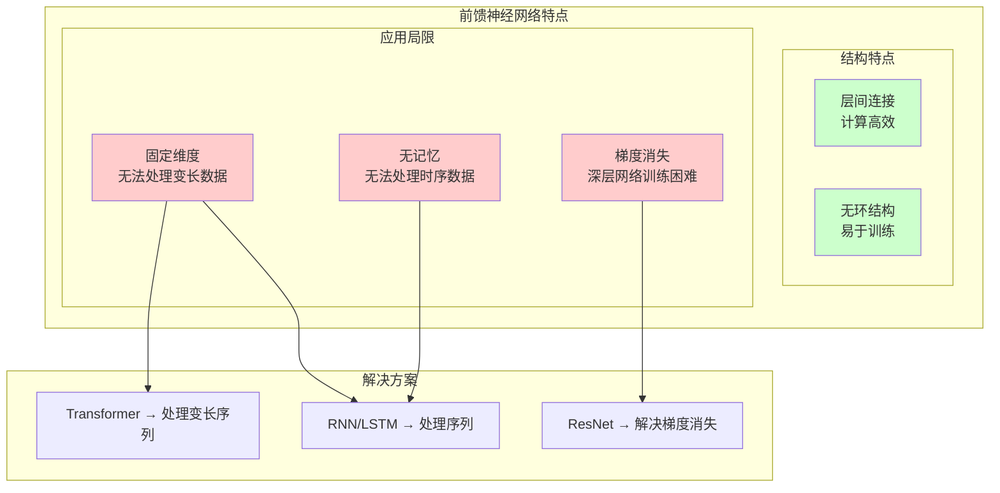

# HCIA-AI 题目分析 - 前馈神经网络缺点

## 题目内容

**问题**: 以下关于前馈神经网络缺点的描述，正确的是哪些项？

**选项**:
- A. 连接只存在于层与层之间，每一层中的节点无连接关系
- B. 输入和输出的维度是固定的，无法处理变长数据
- C. 每次的输入是独立的，分割了前后输入数据之间的联系
- D. 反向传播中容易发生梯度消失

## 选项分析表格

| 选项 | 内容 | 正确性 | 详细分析 | 知识点 |
|------|------|--------|----------|--------|
| A | 连接只存在于层与层之间，每一层中的节点无连接关系 | ❌ | 错误。这实际上是前馈神经网络的**结构特点**而非缺点。这种设计使得网络结构简单、计算高效、易于并行化。相比之下，循环神经网络中同层节点间的连接反而增加了计算复杂度。 | 网络拓扑结构 |
| B | 输入和输出的维度是固定的，无法处理变长数据 | ✅ | 正确。这是前馈神经网络的重要局限性。网络在设计时就确定了输入层和输出层的神经元数量，无法直接处理长度不固定的序列数据（如不同长度的文本、语音）。这限制了其在NLP、语音识别等领域的应用。 | 固定维度限制 |
| C | 每次的输入是独立的，分割了前后输入数据之间的联系 | ✅ | 正确。前馈网络没有记忆机制，无法保持历史信息。每次前向传播都是独立的，这使得它无法处理具有时序依赖关系的数据，如时间序列预测、语言建模等任务。 | 无记忆能力 |
| D | 反向传播中容易发生梯度消失 | ✅ | 正确。在深层前馈网络中，梯度在反向传播过程中会逐层衰减，特别是使用Sigmoid、Tanh等激活函数时。这导致深层网络难以训练，是深度学习早期发展的重要瓶颈。 | 梯度消失问题 |

## 正确答案
**答案**: BCD

**解题思路**:
1. **区分结构特点vs缺点**: A选项描述的是前馈网络的结构特点，这种设计实际上带来了计算效率的优势。
2. **识别真正的局限性**: B、C、D都是前馈网络在实际应用中遇到的真正问题和限制。
3. **理解应用场景**: 前馈网络适合处理固定维度、无时序依赖的数据，但在序列数据、变长数据处理上存在天然劣势。

**失分点分析**: 您选择了ABD，错误地将A（结构特点）当作缺点，同时遗漏了C（无记忆能力）。需要区分网络的"设计特点"和"应用局限"。层间连接的设计是为了简化计算，而非缺陷。

## 概念图解 (如需要)

*图示：区分前馈网络的结构特点（优势）和应用局限（缺点），以及相应的解决方案。*

## 知识点总结

### 核心概念
- **前馈神经网络 (Feedforward Neural Network)**: 信息只能从输入层向输出层单向流动，不存在反馈连接的神经网络。
- **多层感知机 (MLP)**: 最典型的前馈神经网络，由输入层、隐藏层和输出层组成。

### 前馈网络的真正缺点
- **固定维度**: 无法处理变长序列数据
- **无记忆能力**: 无法利用历史信息
- **梯度消失**: 深层网络训练困难

### 前馈网络的优势
- **结构简单**: 易于理解和实现
- **计算高效**: 支持并行计算
- **训练稳定**: 无循环连接，避免梯度爆炸

### 改进方案
- **RNN/LSTM/GRU**: 解决序列数据和记忆问题
- **ResNet/DenseNet**: 通过跳跃连接解决梯度消失
- **Transformer**: 通过注意力机制处理变长序列
- **Batch Normalization**: 缓解梯度消失问题

### 记忆要点
- 前馈网络 = "一次性"处理，没有"回头看"的能力
- 固定维度 = 只能处理"标准尺寸"的数据
- 无记忆 = 每次都是"全新开始"
- 梯度消失 = 深层网络的"信号衰减"问题

## 扩展学习

### 应用场景
- **适合**: 图像分类、回归预测、特征提取
- **不适合**: 机器翻译、语音识别、时间序列预测

### 在MindSpore中的实现
- 使用`nn.Dense`层构建前馈网络
- 通过`nn.SequentialCell`组织多层结构
- 可以与其他网络类型（如CNN、RNN）结合使用