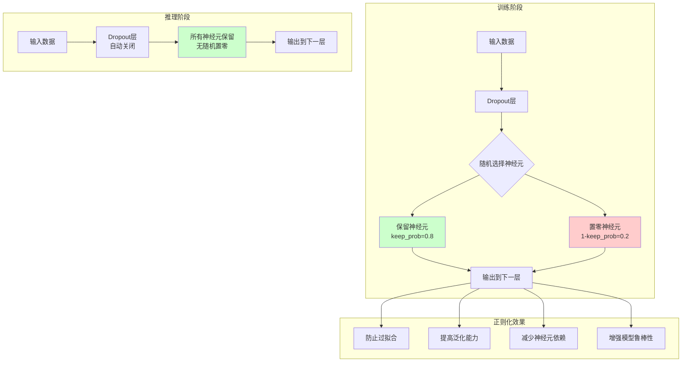

# HCIA-AI 题目分析 - MindSpore nn.Dropout层

## 题目内容

**问题**: 以下关于MindSpore中nn.Dropout层的描述，正确的是哪些项？

**选项**:
- A. Dropout层在训练时随机将部分神经元输出置为0
- B. Dropout层的keep_prob参数表示神经元被保留的概率
- C. Dropout层在推理时会自动关闭，不进行随机置零操作
- D. Dropout层可以有效防止模型过拟合

## 选项分析表格

| 选项 | 内容 | 正确性 | 详细分析 | 知识点 |
|------|------|--------|----------|--------|
| A | Dropout层在训练时随机将部分神经元输出置为0 | ✅ | 正确。这是Dropout的核心机制。在训练阶段，Dropout会随机选择一定比例的神经元，将它们的输出设置为0，从而强制网络不依赖于特定的神经元，提高泛化能力。 | Dropout机制 |
| B | Dropout层的keep_prob参数表示神经元被保留的概率 | ✅ | 正确。keep_prob参数定义了每个神经元在训练时被保留（不被置零）的概率。例如keep_prob=0.8表示80%的神经元会被保留，20%会被随机置零。 | 参数含义 |
| C | Dropout层在推理时会自动关闭，不进行随机置零操作 | ✅ | 正确。在推理（evaluation）模式下，Dropout层会自动关闭随机置零操作，所有神经元都会参与计算。这通过model.eval()或者training=False来控制。 | 训练vs推理 |
| D | Dropout层可以有效防止模型过拟合 | ✅ | 正确。Dropout是一种正则化技术，通过在训练时随机"丢弃"部分神经元，防止模型过度依赖特定的神经元组合，从而减少过拟合，提高模型的泛化能力。 | 正则化效果 |

## 正确答案
**答案**: ABCD

**解题思路**:
1. **理解Dropout原理**: 训练时随机置零，推理时全部保留。
2. **掌握参数含义**: keep_prob是保留概率，不是丢弃概率。
3. **区分训练和推理**: 训练时启用Dropout，推理时自动关闭。
4. **认识正则化作用**: Dropout是防止过拟合的有效手段。

**解题要点**: 这道题考查的是Dropout的基本概念和工作机制，四个选项都正确描述了Dropout的不同方面。需要全面理解Dropout的工作原理。

## 概念图解 (如需要)


*图示：Dropout在训练和推理阶段的不同行为，以及其正则化效果。*

## 知识点总结

### 核心概念
- **Dropout**: 一种正则化技术，通过随机"丢弃"神经元来防止过拟合。
- **随机性**: 训练时的随机置零是Dropout发挥作用的关键。

### MindSpore nn.Dropout的关键参数
- **keep_prob**: 神经元保留概率（默认0.5）
- **dtype**: 数据类型（默认float32）

### Dropout的工作机制
1. **训练阶段**:
   - 以keep_prob概率保留神经元
   - 以(1-keep_prob)概率将神经元置零
   - 对保留的神经元进行缩放补偿

2. **推理阶段**:
   - 所有神经元都参与计算
   - 不进行随机置零操作
   - 自动通过training模式控制

### 数学原理
- **训练时**: output = input * mask / keep_prob
- **推理时**: output = input
- **mask**: 随机生成的0/1掩码

### 使用示例
```python
import mindspore.nn as nn

# 基本用法
dropout = nn.Dropout(keep_prob=0.8)  # 保留80%的神经元

# 在网络中使用
class MyNet(nn.Cell):
    def __init__(self):
        super().__init__()
        self.dense1 = nn.Dense(784, 256)
        self.dropout = nn.Dropout(keep_prob=0.5)
        self.dense2 = nn.Dense(256, 10)
        
    def construct(self, x):
        x = self.dense1(x)
        x = nn.ReLU()(x)
        x = self.dropout(x)  # 训练时随机置零
        x = self.dense2(x)
        return x
```

### 最佳实践
- **keep_prob选择**: 通常在0.5-0.8之间
- **位置选择**: 通常放在全连接层之后
- **不同层不同概率**: 可以为不同层设置不同的keep_prob
- **避免过度使用**: 在小网络或数据充足时可能不需要

### 记忆要点
- Dropout = "训练时丢弃，推理时保留"
- keep_prob = "保留概率"（不是丢弃概率）
- 自动切换 = 根据training模式自动开关
- 正则化 = 防止过拟合的"随机化"策略

## 扩展学习

### 相关正则化技术
- **Batch Normalization**: 标准化输入分布
- **Layer Normalization**: 层级标准化
- **Weight Decay**: 权重衰减
- **Early Stopping**: 早停策略

### Dropout变种
- **DropConnect**: 随机丢弃连接而非神经元
- **Spatial Dropout**: 用于卷积层的Dropout
- **Scheduled Dropout**: 动态调整丢弃率

### 在MindSpore中的应用
- 与其他正则化技术结合使用
- 在不同网络架构中的应用策略
- 超参数调优的考虑因素