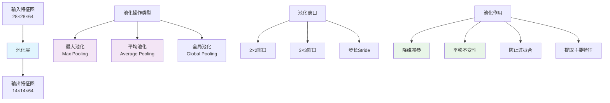

# HCIA-AI 题目分析 - 卷积神经网络池化层

## 题目内容

**问题**: 关于卷积神经网络池化层以下描述正确的是？

**选项**:
- A. 池化操作采用扫描窗口实现
- B. 池化层可以起到降维的作用
- C. 常用的池化方法有最大池化和平均池化
- D. 经过池化的特征图像变小了

## 选项分析表格

| 选项 | 内容 | 正确性 | 详细分析 | 知识点 |
|------|------|--------|----------|--------|
| A | 池化操作采用扫描窗口实现 | ✅ | 池化操作通过在输入特征图上滑动固定大小的窗口（如2×2、3×3）来实现，窗口在特征图上按步长移动，对窗口内的值进行聚合操作 | 池化操作机制 |
| B | 池化层可以起到降维的作用 | ✅ | 池化层通过下采样减少特征图的空间维度，例如2×2池化可以将特征图尺寸减半，从而降低数据维度和计算复杂度 | 降维与下采样 |
| C | 常用的池化方法有最大池化和平均池化 | ✅ | 最大池化(Max Pooling)选择窗口内的最大值，平均池化(Average Pooling)计算窗口内的平均值，这是两种最常用的池化方法 | 池化方法类型 |
| D | 经过池化的特征图像变小了 | ✅ | 池化操作会减小特征图的空间尺寸，例如输入28×28经过2×2池化后变成14×14，这是池化层的主要作用之一 | 特征图尺寸变化 |

## 正确答案
**答案**: ABCD

**解题思路**: 
1. 理解池化层的基本工作原理（扫描窗口机制）
2. 分析池化层的主要作用（降维、减少参数）
3. 掌握常见的池化方法（最大池化、平均池化）
4. 理解池化对特征图尺寸的影响（空间维度减小）

## 概念图解

## 知识点总结

### 核心概念
- **扫描窗口机制**: 池化通过滑动窗口对局部区域进行聚合操作
- **降维作用**: 减少特征图的空间维度，降低计算复杂度
- **池化方法**: 最大池化保留最强特征，平均池化保留平均信息
- **尺寸变化**: 池化后特征图空间尺寸减小，通道数不变

### 相关技术
- CNN卷积神经网络架构
- 下采样技术
- 特征提取与压缩
- MindSpore池化层实现

### 记忆要点
- 池化 = 扫描窗口 + 聚合操作
- 主要作用：降维、减参、防过拟合
- 常用方法：Max Pooling、Average Pooling
- 结果：特征图变小，通道数不变

## 扩展学习

### 相关文档
- CNN网络架构设计原理
- MindSpore池化层API文档
- 深度学习中的下采样技术

### 实践应用
- 图像分类网络（ResNet、VGG）
- 目标检测网络（YOLO、R-CNN）
- 华为ModelArts中的CNN模型
- 计算机视觉任务优化