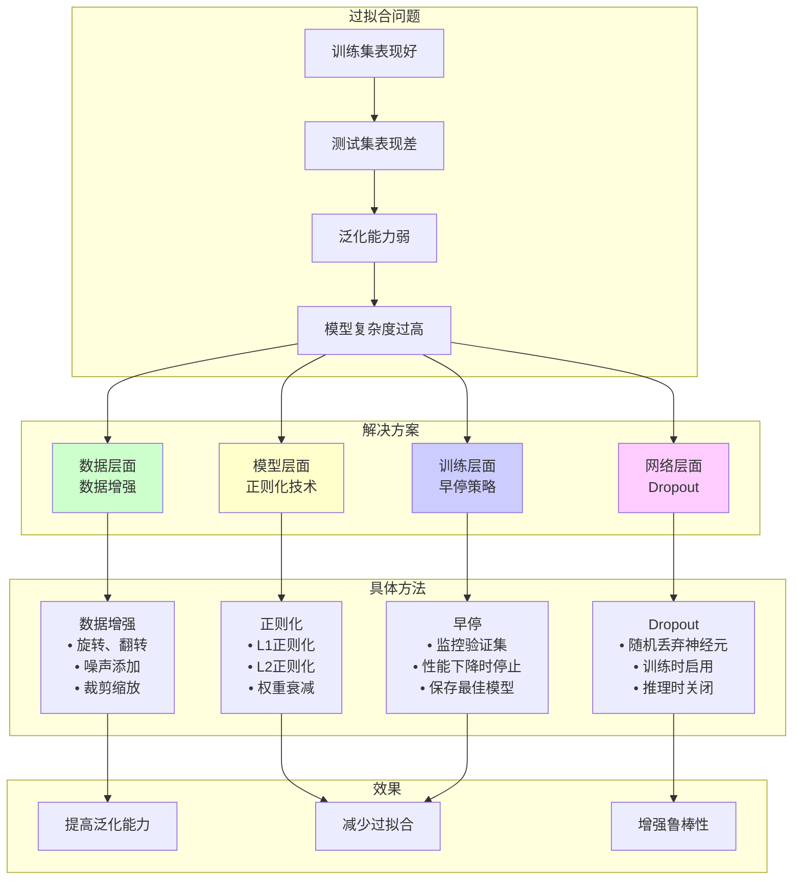

# HCIA-AI 题目分析 - 过拟合问题解决方法

## 题目内容

**问题**: 过拟合问题是模型在训练集表现较好，但在测试集表现较差，为了避免过拟合问题，我们可以采取以下哪些方法？

**选项**:
- A. 数据集合扩充
- B. L1和L2正则化
- C. 提前停止训练
- D. 使用Dropout方法

## 选项分析表格

| 选项 | 内容 | 正确性 | 详细分析 | 知识点 |
|------|------|--------|----------|--------|
| A | 数据集合扩充 | ✅ | 正确。数据增强（Data Augmentation）是防止过拟合的有效方法。通过增加训练数据的多样性和数量，可以让模型学习到更泛化的特征，减少对特定训练样本的记忆，从而提高泛化能力。 | 数据增强技术 |
| B | L1和L2正则化 | ✅ | 正确。正则化是经典的防过拟合技术。L1正则化（Lasso）倾向于产生稀疏权重，L2正则化（Ridge）倾向于让权重值较小且平滑。两者都通过在损失函数中添加惩罚项来约束模型复杂度。 | 正则化技术 |
| C | 提前停止训练 | ✅ | 正确。Early Stopping通过监控验证集上的性能，在验证误差开始上升时停止训练，避免模型在训练集上过度拟合。这是一种简单而有效的正则化策略。 | 训练策略 |
| D | 使用Dropout方法 | ✅ | 正确。Dropout在训练时随机"丢弃"部分神经元，强制网络不依赖特定的神经元组合，增强模型的鲁棒性和泛化能力，是深度学习中广泛使用的正则化技术。 | 神经网络正则化 |

## 正确答案
**答案**: ABCD

**解题思路**:
1. **理解过拟合本质**: 模型在训练数据上表现好，但泛化能力差。
2. **识别解决策略**: 从数据、模型复杂度、训练过程等多个角度防止过拟合。
3. **掌握常用方法**: 数据增强、正则化、早停、Dropout都是经典的防过拟合技术。
4. **综合应用**: 实际中通常会组合使用多种方法。

**解题要点**: 这道题考查防止过拟合的常用方法，四个选项都是有效的解决方案，需要全面掌握各种正则化技术。

## 概念图解 (如需要)


*图示：过拟合问题的四种主要解决方案及其具体实现方法。*

## 知识点总结

### 核心概念
- **过拟合 (Overfitting)**: 模型在训练数据上表现很好，但在新数据上表现较差的现象。
- **泛化能力**: 模型对未见过数据的预测能力。

### 过拟合的表现
- 训练误差很小，验证/测试误差较大
- 训练和验证曲线出现明显分离
- 模型对训练数据"记忆"过度

### 防过拟合方法分类

#### 1. 数据层面 - 数据增强
- **图像数据**: 旋转、翻转、裁剪、缩放、颜色变换
- **文本数据**: 同义词替换、回译、随机插入
- **音频数据**: 时间拉伸、音调变化、噪声添加
- **作用机制**: 增加数据多样性，让模型见到更多变化

#### 2. 模型层面 - 正则化
- **L1正则化**: ||w||₁，产生稀疏权重，特征选择
- **L2正则化**: ||w||₂²，权重衰减，平滑权重
- **弹性网络**: L1 + L2的组合
- **作用机制**: 约束模型复杂度，防止权重过大

#### 3. 训练层面 - 早停
- **监控指标**: 验证集损失或准确率
- **停止条件**: 连续N个epoch无改善
- **模型保存**: 保存验证集上最佳的模型
- **作用机制**: 在最佳泛化点停止训练

#### 4. 网络层面 - Dropout
- **随机丢弃**: 训练时随机将部分神经元输出置零
- **保留概率**: 通常设置为0.5-0.8
- **推理时关闭**: 测试时使用所有神经元
- **作用机制**: 防止神经元共适应，增强鲁棒性

### 其他防过拟合方法
- **批量标准化 (Batch Normalization)**: 稳定训练过程
- **权重共享**: 如CNN中的卷积核共享
- **集成学习**: 多个模型的组合
- **交叉验证**: 更好地评估模型性能

### 实际应用策略
```python
# 综合防过拟合策略示例
import mindspore.nn as nn

class RegularizedNet(nn.Cell):
    def __init__(self):
        super().__init__()
        # L2正则化通过优化器实现
        self.dense1 = nn.Dense(784, 256)
        self.bn1 = nn.BatchNorm1d(256)  # 批量标准化
        self.dropout1 = nn.Dropout(0.5)  # Dropout
        
        self.dense2 = nn.Dense(256, 128)
        self.bn2 = nn.BatchNorm1d(128)
        self.dropout2 = nn.Dropout(0.3)
        
        self.dense3 = nn.Dense(128, 10)
        
    def construct(self, x):
        x = self.dropout1(self.bn1(nn.ReLU()(self.dense1(x))))
        x = self.dropout2(self.bn2(nn.ReLU()(self.dense2(x))))
        return self.dense3(x)

# 训练时使用早停
from mindspore.train.callback import EarlyStopping
early_stop = EarlyStopping(monitor='val_loss', patience=10)
```

### 选择策略
- **数据充足**: 优先使用数据增强
- **数据稀少**: 重点使用正则化和Dropout
- **深层网络**: 结合多种方法
- **计算资源有限**: 优先使用早停和Dropout

### 记忆要点
- 数据增强 = "让模型见更多样本"
- 正则化 = "限制模型复杂度"
- 早停 = "在最佳点停下"
- Dropout = "随机丢弃防依赖"

## 扩展学习

### 过拟合检测
- **学习曲线**: 观察训练和验证误差的变化
- **复杂度曲线**: 模型复杂度与性能的关系
- **交叉验证**: 更可靠的性能评估

### 现代正则化技术
- **DropConnect**: 随机丢弃连接而非神经元
- **Spectral Normalization**: 谱归一化
- **Label Smoothing**: 标签平滑
- **Mixup**: 样本混合增强

### 在不同领域的应用
- **计算机视觉**: 数据增强 + Dropout + 批量标准化
- **自然语言处理**: Dropout + 权重衰减 + 早停
- **推荐系统**: 正则化 + 负采样
- **时间序列**: 早停 + 集成方法