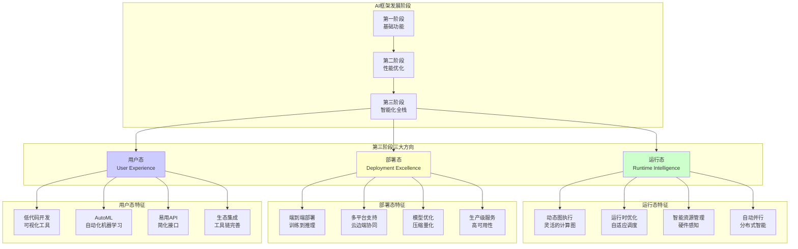

# HCIA-AI 题目分析 - AI框架第三阶段发展方向

## 题目内容

**问题**: AI框架第三阶段的发展方向主要包括以下哪几方面？

**选项**:
- A. 运行态
- B. 部署态
- C. 用户态
- D. 平行态

## 选项分析表格

| 选项 | 内容 | 正确性 | 详细分析 | 知识点 |
|------|------|--------|----------|--------|
| A | 运行态 | ✅ | 正确。AI框架第三阶段强调运行时的智能化和自适应能力，包括动态图执行、运行时优化、自适应调度等。框架需要在运行时根据硬件环境和数据特征进行智能决策和优化。 | 运行时智能化 |
| B | 部署态 | ✅ | 正确。第三阶段AI框架重视端到端的部署能力，包括模型压缩、量化、边缘部署、云边协同等。框架需要支持从训练到部署的全流程，适应不同的部署环境和硬件平台。 | 全栈部署能力 |
| C | 用户态 | ✅ | 正确。第三阶段强调用户体验和易用性，包括低代码/无代码开发、自动化机器学习(AutoML)、可视化工具等。框架需要降低AI开发门槛，让更多用户能够便捷地使用AI技术。 | 用户体验优化 |
| D | 平行态 | ❌ | 错误。"平行态"不是AI框架发展的标准术语或公认的发展方向。AI框架的发展主要关注运行效率、部署便利性和用户体验，而不是"平行态"这个概念。 | 发展方向识别 |

## 正确答案
**答案**: ABC

**解题思路**:
1. **理解AI框架发展阶段**: 第一阶段关注基础功能，第二阶段关注性能优化，第三阶段关注智能化和易用性。
2. **识别核心方向**: 运行态（智能运行）、部署态（全栈部署）、用户态（易用性）是第三阶段的主要特征。
3. **排除干扰项**: "平行态"不是AI框架发展的标准概念。
4. **掌握发展趋势**: 现代AI框架向着更智能、更易用、更全面的方向发展。

**失分点分析**: 您选择了ABCD，错误地包含了D（平行态）。需要准确理解AI框架发展的标准术语和公认方向，避免被非标准概念误导。

## 概念图解 (如需要)


*图示：AI框架第三阶段的三大发展方向及其具体特征。*

## 知识点总结

### 核心概念
- **AI框架第三阶段**: 以智能化、全栈化、易用化为特征的AI框架发展阶段。
- **全栈AI**: 覆盖从算法研发到生产部署的完整AI生命周期。

### AI框架发展历程

#### 第一阶段：基础功能期
- **代表框架**: 早期TensorFlow、Caffe
- **主要特征**: 提供基本的深度学习功能
- **关注点**: 算法实现、基础API

#### 第二阶段：性能优化期
- **代表框架**: PyTorch、TensorFlow 2.0
- **主要特征**: 注重计算性能和开发效率
- **关注点**: 自动微分、GPU加速、动态图

#### 第三阶段：智能全栈期
- **代表框架**: MindSpore、JAX、PyTorch 2.0+
- **主要特征**: 智能化、全栈化、易用化
- **关注点**: 运行态、部署态、用户态

### 第三阶段三大发展方向详解

#### 1. 运行态 (Runtime Intelligence)

**核心理念**: 框架在运行时具备智能决策和自适应能力

**主要特征**:
- **动态图执行**: 支持灵活的计算图构建和执行
- **运行时优化**: 根据实际运行情况进行优化
- **自适应调度**: 智能的任务调度和资源分配
- **硬件感知**: 自动适配不同硬件平台

**技术实现**:
```python
# MindSpore动态图示例
import mindspore as ms
from mindspore import nn, ops

# 支持动态控制流
def dynamic_network(x, condition):
    if condition:
        return ops.relu(x)
    else:
        return ops.sigmoid(x)

# 运行时自动优化
ms.set_context(mode=ms.GRAPH_MODE, device_target="Ascend")
# 框架自动进行图优化和硬件适配
```

#### 2. 部署态 (Deployment Excellence)

**核心理念**: 提供端到端的部署解决方案

**主要特征**:
- **全流程支持**: 从训练到推理的完整链路
- **多平台部署**: 云、边、端的统一部署
- **模型优化**: 自动压缩、量化、剪枝
- **生产级服务**: 高可用、高性能的推理服务

**技术栈**:
- **模型转换**: ONNX、TensorRT、MindIR
- **推理引擎**: MindSpore Lite、TensorFlow Lite
- **服务框架**: TensorFlow Serving、TorchServe
- **容器化**: Docker、Kubernetes部署

#### 3. 用户态 (User Experience)

**核心理念**: 降低AI开发门槛，提升用户体验

**主要特征**:
- **低代码开发**: 可视化建模工具
- **AutoML**: 自动化机器学习流程
- **简化API**: 更直观的编程接口
- **生态集成**: 丰富的工具链和社区支持

**用户体验提升**:
```python
# 简化的高级API
from mindspore import Model
from mindspore.train import CheckpointConfig, ModelCheckpoint

# 一行代码创建模型
model = Model.from_pretrained('resnet50', num_classes=1000)

# 简化的训练流程
model.train(dataset, epochs=10, callbacks=[ModelCheckpoint()])

# 一键部署
model.export('model.mindir')
```

### 华为MindSpore的第三阶段特征

#### 运行态创新
- **自动并行**: 智能的分布式训练策略
- **动态图**: 支持控制流的动态执行
- **图算融合**: 自动的算子融合优化

#### 部署态优势
- **端边云协同**: 统一的开发和部署体验
- **MindSpore Lite**: 轻量化推理引擎
- **ModelArts**: 全流程AI开发平台

#### 用户态改进
- **MindStudio**: 可视化开发工具
- **MindX**: 行业解决方案套件
- **丰富的预训练模型**: 降低开发门槛

### 与其他框架对比

| 框架 | 运行态 | 部署态 | 用户态 |
|------|--------|--------|--------|
| MindSpore | 自动并行、图算融合 | 端边云协同 | MindStudio、ModelArts |
| PyTorch | TorchScript、JIT | TorchServe | PyTorch Lightning |
| TensorFlow | TF Function、XLA | TF Serving、TF Lite | Keras、TensorBoard |

### 发展趋势
- **更智能的运行时**: AI编译器、自动调优
- **更便捷的部署**: 一键部署、自动扩缩容
- **更友好的用户体验**: 自然语言编程、可视化建模

### 记忆要点
- 运行态 = "智能运行，自适应优化"
- 部署态 = "端到端，全平台部署"
- 用户态 = "易用性，低门槛开发"
- 第三阶段 = 智能化 + 全栈化 + 易用化

## 扩展学习

### 相关技术
- **AI编译器**: MLIR、XLA、Graph Engine
- **模型优化**: 量化、剪枝、知识蒸馏
- **AutoML**: NAS、HPO、AutoAugment

### 产业应用
- **云原生AI**: Kubernetes + AI框架
- **边缘AI**: 轻量化模型和推理引擎
- **MLOps**: AI全生命周期管理

### 未来展望
- **第四阶段**: 可能向着更加自主化、通用化的方向发展
- **技术融合**: AI框架与量子计算、生物计算的结合
- **生态演进**: 更加开放和标准化的AI生态系统