# HCIA-AI 题目分析 - 决策树算法特点

## 题目内容

**问题**: 关于决策树算法，以下哪个描述是正确的？

**选项**:
- A. 决策树只能处理数值型特征
- B. 决策树算法不容易过拟合
- C. 决策树可以处理缺失值
- D. 决策树的预测结果总是连续值

## 选项分析表格

| 选项 | 内容 | 正确性 | 详细分析 | 知识点 |
|------|------|--------|----------|--------|
| A | 决策树只能处理数值型特征 | ❌ | 这个描述是错误的。决策树算法的一个重要优势就是能够同时处理数值型（连续）和类别型（离散）特征。对于类别型特征，决策树可以直接使用等于/不等于的条件进行分割，无需额外的编码处理 | 特征类型处理 |
| B | 决策树算法不容易过拟合 | ❌ | 这个描述是错误的。决策树算法实际上非常容易过拟合，特别是当树的深度过大或叶子节点包含的样本数过少时。这是决策树的主要缺点之一，需要通过剪枝、限制深度等方法来控制 | 过拟合问题 |
| C | 决策树可以处理缺失值 | ✅ | 这个描述是正确的。决策树算法具有处理缺失值的内在能力。常用方法包括：代理分割（surrogate splits）、将缺失值作为单独类别处理、或在训练时忽略缺失值样本。这是决策树相比其他算法的优势之一 | 缺失值处理 |
| D | 决策树的预测结果总是连续值 | ❌ | 这个描述是错误的。决策树的预测结果取决于任务类型：分类任务输出离散的类别标签，回归任务输出连续值。即使在回归任务中，决策树的输出也是分段常数，而不是真正的连续函数 | 输出类型 |

## 正确答案
**答案**: C

**解题思路**: 
1. 理解决策树算法的基本特性和优势
2. 分析决策树在特征类型、过拟合、缺失值处理等方面的表现
3. 区分分类树和回归树的输出特征
4. 识别决策树算法的核心优势：可解释性强、能处理混合数据类型

## 概念图解

```mermaid
graph TD
    A[决策树算法] --> B[算法特点]
    A --> C[数据处理能力]
    A --> D[算法类型]
    A --> E[优缺点]
    
    B --> F[基于规则的分割]
    B --> G[树形结构]
    B --> H[可解释性强]
    B --> I[非参数方法]
    
    C --> J[特征类型]
    C --> K[缺失值处理]
    C --> L[数据规模]
    
    J --> M[数值型特征 ✓]
    J --> N[类别型特征 ✓]
    J --> O[混合类型 ✓]
    
    K --> P[代理分割]
    K --> Q[单独类别处理]
    K --> R[样本权重调整]
    K --> S[多重插补]
    
    D --> T[分类树]
    D --> U[回归树]
    
    T --> V[输出：离散类别]
    T --> W[评估：准确率、F1等]
    T --> X[分割准则：信息增益、基尼系数]
    
    U --> Y[输出：连续值（分段常数）]
    U --> Z[评估：MSE、MAE等]
    U --> AA[分割准则：方差减少]
    
    E --> BB[优点]
    E --> CC[缺点]
    
    BB --> DD[易于理解和解释]
    BB --> EE[无需特征缩放]
    BB --> FF[自动特征选择]
    BB --> GG[处理非线性关系]
    
    CC --> HH[容易过拟合]
    CC --> II[对噪声敏感]
    CC --> JJ[预测不稳定]
    CC --> KK[难以处理线性关系]
    
    style K fill:#e8f5e8
    style P fill:#fff3cd
    style Q fill:#fff3cd
```



## 知识点总结

### 核心概念
- **决策树**: 基于特征进行逐步决策的树形模型
- **节点分割**: 根据某个特征的阈值或类别进行数据分割
- **叶子节点**: 树的终端节点，包含最终的预测结果
- **剪枝**: 控制树复杂度，防止过拟合的技术

### 决策树构建过程

#### 1. 特征选择
- **信息增益**: ID3算法使用
- **信息增益率**: C4.5算法使用，解决信息增益偏向多值特征的问题
- **基尼系数**: CART算法使用，计算简单
- **方差减少**: 回归树使用

#### 2. 树的生长
```
1. 从根节点开始
2. 选择最佳分割特征和阈值
3. 将数据分割到子节点
4. 递归处理子节点
5. 满足停止条件时创建叶子节点
```

#### 3. 停止条件
- 节点中样本数少于阈值
- 树的深度达到最大值
- 信息增益小于阈值
- 所有样本属于同一类别

### 缺失值处理方法详解

#### 1. 代理分割（Surrogate Splits）
- 寻找与主分割特征高度相关的其他特征
- 当主特征缺失时，使用代理特征进行分割
- C4.5和CART算法常用此方法

#### 2. 缺失值作为单独类别
- 将缺失值视为特殊的类别值
- 在分割时考虑"是否缺失"作为分割条件
- 简单直观，但可能增加树的复杂度

#### 3. 样本权重分配
- 将含缺失值的样本按比例分配到各子节点
- 根据其他样本的分布确定分配权重
- 保持样本的统计信息

#### 4. 预处理插补
- 训练前使用均值、中位数、众数等填充
- 使用其他算法（如KNN）进行插补
- 可能引入偏差，但处理简单

### 算法变种对比

| 算法 | 分割准则 | 特征类型 | 缺失值处理 | 剪枝方法 |
|------|----------|----------|------------|----------|
| ID3 | 信息增益 | 仅类别型 | 不支持 | 无 |
| C4.5 | 信息增益率 | 数值+类别 | 代理分割 | 后剪枝 |
| CART | 基尼系数/方差 | 数值+类别 | 代理分割 | 后剪枝 |
| CHAID | 卡方检验 | 主要类别型 | 单独类别 | 预剪枝 |

### 过拟合控制方法

#### 预剪枝（Pre-pruning）
- **最大深度限制**: 限制树的最大层数
- **最小样本分割**: 节点最少样本数才能分割
- **最小叶子样本**: 叶子节点最少样本数
- **最小信息增益**: 分割必须达到的最小增益

#### 后剪枝（Post-pruning）
- **代价复杂度剪枝**: CART使用，平衡准确率和复杂度
- **误差率剪枝**: 基于验证集误差进行剪枝
- **悲观剪枝**: C4.5使用，基于统计显著性

### 性能特点分析

#### 时间复杂度
- **训练**: O(n × m × log n)，n为样本数，m为特征数
- **预测**: O(log n)，树的深度
- **空间**: O(n)，存储树结构

#### 数据要求
- **样本数**: 对小数据集效果好
- **特征数**: 能自动进行特征选择
- **数据质量**: 对噪声和异常值敏感

### 应用场景

#### 适用情况
- 需要模型可解释性
- 特征类型混合
- 存在缺失值
- 非线性关系复杂
- 特征选择需求

#### 不适用情况
- 线性关系为主
- 数据噪声很大
- 需要高精度预测
- 特征维度极高

### 记忆要点
- **核心优势**: 可解释性强，能处理混合数据类型和缺失值
- **主要问题**: 容易过拟合，对噪声敏感
- **缺失值处理**: 多种内置方法，无需预处理
- **输出特性**: 分类输出离散值，回归输出分段常数

## 扩展学习

### 集成方法
- **随机森林**: 多个决策树的集成，减少过拟合
- **梯度提升树**: 逐步改进的树集成
- **XGBoost/LightGBM**: 高效的梯度提升实现
- **AdaBoost**: 自适应提升算法

### MindSpore中的决策树
```python
# 虽然MindSpore主要专注深度学习，但可以结合scikit-learn
from sklearn.tree import DecisionTreeClassifier, DecisionTreeRegressor
from sklearn.ensemble import RandomForestClassifier
import numpy as np

# 分类树
clf = DecisionTreeClassifier(
    criterion='gini',           # 分割准则
    max_depth=10,              # 最大深度
    min_samples_split=20,      # 最小分割样本数
    min_samples_leaf=10,       # 最小叶子样本数
    random_state=42
)

# 回归树
reg = DecisionTreeRegressor(
    criterion='mse',           # 分割准则
    max_depth=8,
    min_samples_split=15,
    random_state=42
)

# 处理缺失值的示例
X_with_missing = np.array([[1, 2], [np.nan, 3], [4, np.nan]])
# 决策树可以直接处理，但建议预处理
```

### 可视化工具
- **Graphviz**: 生成决策树图形
- **dtreeviz**: 更美观的树可视化
- **matplotlib**: 自定义树形图
- **plotly**: 交互式树可视化

### 实践建议
1. **数据预处理**: 虽然能处理缺失值，但质量好的数据效果更佳
2. **超参数调优**: 重点关注深度和最小样本数
3. **特征工程**: 合理的特征组合能提升效果
4. **模型验证**: 使用交叉验证评估泛化能力
5. **集成使用**: 单个决策树容易过拟合，建议使用集成方法