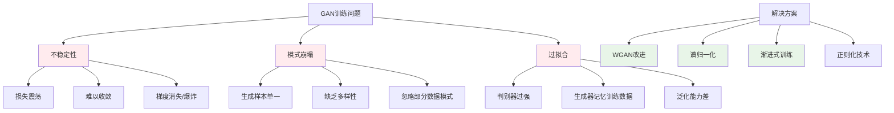

# HCIA-AI 题目分析 - 生成对抗网络训练问题

## 题目内容

**问题**: 以下哪些项属于生成对抗网络训练中的问题？

**选项**:
- A. 不稳定性
- B. 模式崩塌
- C. 过拟合
- D. 欠拟合

## 选项分析表格

| 选项 | 内容 | 正确性 | 详细分析 | 知识点 |
|------|------|--------|----------|--------|
| A | 不稳定性 | ✅ | GAN训练过程中生成器和判别器相互博弈，容易出现训练不稳定，损失函数震荡，难以收敛到纳什均衡点，这是GAN训练的核心挑战之一 | GAN训练稳定性 |
| B | 模式崩塌 | ✅ | Mode Collapse是GAN的典型问题，生成器只学会生成少数几种模式的样本，而忽略数据分布的多样性，导致生成样本缺乏多样性 | 模式崩塌问题 |
| C | 过拟合 | ✅ | GAN训练中可能出现过拟合，特别是判别器过强时会完全区分真假样本，导致生成器无法学习；或生成器记住训练数据而不是学习分布 | GAN过拟合 |
| D | 欠拟合 | ❌ | 欠拟合不是GAN特有的训练问题。GAN的主要挑战是训练不稳定、模式崩塌等，而不是传统意义上的欠拟合问题 | 传统机器学习问题 |

## 正确答案
**答案**: ABC

**解题思路**: 
1. 理解GAN的对抗训练机制和特有挑战
2. 识别GAN训练中的典型问题：不稳定性、模式崩塌
3. 分析过拟合在GAN中的表现形式
4. 区分GAN特有问题与传统机器学习问题

## 概念图解

## 知识点总结

### 核心概念
- **训练不稳定性**: GAN对抗训练的固有挑战，需要平衡生成器和判别器
- **模式崩塌**: 生成器只学会少数模式，是GAN的经典问题
- **过拟合**: 在GAN中表现为判别器过强或生成器记忆训练数据
- **欠拟合**: 不是GAN特有问题，更多是传统机器学习概念

### 相关技术
- WGAN、WGAN-GP改进方法
- 谱归一化(Spectral Normalization)
- 渐进式GAN(Progressive GAN)
- 自注意力GAN(Self-Attention GAN)

### 记忆要点
- GAN三大核心问题：不稳定、模式崩塌、过拟合
- 欠拟合不是GAN特有问题
- 训练稳定性是GAN研究的重点方向
- 需要平衡生成器和判别器的能力

## 扩展学习

### 相关文档
- GAN原理与改进方法
- WGAN理论基础
- 深度生成模型技术

### 实践应用
- 图像生成与编辑
- 数据增强技术
- 华为云ModelArts中的GAN应用
- 创意AI和内容生成