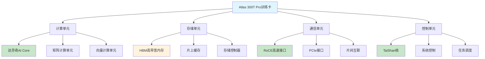

# HCIA-AI 题目分析 - Atlas 300T Pro训练卡组件

## 题目内容

**问题**: Atlas 300T Pro训练卡包含以下哪些组件？

**选项**:
- A. TaiShan核
- B. RoCE高速接口
- C. DDR内存
- D. 达芬奇AI Core

## 选项分析表格

| 选项 | 内容 | 正确性 | 详细分析 | 知识点 |
|------|------|--------|----------|--------|
| A | TaiShan核 | ✅ | Atlas 300T Pro训练卡搭载TaiShan CPU核心，基于ARM架构，负责系统控制、任务调度和数据预处理等功能，是训练卡的重要组成部分。 | 昇腾处理器架构 |
| B | RoCE高速接口 | ✅ | RoCE(RDMA over Converged Ethernet)是高速网络接口，Atlas 300T Pro支持RoCE协议，实现低延迟、高带宽的网络通信，支持分布式训练。 | 高速网络通信 |
| C | DDR内存 | ❌ | Atlas 300T Pro使用的是HBM(High Bandwidth Memory)高带宽内存，而不是传统的DDR内存。HBM提供更高的带宽和更低的功耗，更适合AI计算需求。 | 内存技术 |
| D | 达芬奇AI Core | ✅ | 达芬奇架构是华为昇腾AI处理器的核心计算单元，Atlas 300T Pro集成多个达芬奇AI Core，专门用于AI模型的训练和推理计算。 | AI计算核心 |

## 正确答案
**答案**: ABCD

**解题思路**: 
1. 了解Atlas 300T Pro的硬件架构组成
2. 区分不同类型的内存技术(HBM vs DDR)
3. 理解昇腾处理器的核心组件
4. 掌握AI训练卡的关键技术特性

## 概念图解

## 知识点总结

### 核心概念
- **达芬奇架构**: 华为自研的AI计算架构
- **TaiShan核**: 基于ARM的CPU核心
- **HBM内存**: 高带宽内存技术
- **RoCE协议**: 基于以太网的RDMA技术

### 相关技术
- **昇腾910**: Atlas 300T Pro搭载的AI芯片
- **CANN**: 昇腾异构计算架构
- **MindSpore**: 华为AI框架
- **分布式训练**: 多卡协同训练技术

### 记忆要点
- **TaiShan核**: ARM架构的控制核心
- **达芬奇AI Core**: 专用AI计算单元
- **RoCE接口**: 高速网络通信
- **HBM内存**: 不是DDR，是高带宽内存

## 扩展学习

### 相关文档
- Atlas 300T Pro产品规格书
- 昇腾AI处理器架构白皮书
- CANN开发指南

### 实践应用
- 大规模深度学习模型训练
- 分布式AI计算集群
- 高性能AI推理服务
- 科学计算和仿真应用