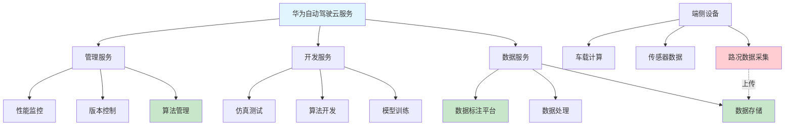

# HCIA-AI 题目分析 - 华为自动驾驶云服务

## 题目内容

**问题**: 以下哪些选项属于华为自动驾驶云服务？

**选项**:
- A. 标注平台
- B. 数据存储
- C. 算法管理
- D. 路况数据采集

## 选项分析表格

| 选项 | 内容 | 正确性 | 详细分析 | 知识点 |
|------|------|--------|----------|--------|
| A | 标注平台 | ✅ | 华为自动驾驶云服务提供数据标注平台，用于对采集的图像、点云等数据进行标注，为模型训练提供高质量的标注数据。这是自动驾驶开发的重要环节。 | 数据标注服务 |
| B | 数据存储 | ✅ | 自动驾驶产生海量数据（图像、激光雷达、传感器数据等），华为云提供大规模数据存储服务，支持结构化和非结构化数据的存储管理。 | 云存储服务 |
| C | 算法管理 | ✅ | 华为自动驾驶云服务包含算法管理功能，提供模型训练、版本管理、算法优化等服务，支持自动驾驶算法的全生命周期管理。 | 算法开发平台 |
| D | 路况数据采集 | ❌ | 路况数据采集通常是通过车载设备、路侧设备等硬件进行的，不属于云服务范畴。云服务主要处理已采集的数据，而不是数据采集本身。 | 数据采集vs云服务 |

## 正确答案
**答案**: ABC

**解题思路**: 
1. 理解华为自动驾驶云服务的核心功能
2. 区分云服务和硬件设备的职责范围
3. 掌握自动驾驶开发流程中的关键环节
4. 明确数据采集属于端侧而非云侧服务

## 概念图解

## 知识点总结

### 核心概念
- **云服务范畴**: 数据处理、存储、计算、管理等云端服务
- **端侧功能**: 数据采集、实时计算、设备控制等
- **数据标注**: 为机器学习提供训练数据的重要环节

### 相关技术
- **华为云存储**: OBS对象存储、EVS云硬盘等
- **ModelArts**: 华为云AI开发平台
- **数据标注工具**: 支持图像、点云、视频标注
- **算法管理**: 模型版本控制、A/B测试等

### 记忆要点
- **标注平台**: 云服务的重要组成部分
- **数据存储**: 海量自动驾驶数据的云端存储
- **算法管理**: 模型全生命周期管理
- **数据采集**: 属于端侧硬件功能，非云服务

## 扩展学习

### 相关文档
- 华为云自动驾驶解决方案
- ModelArts平台使用指南
- 华为云数据标注服务文档

### 实践应用
- 自动驾驶数据标注流程
- 云端模型训练与部署
- 算法版本管理最佳实践
- 多模态数据融合处理