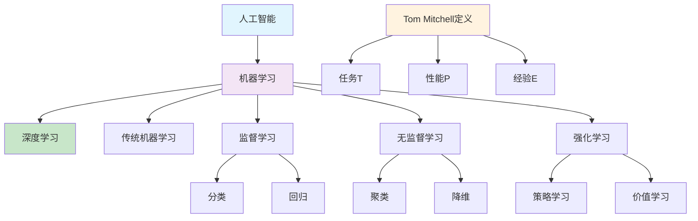

# HCIA-AI 题目分析 - 机器学习算法描述

## 题目内容

**问题**: 以下关于机器学习算法的描述中，哪些选项是正确的？

**选项**:
- A. 深度学习是机器学习的一个特定分支，要想充分理解深度学习，必须对机器学习的基本原理有深刻的理解。
- B. 根据学习过程中的不同经验，机器学习算法可以分为无监督算法和监督算法。
- C. 所谓"学习"是指，对于某类任务T和性能度量P，一个计算机程序在E上以P衡量的性能,随着经验E而自我完善，那么我们称这个计算机程序在从经验E学习。
- D. 人类通过经验归纳规律，机器学习算法也可以从历史数据当中挖掘规则。

## 选项分析表格

| 选项 | 内容 | 正确性 | 详细分析 | 知识点 |
|------|------|--------|----------|--------|
| A | 深度学习是机器学习的一个特定分支，要想充分理解深度学习，必须对机器学习的基本原理有深刻的理解。 | ✅ | 深度学习确实是机器学习的子集，基于神经网络的多层结构。理解机器学习的基础概念（如损失函数、优化、泛化等）对理解深度学习至关重要。 | 深度学习与机器学习关系 |
| B | 根据学习过程中的不同经验，机器学习算法可以分为无监督算法和监督算法。 | ❌ | 这个分类不完整。机器学习算法根据学习方式可以分为：监督学习、无监督学习和强化学习三大类。缺少了强化学习这一重要分支。 | 机器学习分类 |
| C | 所谓"学习"是指，对于某类任务T和性能度量P，一个计算机程序在E上以P衡量的性能,随着经验E而自我完善，那么我们称这个计算机程序在从经验E学习。 | ✅ | 这是Tom Mitchell对机器学习的经典定义，准确描述了机器学习的本质：通过经验E改善在任务T上的性能P。这是机器学习的标准定义。 | 机器学习定义 |
| D | 人类通过经验归纳规律，机器学习算法也可以从历史数据当中挖掘规则。 | ✅ | 这正确描述了机器学习的核心思想：从数据中学习模式和规律。无论是分类、回归还是聚类，都是在从历史数据中提取有用的规则和模式。 | 数据挖掘与规律发现 |

## 正确答案
**答案**: ACD

**解题思路**: 
1. 理解深度学习与机器学习的层次关系
2. 掌握机器学习的完整分类体系
3. 熟悉机器学习的经典定义（Tom Mitchell定义）
4. 理解机器学习的本质：从数据中学习规律

## 概念图解

## 知识点总结

### 核心概念
- **机器学习定义**: 通过经验E改善在任务T上的性能P
- **学习分类**: 监督学习、无监督学习、强化学习
- **层次关系**: 人工智能 > 机器学习 > 深度学习

### 相关技术
- **监督学习**: 利用标注数据学习映射关系
- **无监督学习**: 从无标注数据中发现隐藏模式
- **强化学习**: 通过与环境交互学习最优策略
- **深度学习**: 基于多层神经网络的学习方法

### 记忆要点
- 深度学习是机器学习的**子集**
- 机器学习分为**三大类**：监督、无监督、强化
- Tom Mitchell定义：**T、P、E**三要素
- 核心目标：从**数据中挖掘规律**

## 扩展学习

### 相关文档
- 《机器学习》周志华著
- 《深度学习》Ian Goodfellow著
- Tom Mitchell《Machine Learning》

### 实践应用
- 监督学习：图像分类、语音识别
- 无监督学习：用户画像、异常检测
- 强化学习：游戏AI、自动驾驶
- 深度学习：计算机视觉、自然语言处理