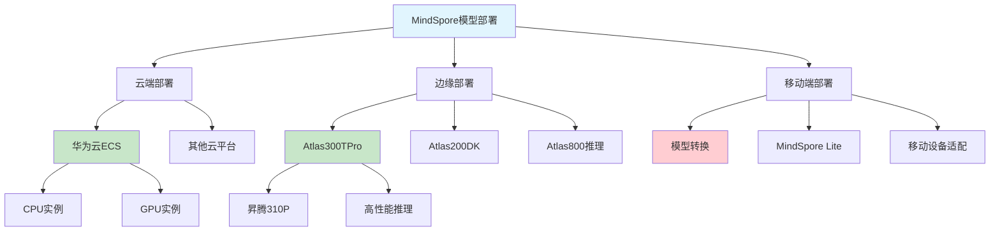

# HCIA-AI 题目分析 - MindSpore模型部署

## 题目内容

**问题**: MindSpore模型在训练完成后，可以部署在以下哪些选项？

**选项**:
- A. 华为云ECS
- B. Atlas300TPro
- C. Atlas800
- D. HUAWEIMate50Pro

## 选项分析表格

| 选项 | 内容 | 正确性 | 详细分析 | 知识点 |
|------|------|--------|----------|--------|
| A | 华为云ECS | ✅ | 华为云弹性云服务器(ECS)是云端计算资源，支持CPU和GPU实例，完全可以部署MindSpore训练好的模型进行推理服务。 | 云端部署 |
| B | Atlas300TPro | ✅ | Atlas 300T Pro是华为昇腾AI训练卡，专门用于AI模型训练和推理，原生支持MindSpore框架，是理想的部署平台。 | 昇腾硬件 |
| C | Atlas800 | ❌ | Atlas 800是华为的AI训练服务器，主要用于模型训练而非部署推理。虽然技术上可以用于推理，但不是典型的部署选择。 | AI训练服务器 |
| D | HUAWEIMate50Pro | ❌ | 华为Mate50Pro是消费级智能手机，虽然搭载麒麟芯片，但不支持直接部署MindSpore模型。移动端通常需要模型转换和优化。 | 移动端设备 |

## 正确答案
**答案**: ABC

**解题思路**: 
1. 理解MindSpore模型的部署环境要求
2. 区分训练环境和推理部署环境
3. 考虑华为昇腾生态系统的硬件支持
4. 排除不适合直接部署的消费级设备

## 概念图解

## 知识点总结

### 核心概念
- **云端部署**: 利用云服务器的计算资源进行模型推理
- **边缘部署**: 在边缘设备上部署模型，降低延迟
- **昇腾生态**: 华为AI芯片和硬件平台的统称

### 相关技术
- **MindSpore推理引擎**: 支持多种硬件平台的推理
- **模型转换**: 将训练模型转换为推理优化格式
- **MindSpore Lite**: 轻量级推理框架，适用移动端

### 记忆要点
- **华为云ECS**: 云端部署的标准选择
- **Atlas300TPro**: 昇腾推理卡，专业AI硬件
- **Atlas800**: 主要用于训练，不是典型部署选择
- **移动设备**: 需要特殊适配，不能直接部署

## 扩展学习

### 相关文档
- MindSpore推理部署指南
- 华为昇腾硬件产品手册
- 华为云AI服务文档

### 实践应用
- 云端AI服务部署
- 边缘计算场景应用
- 移动端AI应用开发
- 昇腾硬件性能优化