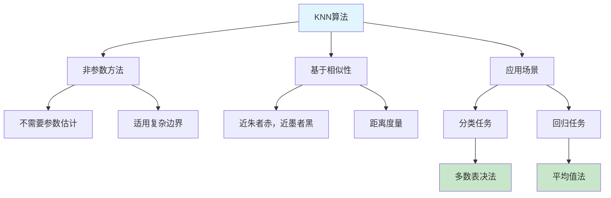

# HCIA-AI 题目分析 - KNN算法描述

## 题目内容

**问题**: 以下关于KNN算法的描述中，正确的是哪几个选项？

**选项**:
- A. KNN的核心思想是"近朱者赤，近墨者黑"，其在逻辑上十分的简洁。
- B. KNN是参数方法，常用在决策边界非常规则的数据集中。
- C. KNN在做回归预测时，一般采用平均值法
- D. KNN在分类预测时，一般采用多数表决法

## 选项分析表格

| 选项 | 内容 | 正确性 | 详细分析 | 知识点 |
|------|------|--------|----------|--------|
| A | KNN的核心思想是"近朱者赤，近墨者黑"，其在逻辑上十分的简洁。 | ✅ | KNN算法基于相似性原理，认为相似的样本具有相似的标签，这正是"近朱者赤，近墨者黑"的体现。算法逻辑简单直观，易于理解和实现。 | KNN基本原理 |
| B | KNN是参数方法，常用在决策边界非常规则的数据集中。 | ❌ | KNN是非参数方法，不需要对数据分布做假设。它适用于决策边界复杂、非线性的数据集，而不是规则的数据集。参数方法如线性回归才适用于规则边界。 | 参数vs非参数方法 |
| C | KNN在做回归预测时，一般采用平均值法 | ✅ | 在回归任务中，KNN通过计算K个最近邻样本的目标值平均值来预测新样本的值。这是KNN回归的标准做法。 | KNN回归 |
| D | KNN在分类预测时，一般采用多数表决法 | ✅ | 在分类任务中，KNN通过统计K个最近邻样本中各类别的数量，选择出现次数最多的类别作为预测结果，这就是多数表决法。 | KNN分类 |

## 正确答案
**答案**: ACD

**解题思路**: 
1. 理解KNN算法的基本原理：基于相似性的非参数方法
2. 区分KNN在分类和回归任务中的不同预测策略
3. 明确KNN适用的数据类型：复杂边界而非规则边界

## 概念图解

## 知识点总结

### 核心概念
- **非参数方法**: KNN不需要对数据分布做假设，不需要训练参数
- **相似性原理**: 相似的样本具有相似的标签或值
- **懒惰学习**: 训练阶段只存储数据，预测时才进行计算

### 相关技术
- **距离度量**: 欧氏距离、曼哈顿距离、余弦距离等
- **K值选择**: 影响算法性能的关键超参数
- **维度灾难**: 高维空间中距离度量失效的问题

### 记忆要点
- KNN是**非参数**方法，不是参数方法
- 适用于**复杂边界**，不是规则边界
- 分类用**多数表决**，回归用**平均值**
- 核心思想：**近朱者赤，近墨者黑**

## 扩展学习

### 相关文档
- 机器学习基础：监督学习算法
- 距离度量方法详解
- KNN算法优化技术

### 实践应用
- 推荐系统中的协同过滤
- 图像识别中的相似图片检索
- 文本分类中的相似文档匹配