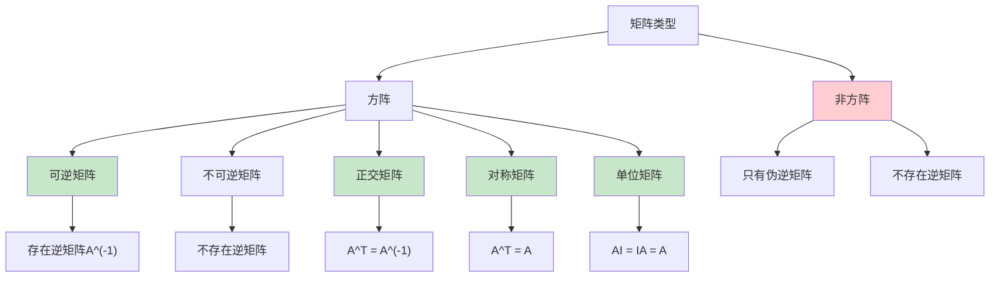

# HCIA-AI 题目分析 - 矩阵运算说法

## 题目内容

**问题**: 关于矩阵的说法正确的是？

**选项**:
- A. 非方阵也存在逆矩阵
- B. 正交矩阵A的转置等于A的逆
- C. 对称矩阵A的转置还是A本身
- D. 任意矩阵与单位矩阵相乘等于其本身

## 选项分析表格

| 选项 | 内容 | 正确性 | 详细分析 | 知识点 |
|------|------|--------|----------|--------|
| A | 非方阵也存在逆矩阵 | ❌ | 逆矩阵只存在于方阵（行数等于列数的矩阵）中，且该方阵必须是可逆的（行列式不为0）。非方阵（m×n，m≠n）不存在逆矩阵，只能有伪逆矩阵。 | 逆矩阵存在条件 |
| B | 正交矩阵A的转置等于A的逆 | ✅ | 正交矩阵的定义就是A^T = A^(-1)，即正交矩阵的转置矩阵等于其逆矩阵。这是正交矩阵的重要性质，满足AA^T = A^TA = I。 | 正交矩阵性质 |
| C | 对称矩阵A的转置还是A本身 | ✅ | 对称矩阵的定义就是A^T = A，即矩阵的转置等于其本身。对称矩阵满足a_ij = a_ji，关于主对角线对称。 | 对称矩阵定义 |
| D | 任意矩阵与单位矩阵相乘等于其本身 | ✅ | 单位矩阵I是乘法单位元，对于任意矩阵A，都有AI = IA = A（前提是矩阵维度匹配）。这是单位矩阵的基本性质。 | 单位矩阵性质 |

## 正确答案
**答案**: BCD

**解题思路**: 
1. 理解逆矩阵的存在条件：只有方阵且可逆
2. 掌握正交矩阵的核心性质：转置等于逆
3. 理解对称矩阵的定义：转置等于自身
4. 掌握单位矩阵的乘法性质：乘法单位元

## 概念图解

## 知识点总结

### 核心概念
- **逆矩阵**: 只存在于可逆方阵中
- **正交矩阵**: 转置等于逆矩阵
- **对称矩阵**: 转置等于自身
- **单位矩阵**: 乘法单位元

### 相关技术
- **矩阵运算**: 加法、乘法、转置、求逆
- **线性代数**: 向量空间、线性变换
- **数值计算**: 矩阵分解、特征值计算
- **深度学习**: 权重矩阵、梯度计算

### 记忆要点
- **逆矩阵**: 只有**方阵**且**可逆**才存在
- **正交矩阵**: **转置=逆矩阵**
- **对称矩阵**: **转置=自身**
- **单位矩阵**: **乘法单位元**

## 扩展学习

### 相关文档
- 《线性代数》教材
- NumPy矩阵运算文档
- TensorFlow/PyTorch张量操作指南

### 实践应用
- 深度学习中的权重初始化
- 图像处理中的变换矩阵
- 机器学习中的协方差矩阵
- 优化算法中的Hessian矩阵