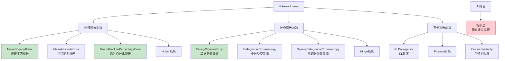

# HCIA-AI 题目分析 - tf.keras.losses损失函数

## 题目内容

**问题**: tf.keras.losses下内置的损失函数有？

**选项**:
- A. 误差平方损失
- B. 二进制交叉损失
- C. 相似度
- D. 绝对百分比误差

## 选项分析表格

| 选项 | 内容 | 正确性 | 详细分析 | 知识点 |
|------|------|--------|----------|--------|
| A | 误差平方损失 | ✅ | tf.keras.losses.MeanSquaredError(MSE)是内置的损失函数，计算预测值与真实值之间的平方误差均值，常用于回归任务。 | 回归损失函数 |
| B | 二进制交叉损失 | ✅ | tf.keras.losses.BinaryCrossentropy是内置的损失函数，用于二分类任务，计算二进制交叉熵损失。 | 分类损失函数 |
| C | 相似度 | ❌ | 相似度不是tf.keras.losses中的标准损失函数。虽然可以基于相似度构建自定义损失函数，但它不是内置的损失函数类型。 | 自定义损失 |
| D | 绝对百分比误差 | ✅ | tf.keras.losses.MeanAbsolutePercentageError(MAPE)是内置的损失函数，计算绝对百分比误差的均值，常用于回归任务。 | 回归损失函数 |

## 正确答案
**答案**: ABD

**解题思路**: 
1. 了解tf.keras.losses模块的内置损失函数
2. 区分回归损失函数和分类损失函数
3. 理解各种损失函数的应用场景
4. 识别非标准损失函数概念

## 概念图解

## 知识点总结

### 核心概念
- **回归损失**: MSE、MAE、MAPE等
- **分类损失**: 交叉熵、Hinge等
- **内置函数**: tf.keras.losses预定义的损失函数
- **自定义损失**: 用户自行实现的损失函数

### 相关技术
- **TensorFlow/Keras**: 深度学习框架
- **损失函数**: 模型优化的目标函数
- **梯度下降**: 基于损失函数的优化算法
- **模型评估**: 损失值作为性能指标

### 记忆要点
- **MSE**: 误差**平方**损失，回归常用
- **BinaryCrossentropy**: **二分类**交叉熵
- **MAPE**: **绝对百分比**误差
- **相似度**: **非内置**损失函数

## 扩展学习

### 相关文档
- TensorFlow官方文档 - tf.keras.losses
- Keras损失函数使用指南
- 深度学习损失函数选择策略

### 实践应用
- 回归任务：房价预测使用MSE
- 分类任务：图像分类使用交叉熵
- 时间序列：股价预测使用MAPE
- 自定义损失：特殊业务需求