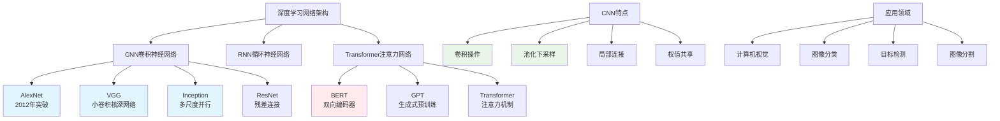

# HCIA-AI 题目分析 - CNN网络结构

## 题目内容

**问题**: 以下哪些选项是CNN网络结构？

**选项**:
- A. Inception
- B. Bert
- C. AlexNet
- D. VGG

## 选项分析表格

| 选项 | 内容 | 正确性 | 详细分析 | 知识点 |
|------|------|--------|----------|--------|
| A | Inception | ✅ | Inception是Google提出的经典CNN架构，采用多尺度卷积并行处理的设计思想，通过Inception模块实现不同感受野的特征提取，代表作品有GoogLeNet(Inception v1) | Inception网络架构 |
| B | Bert | ❌ | BERT(Bidirectional Encoder Representations from Transformers)是基于Transformer的自然语言处理模型，属于注意力机制架构，不是CNN网络结构 | Transformer架构 |
| C | AlexNet | ✅ | AlexNet是2012年ImageNet竞赛冠军，是深度学习复兴的标志性CNN网络，采用8层结构（5个卷积层+3个全连接层），首次大规模应用ReLU和Dropout | 经典CNN架构 |
| D | VGG | ✅ | VGG网络由牛津大学提出，特点是使用小尺寸卷积核(3×3)和深层网络结构，有VGG-16、VGG-19等变体，证明了网络深度的重要性 | VGG网络系列 |

## 正确答案
**答案**: ACD

**解题思路**: 
1. 识别经典的CNN网络架构
2. 区分CNN与其他深度学习架构（如Transformer）
3. 了解各个网络的特点和贡献
4. BERT属于NLP领域的Transformer架构，不是CNN

## 概念图解

## 知识点总结

### 核心概念
- **AlexNet**: 深度学习复兴的里程碑，首次证明深度CNN的强大能力
- **VGG**: 证明网络深度重要性，使用小卷积核构建深层网络
- **Inception**: 多尺度特征提取，通过并行卷积提高效率
- **BERT**: 属于Transformer架构，用于自然语言处理，不是CNN

### 相关技术
- 卷积神经网络基础
- 深度学习发展历程
- 计算机视觉经典模型
- MindSpore中的CNN实现

### 记忆要点
- CNN三大经典：AlexNet、VGG、Inception
- BERT是Transformer，不是CNN
- CNN主要用于计算机视觉任务
- 每个网络都有独特的设计思想

## 扩展学习

### 相关文档
- CNN网络发展历程
- 经典网络架构对比
- 深度学习模型选择指南

### 实践应用
- 图像分类项目
- 华为ModelArts预训练模型
- 计算机视觉解决方案
- MindSpore模型库使用