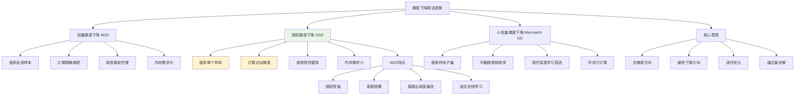

# HCIA-AI 题目分析 - 随机梯度下降法

## 题目内容

**问题**: （）方法的优化思想是用当前位置负梯度方向作为搜索方向，该方向为当前位置最快下降方向，每次更新随机使用一个样本参与计算。（输入中文）

**答案**: 随机梯度下降法

## 题目分析

### 关键信息提取
1. **负梯度方向**: 作为搜索方向
2. **最快下降方向**: 当前位置的最优下降方向
3. **每次更新**: 随机使用一个样本
4. **参与计算**: 单样本参与梯度计算

### 答案解析

**正确答案**: 随机梯度下降法（Stochastic Gradient Descent, SGD）

**解题思路**: 
1. 识别关键特征：负梯度方向 + 单样本更新
2. 区分三种梯度下降方法的特点
3. 确认SGD的核心特征：每次只用一个样本

## 概念图解



## 知识点总结

### 核心概念
- **梯度**: 函数在某点处的方向导数，指向函数值增长最快的方向
- **负梯度**: 函数值下降最快的方向
- **随机性**: 每次迭代随机选择一个样本进行计算
- **在线学习**: 数据逐个到达时的学习方式

### 三种梯度下降方法对比

| 方法 | 样本使用 | 梯度精度 | 收敛特性 | 计算复杂度 | 内存需求 |
|------|----------|----------|----------|------------|----------|
| BGD | 全部样本 | 精确 | 稳定，较慢 | O(mn) | 高 |
| SGD | 单个样本 | 近似 | 快速，震荡 | O(m) | 低 |
| Mini-batch | 样本子集 | 中等 | 平衡 | O(mk) | 中等 |

*注：m为特征数，n为样本数，k为批次大小*

### SGD算法流程

#### 数学表示
```
1. 初始化参数 θ₀
2. For each epoch:
   For each sample (xᵢ, yᵢ):
     - 计算损失：L(θ, xᵢ, yᵢ)
     - 计算梯度：∇θL(θ, xᵢ, yᵢ)
     - 更新参数：θ = θ - α∇θL(θ, xᵢ, yᵢ)
```

#### 伪代码
```python
def sgd(X, y, learning_rate, epochs):
    theta = initialize_parameters()
    
    for epoch in range(epochs):
        # 随机打乱数据
        indices = shuffle(range(len(X)))
        
        for i in indices:
            # 使用单个样本
            x_i, y_i = X[i], y[i]
            
            # 计算梯度
            gradient = compute_gradient(theta, x_i, y_i)
            
            # 更新参数
            theta = theta - learning_rate * gradient
    
    return theta
```

### SGD的优缺点分析

#### 优点
- **计算效率高**: 每次只处理一个样本
- **内存需求低**: 不需要存储全部数据
- **收敛速度快**: 更新频繁，快速逼近最优解
- **在线学习**: 适合流式数据处理
- **跳出局部最优**: 随机性有助于探索
- **适合大数据**: 处理大规模数据集的首选

#### 缺点
- **收敛不稳定**: 存在震荡现象
- **梯度噪声**: 单样本梯度不够准确
- **学习率敏感**: 需要仔细调整学习率
- **可能不收敛**: 在某些情况下可能发散

### SGD变种算法

#### 1. SGD with Momentum
```
vₜ = βvₜ₋₁ + (1-β)∇θL(θ, xᵢ, yᵢ)
θₜ = θₜ₋₁ - αvₜ
```
- 引入动量项，减少震荡
- 加速收敛过程

#### 2. AdaGrad
```
Gₜ = Gₜ₋₁ + (∇θL)²
θₜ = θₜ₋₁ - α/√(Gₜ + ε) * ∇θL
```
- 自适应学习率
- 对稀疏特征友好

#### 3. Adam
```
mₜ = β₁mₜ₋₁ + (1-β₁)∇θL
vₜ = β₂vₜ₋₁ + (1-β₂)(∇θL)²
θₜ = θₜ₋₁ - α * m̂ₜ/√(v̂ₜ + ε)
```
- 结合动量和自适应学习率
- 现代深度学习的主流选择

### 实际应用场景

#### 适用情况
- **大规模数据集**: 样本数量巨大
- **在线学习**: 数据流式到达
- **资源受限**: 内存或计算能力有限
- **快速原型**: 需要快速验证想法
- **非凸优化**: 复杂的损失函数

#### 不适用情况
- **小数据集**: 样本数量很少
- **高精度要求**: 需要精确收敛
- **稳定性要求**: 不能容忍震荡
- **确定性需求**: 需要可重复结果

### 超参数调优

#### 学习率选择
- **过大**: 可能发散或震荡剧烈
- **过小**: 收敛过慢
- **自适应**: 使用学习率衰减策略
- **经验值**: 通常从0.01开始尝试

#### 学习率衰减策略
1. **步长衰减**: 每隔固定步数减少学习率
2. **指数衰减**: 按指数函数衰减
3. **余弦衰减**: 按余弦函数衰减
4. **自适应衰减**: 根据验证集性能调整

### 记忆要点
- **核心特征**: 每次使用一个样本，负梯度方向
- **主要优势**: 计算效率高，适合大数据
- **主要问题**: 收敛不稳定，存在震荡
- **应用场景**: 大规模机器学习，在线学习

## 扩展学习

### MindSpore中的SGD实现
```python
import mindspore.nn as nn
from mindspore import Tensor
import mindspore.ops as ops

# 使用SGD优化器
optimizer = nn.SGD(
    params=model.trainable_params(),
    learning_rate=0.01,
    momentum=0.9,
    weight_decay=1e-4
)

# 训练步骤
def train_step(data, label):
    def forward_fn(data, label):
        logits = model(data)
        loss = loss_fn(logits, label)
        return loss
    
    grad_fn = ops.value_and_grad(forward_fn, None, optimizer.parameters)
    loss, grads = grad_fn(data, label)
    optimizer(grads)
    return loss
```

### 实践建议
1. **数据预处理**: 标准化输入特征
2. **学习率调优**: 使用学习率搜索
3. **批次大小**: 考虑使用Mini-batch
4. **正则化**: 结合L1/L2正则化
5. **早停策略**: 监控验证集性能

### 调试技巧
- **损失监控**: 观察损失函数变化趋势
- **梯度检查**: 检查梯度是否合理
- **学习率可视化**: 绘制学习率vs损失曲线
- **参数统计**: 监控参数更新幅度

### 理论基础
- **凸优化理论**: SGD在凸函数上的收敛性
- **随机逼近**: 随机算法的理论基础
- **鞍点逃逸**: SGD跳出鞍点的能力
- **泛化能力**: SGD对模型泛化性能的影响